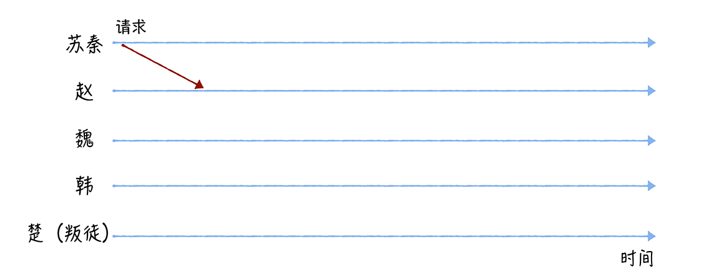
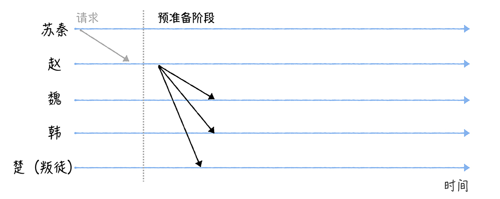
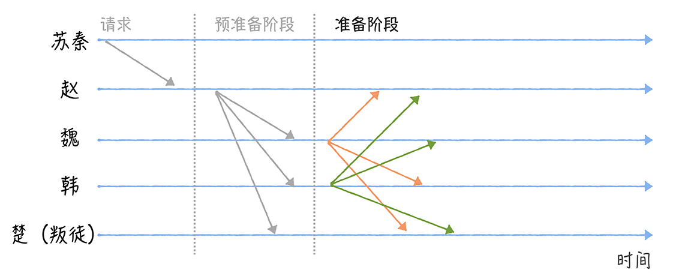
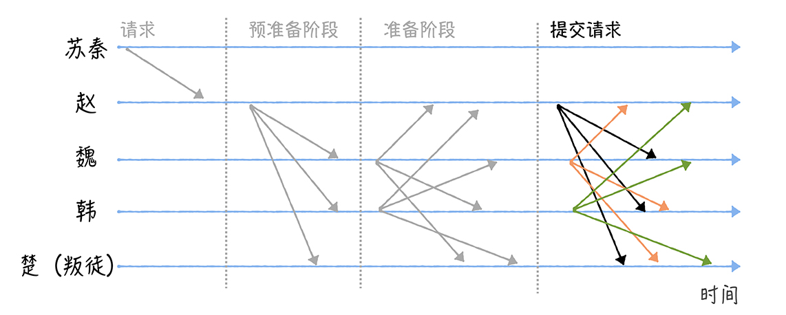
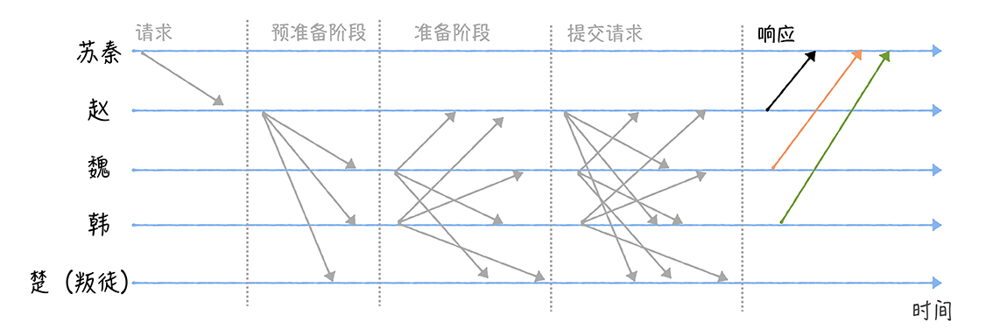
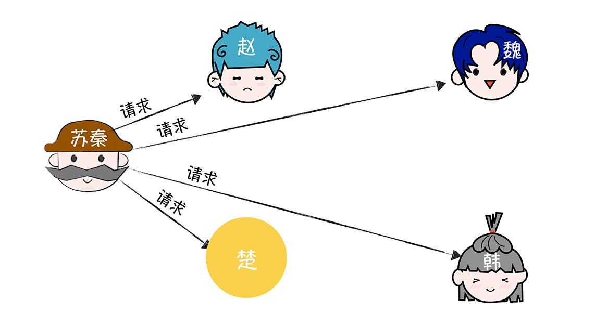
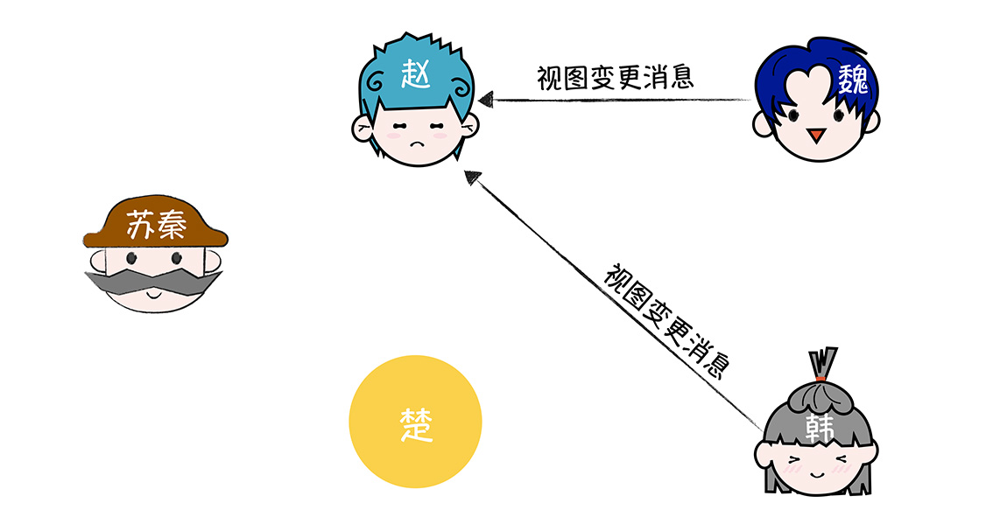
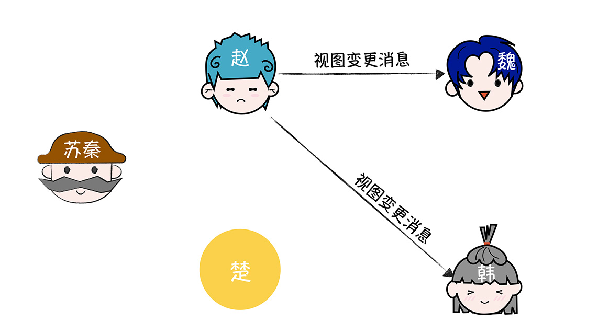

[TOC]

# PBFT算法

**From 极客时间，韩健**

学完了之前讲的拜占庭将军问题之后，有同学在留言中表达了自己的思考和困惑：口信消息型拜占庭问题之解在实际项目中是如何落地的呢？先给这位同学点个赞，很棒！你能在学习的同时思考落地实战。

不过事实上，它很难在实际项目落地，因为口信消息型拜占庭问题之解是一个非常理论化的算法，没有和实际场景结合，也没有考虑如何在实际场景中落地和实现。

比如，它实现的是在拜占庭错误场景下，忠将们如何在叛徒干扰时，就一致行动达成共识。但是它并不关心结果是什么，这会出现一种情况：现在适合进攻，但将军们达成的最终共识却是撤退。

很显然，这不是我们想要的结果。因为在实际场景中，我们需要就提议的一系列值（而不是单值），即使在拜占庭错误发生的时候也能被达成共识。那你要怎么做呢？答案就是掌握 PBFT 算法。

PBFT 算法非常实用，是一种能在实际场景中落地的拜占庭容错算法，它在区块链中应用广泛（比如 Hyperledger Sawtooth、Zilliqa）。为了帮助你更好地理解 PBFT 算法，在今天的内容中，我除了带你了解 PBFT 达成共识的原理之外，还会介绍**口信消息型拜占庭问题之解的局限**。相信学习完本讲内容后，你不仅能理解 PBFT 达成共识的基本原理，还能理解算法背后的演化和改进。

老规矩，在开始今天的学习之前，咱们先看一道思考题：

假设苏秦再一次带队抗秦，这一天，苏秦和 4 个国家的 4 位将军赵、魏、韩、楚商量军机要事，结果刚商量完没多久苏秦就接到了情报，情报上写道：联军中可能存在一个叛徒。这时，苏秦要如何下发作战指令，保证忠将们正确、一致地执行下发的作战指令，而不是被叛徒干扰呢？

图 1：

带着这个问题，我们正式进入今天的学习。

首先，咱们先来研究一下，为什么口信消息型拜占庭问题之解很难在实际场景中落地，除了我在开篇提到的非常理论化，没有和实际的需求结合之外，还有其他的原因么？

其实，这些问题是后续众多拜占庭容错算法在努力改进和解决的，理解了这些问题，能帮助你更好地理解后来的**拜占庭容错算法**（包括 PBFT 算法）。

## 1. 口信消息型拜占庭问题之解的局限

我想说的是，这个算法有个非常致命的缺陷。如果将军数为 n、叛将数为 f，那么算法需要递归协商 f+1 轮，消息复杂度为 O(n ^ (f + 1))，消息数量指数级暴增。你可以想象一下，如果叛将数为 64，消息数已经远远超过 int64 所能表示的了，这是无法想象的，肯定不行啊。

另外，尽管对于签名消息，不管叛将数（比如 f）是多少，经过 f + 1 轮的协商，忠将们都能达成一致的作战指令，但是这个算法同样存在“理论化”和“消息数指数级暴增”的痛点。

讲到这儿，你肯定明白为什么这个算法很难在实际场景中落地了。可技术是不断发展的，算法也是在解决实际场景问题中不断改进的。那么 PBFT 算法的原理是什么呢？为什么它能在实际场景中落地呢？

## 2. PBFT 是如何达成共识的

我们先来看看如何通过 PBFT 算法，解决苏秦面临的共识问题。先假设苏秦制定的作战指令是进攻，而楚是叛徒（为了演示方便）：

图 2：

需要你注意的是，所有的消息都是签名消息，也就是说，消息发送者的身份和消息内容都是无法伪造和篡改的（比如，楚无法伪造一个假装来自赵的消息）。

首先，苏秦联系赵，向赵发送包含作战指令“进攻”的请求（就像下图的样子）。

图 3：

当赵接收到苏秦的请求之后，会执行**三阶段协议**（Three-phase protocol）。

- 赵将进入**预准备（Pre-prepare）阶段**，构造包含作战指令的预准备消息，并广播给其他将军（魏、韩、楚）。

图 4：

那么在这里，我想问你一个问题：魏、韩、楚，收到消息后，能直接执行指令吗？

答案是不能，因为他们不能确认自己接收到指令和其他人接收到的指令是相同的。比如，赵可能是叛徒，赵收到了 2 个指令，分别是“进攻”和“准备 30 天的粮草”，然后他给魏发送的是“进攻”，给韩、楚发送的是“准备 30 天粮草”，这样就会出现无法一致行动的情况。那么他们具体怎么办呢？我接着说一下。

- 接收到预准备消息之后，魏、韩、楚将进入**准备（Prepare）阶段**，并分别广播包含作战指令的准备消息给其他将军。比如，魏广播准备消息给赵、韩、楚（如图所示）。为了方便演示，我们假设叛徒楚想通过不发送消息，来干扰共识协商（你能看到，图中的楚是没有发送消息的）。

- 接收到预准备消息之后，魏、韩、楚将进入**准备（Prepare）阶段**，并分别广播包含作战指令的准备消息给其他将军。比如，魏广播准备消息给赵、韩、楚（如图所示）。为了方便演示，我们假设叛徒楚想通过不发送消息，来干扰共识协商（你能看到，图中的楚是没有发送消息的）。

图 5：

然后，当某个将军收到 2f 个一致的包含作战指令的准备消息后，会进入**提交（Commit）阶段**（这里的 2f 包括自己，其中 f 为叛徒数，在我的演示中是 1）。在这里，我也给你提一个问题：这个时候该将军（比如魏）可以直接执行指令吗？

答案还是不能，因为魏不能确认赵、韩、楚是否收到了 2f 个一致的包含作战指令的准备消息。也就是说，魏这时无法确认赵、韩、楚是否准备好了执行作战指令。那么怎么办呢？别着急，咱们继续往下看。

- 进入提交阶段后，各将军分别**广播提交消息**给其他将军，也就是告诉其他将军，我已经准备好了，可以执行指令了。

图 6：

- 最后，当某个将军收到 **2f + 1** 个验证通过的提交消息后（包括自己，其中 f 为叛徒数，在我的演示中为 1），也就是说，大部分的将军们已经达成共识，这时可以执行作战指令了，那么该将军将执行苏秦的作战指令，执行完毕后发送执行成功的消息给苏秦。

图 7：

最后，当苏秦收到 f+1 个相同的**响应（Reply）消息**时，说明各位将军们已经就作战指令达成了共识，并执行了作战指令（其中 f 为叛徒数，在我的演示中为 1）。

你看，经过了三轮协商，是不是就指定的作战指令达成了共识，并执行了作战指令了呢？

在这里，苏秦采用的就是简化版的 PBFT 算法。在这个算法中：

- 你可以将赵、魏、韩、楚理解为分布式系统的四个节点，其中赵是主节点（Primary），魏、韩、楚是备份节点（Backup）；

- 将苏秦理解为业务，也就是客户端；

- 将消息理解为网络消息；

- 将作战指令“进攻”，理解成客户端提议的值，也就是希望被各节点达成共识，并提交给状态机的值。

**在这里我想说的是**， PBFT 算法是通过**签名（或消息认证码 MAC）**约束恶意节点的行为，也就是说，每个节点都可以通过验证消息签名确认消息的发送来源，一个节点无法伪造另外一个节点的消息。最终，基于大多数原则（2f + 1）实现共识的。

需要你注意的是，最终的共识是否达成，客户端是会做判断的，如果客户端在指定时间内未收到请求对应的 f + 1 相同响应，就认为集群出故障了，共识未达成，客户端会重新发送请求。

另外需要你注意的是，PBFT 算法通过**视图变更**（View Change）的方式，来处理主节点作恶，当发现主节点在作恶时，会以“轮流上岗”方式，推举新的主节点。

最后我想说的是，尽管 PBFT 算法相比口信消息型拜占庭之解已经有了很大的优化，**将消息复杂度从 O(n ^ (f + 1)) 降低为 O(n ^ 2)**，能在实际场景中落地，并解决实际的共识问题。但 PBFT 还是需要比较多的消息。比如在 13 节点集群中（f 为 4）。

- 请求消息：1
- 预准备消息：3f = 12
- 准备消息：3f * (3f - f) = 96
- 提交消息：(3f - f + 1) * (3f + 1)= 117
- 回复消息：3f - 1 = 11

也就是说，一次共识协商需要 237 个消息，你看，消息数还是蛮多的，所以我推荐你，在中小型分布式系统中使用 PBFT 算法。

## 3. 内容小结

以上就是本节课的全部内容了，本节课我主要带你了解了口信消息型拜占庭问题之解的局限和 PBFT 的原理，我希望你明确这样几个重点。

1. 不管口信消息型拜占庭问题之解，还是签名消息型拜占庭问题之解，都是非常理论化的，未考虑实际场景的需求，而且协商成本非常高，指数级的消息复杂度是很难在实际场景中落地，和解决实际场景问题的。

2. PBFT 算法是**通过签名（或消息认证码 MAC）约束恶意节点的行为**，采用**三阶段协议**，基于**大多数原则**达成共识的。另外，与口信消息型拜占庭问题之解（以及签名消息型拜占庭问题之解）不同的是，PBFT 算法实现的是一系列值的共识，而不是单值的共识。

3. **相比 Raft 算法完全不适应有人作恶的场景**，PBFT 算法能容忍 (n - 1)/3 个恶意节点 (也可以是故障节点)。另外，**相比 PoW 算法，PBFT 的优点是不消耗算力，所以在日常实践中，PBFT 比较适用于相对“可信”的场景中**，比如联盟链。

需要你注意的是，PBFT 算法与 Raft 算法类似，也存在一个“领导者”（就是主节点），同样，集群的性能也受限于“领导者”。另外，**O(n ^ 2)** 的消息复杂度，以及随着消息数的增加，网络时延对系统运行的影响也会越大，这些都限制了运行 PBFT 算法的分布式系统的规模，也决定了 PBFT 算法适用于中小型分布式系统。

## 4. 思考

当客户端在收到了 f + 1 个结果，就认为共识达成了，那么为什么这个值不能小于 f + 1 呢？

## 5. 如何替换作恶的Leader

我们了解到，**PBFT 可以防止备份节点作恶**，因为这个算法是主节点和备份节点组成的，那你想象一下，如果主节点作恶（比如主节点接收到了客户端的请求，但就是默不作声，不执行三阶段协议），这时无论正常节点数有多少，备份节点肯定没办法达成共识，整个集群都没办法正常运行。这么大的问题，你该怎么解决呢？

答案是**视图变更（View Change），也就是通过领导者选举，选举出新的主节点，并替换掉作恶的主节点**。（其中的“视图”你可以理解为领导者任期的，不同的视图值对应不同的主节点。比如，视图值为 1 时，主节点为 A；视图值为 2 时，主节点为 B。）

对于领导者模型算法而言，不管是非拜占庭容错算法（比如 Raft），还是拜占庭容错算法（比如 PBFT），领导者选举都是它们实现容错能力非常重要的一环。比如，对 Raft 而言，领导者选举实现了领导者节点的容错能力，避免了因领导者节点故障导致整个集群不可用。而对 PBFT 而言，视图变更，除了能解决主节点故障导致的集群不可用之外，还能解决主节点是恶意节点的问题。

对你来说，理解视图变更，可以理解拜占庭容错算法如何处理领导者故障和作恶。这样一样，从 07 讲到 13 讲（非拜占庭容错场景到拜占庭容错场景），你就能更全面地理解领导者选举的原理，和能解决的问题了，这样当你后续熟悉其他领导者选举算法，或设计自己的领导者选举算法时，也能更加的得心应手了。

既然领导者选举这么重要，那么 PBFT 到底是如何实现视图变更的呢？带着这样的疑问，我们进入今天的内容。

## 6. 主节点作恶会出现什么问题

在 PBFT 中，主节点作恶有这么几种情况，比如：

- 我开篇提到的，主节点接收到客户端请求后，它不做任何处理，也就是默不作声；

- 主节点接收到客户端请求后，给不同的预准备请求分配不同的序号；

- 再或者，主节点只给部分节点发送预准备消息。

需要你注意的是，不管出现哪种情况，共识都是无法达成的，也就是说，如果恶意节点当选了主节点，此时无论忠诚节点数多少，忠诚节点们将都无法达成共识。

而这种情况肯定是无法接受的，这就需要我们在发现主节点可能在作恶时，设计一个机制，将作恶的主节点替换掉，并保证最终只有忠诚的节点在担任主节点。这样，PFBT 才能保证当节点数为 3f + 1（其中 f 为恶意节点数）时，忠诚的节点们能就客户端提议的指令达成共识，并执行一致的指令。

那么，在 PBFT 中，视图变更是如何选举出新的主节点，并替换掉作恶的主节点的呢？答案你肯定知道了，那就是视图变更。

## 7. 如何替换作恶的主节点

在我看来，视图变更是保证 PBFT 算法能稳定运行的关键，当系统运行异常时，客户端或备份节点触发系统的视图变更，通过“轮流上岗”的方式：(v + 1) mod |R|，其中 v 为当前视图的值，|R|为节点数选出下一个视图的主节点，最终选出一个忠诚、稳定运行新主节点，并保证了共识的达成。

为了帮你更好地理解视图变更的原理，我继续以苏秦为例（这次，咱们把叛将楚当作是“大元帅”，让它扮演主节点的角色）。

图 8：

首先，苏秦联系楚，向楚发送包含作战指令“进攻”的请求。

图 9：

当楚接收到苏秦的请求之后，为了达到破坏作战计划的目的，它默不作声，内心想：我就是不执行三阶段协议（Three-phase protocol），不执行你的指令，也不通知其他将军执行你的指令，你能把我怎么办？

结果，苏秦等到花都谢了，还是没办法接收到 2 个相同的响应（Reply）消息。都过了约定的时间了，苏秦在想，也许各位将军们出什么问题了。

这时苏秦会**直接给各位将军发送作战指令**。

图 10：

当赵、魏、韩接收到来自的苏秦的作战指令时，它们会将作战指令分别发送给楚，并等待一段时间，如果在这段时间内，仍未接收到来自楚的预准备消息，那么它们就认为楚可能已经叛变了，就发起视图变更（采用“轮流上岗”的方式选出新的大元帅，比如赵），并向集群所有节点发送视图变更消息（view-change message）。

图 11：

当赵接收到 2 个视图变更消息后，它就发送新视图消息（new-view message）给其他将军，告诉大家，我是大元帅了。

图 12：

当其他将军接收到新视图消息后，就认为选出了新的大元帅。然后，忠诚的将军们就可以一致地执行来自苏秦的作战指令了。

你看，叛变的大元帅，就这样被发现和替换掉了，而最终大元帅一定是忠诚的。

回到计算机的世界中，如何理解呢？与 13 讲一样，在这里我就不啰嗦了。不过为了帮你更全面地理解视图变更，我想补充几点：

- 首先，当一个备份节点，在定时器超时触发了视图变更后，它将暂时停止接收和处理，除了检查点（CHECKPOINT） 、视图变更、新视图之外的消息。你可以这么理解，这个节点认为现在集群处于异常状态，不能再处理客户端请求相关的消息了。

- 其次，除了演示中的情况，会触发备份节点进行视图变更，下面几种情况也会触发视图变更，比如：

  - 备份节点发送了准备消息后，在约定的时间内未接收到来自其他节点的 2f 个相同的准备消息。
  
  - 备份节点发送了提交消息后，在约定的时间内未接收到来自其他节点的 2f 个相同的提交消息。
  
  - 备份节点接收到异常消息，比如视图值、序号和已接受的消息相同，但内容摘要不同。

也就是说，视图变更除了能解决主节点故障和作恶的问题，还能避免备份节点长时间阻塞等待客户端请求被执行。

最后，需要你注意的是，了解 Raft 的同学应该知道，领导者的选举和日志提交，都是由集群的节点来完成的。但在 PBFT 中，客户端参与了拜占庭容错的实现，比如，客户端实现定时器，等待接收来自备份节点的响应，并且如果等待超时，发送请求给所有节点，我希望你能注意到这点。

## 8. 内容小结

本节课我主要带你了解了 PBFT 是如何替换作恶的领导者的。我希望你明确这样几个重点。

- 客户端通过等待 f+1 个相同响应消息超时，来发现主节点可能在作恶，此时客户端发送客户端请求给所有集群节点，从而触发可能的视图变更。

- 与 Raft 在领导者选举期间服务不可用类似，在视图变更时，PBFT 集群也是无法提供服务的。

因为本讲是 PBFT 算法的最后一讲，所以我想多说几句。

首先，在一般情况下，每个节点都需要持久化保存状态数据（比如准备消息），以便在后面使用。但随着系统运行，数据就会越来越多，最终肯定会出现存储空间不足的情况。那么，怎么解决这个问题？

答案是检查点（checkpoint）机制。PBFT 实现了检查点，来定时清理节点本地缓存的但已经不再需要的历史数据（比如预准备消息、准备消息和提交消息），节省了本地的存储空间，并不会影响系统的运行。

其次，我们都知道基于数字签名的加解密，是非常消耗性能，这也是为什么在一些对加解密要求高的场景中，大家常直接在硬件中实现加解密，比如 IPSEC VPN。如果在 PBFT 中，所有消息都是签名消息，那么肯定非常消耗性能，会极大制约 PBFT 算法的落地场景。那么，有什么办法优化这个问题呢？

答案是将数字签名和消息验证码（MAC）混合着使用。具体来说就是，在 PBFT 中，只有视图变更消息和新视图消息采用了签名消息，其他消息采用的是消息验证码，这样一来，就节省了大量的加解密的性能开销。

最后，PBFT 是一个能在实际场景中落地的拜占庭容错算法，它和区块链也结合紧密，具体来说的话，有这么几种应用。

- 相对可信、有许可限制的联盟链，比如 Hyperledger Sawtooth。

- 与其他拜占庭容错算法结合起来，落地公有链。比如 Zilliqa，将 POW 算法和 PBFT 结合起来，实现公有链的共识协商。具体来说，POW 算法作为认证，证明节点不是“坏人”，PBFT 来实现共识。针对 PBFT 消息数过多、不适应大型分布式系统的痛点，Zilliqa 实现了分片（Sharding）技术。

另外，也有团队因为 PBFT 消息数过多、不适应大型分布式系统的痛点，放弃使用 PBFT，通过法律来约束“节点作恶”的行为，比如 IBM 的 Hyperledger Fabric。那么我想说的是，技术是发展的，适合的才是最好的，所以，我建议你根据场景的可信度，来决定是否采用 PBFT 算法，是否改进和优化 PBFT 算法。

## 思考

既然我提到在 PBFT 中，PBFT 是通过视图变更来选举出新的主节点的。那么你不妨想想，集群是在视图变更时，能否继续处理来自客户端的写请求呢？为什么呢？
