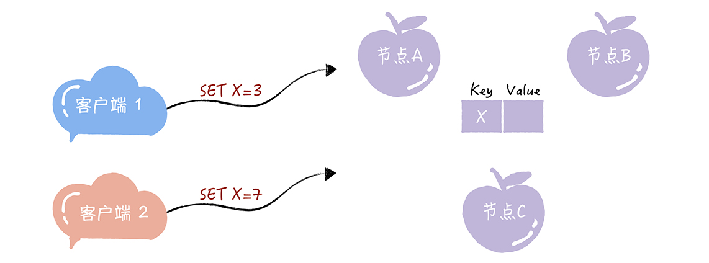
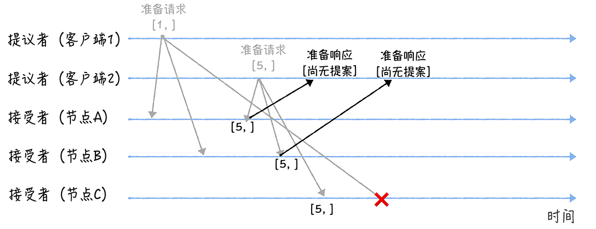
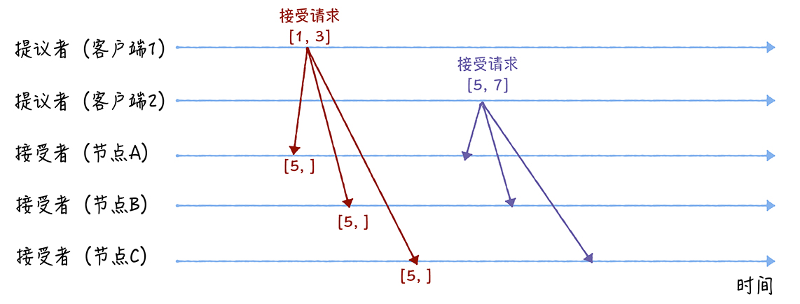
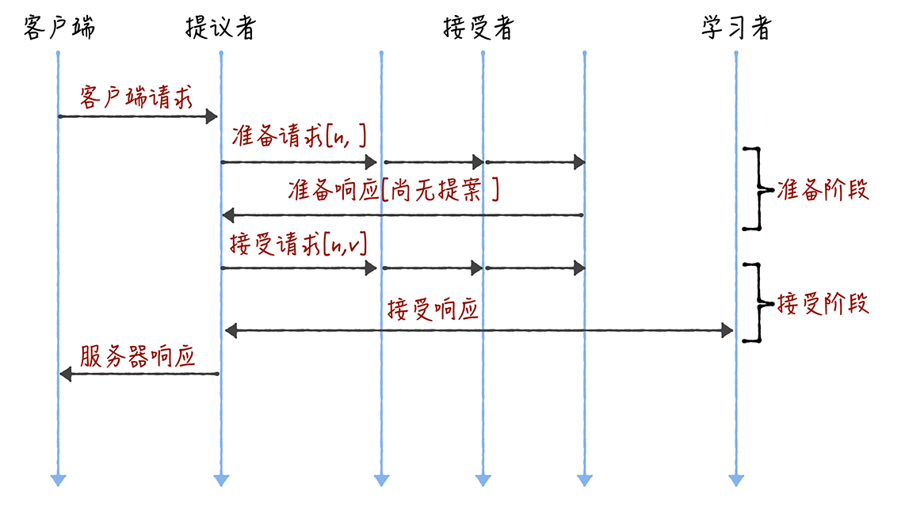
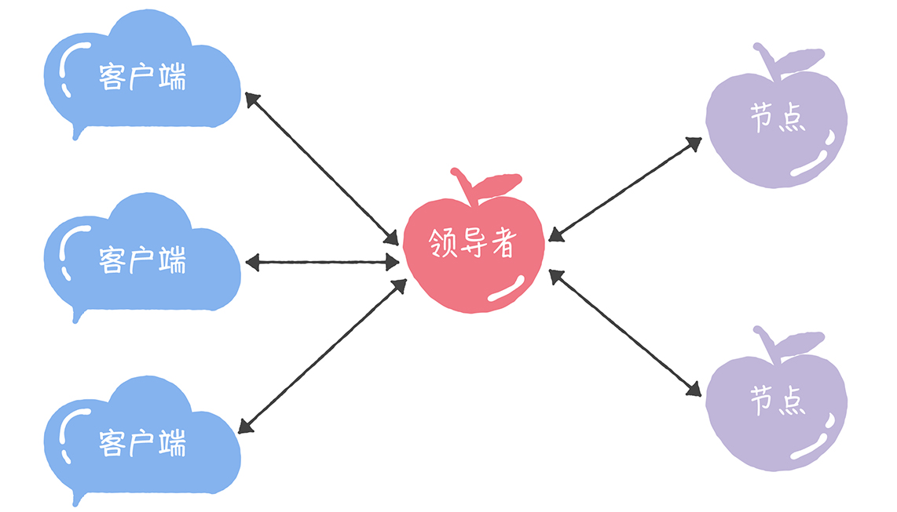
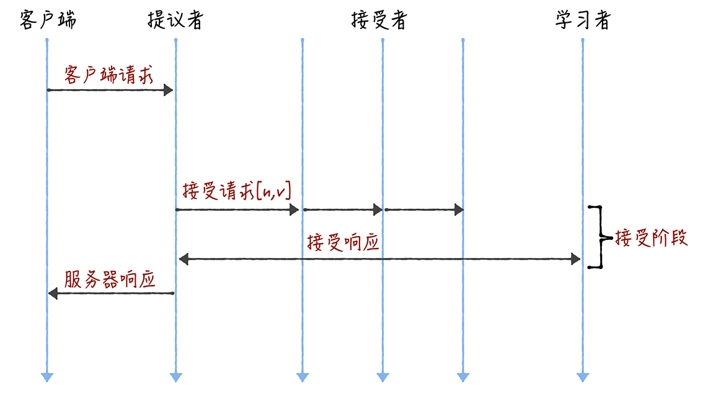
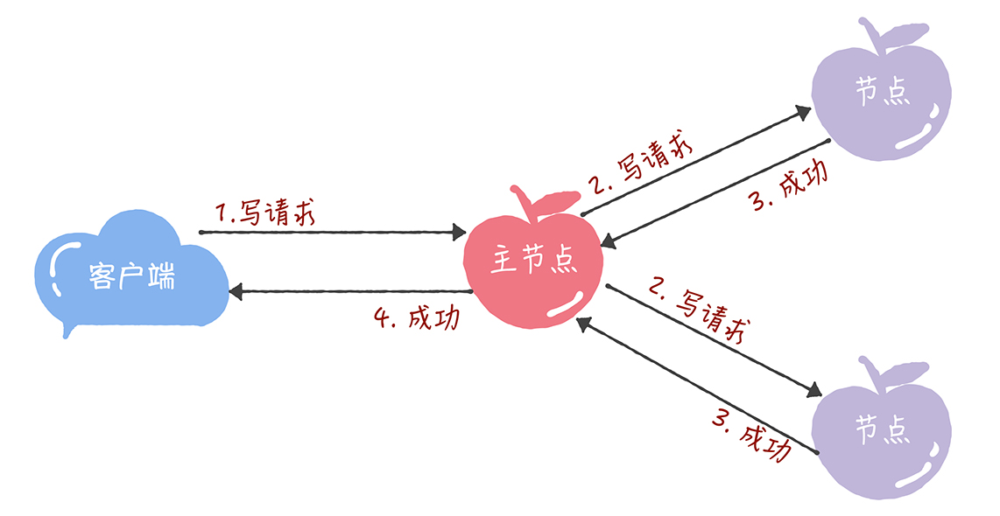

[TOC]

# Paxos算法

**From 极客时间，韩健**

提到分布式算法，就不得不提 Paxos 算法，在过去几十年里，它基本上是分布式共识的代名词，因为当前最常用的一批共识算法都是基于它改进的。比如，Fast Paxos 算法、Cheap Paxos 算法、Raft 算法等等。而很多同学都会在准确和系统理解 Paxos 算法上踩坑，比如，只知道它可以用来达成共识，但不知道它是如何达成共识的。

这其实侧面说明了 Paxos 算法有一定的难度，可分布式算法本身就很复杂，Paxos 算法自然也不会例外，当然了，除了这一点，还跟兰伯特有关。

兰伯特提出的 Paxos 算法包含 2 个部分：

- 一个是 Basic Paxos 算法，描述的是多节点之间如何就某个值（提案 Value）达成共识；
- 另一个是 Multi-Paxos 思想，描述的是执行多个 Basic Paxos 实例，就一系列值达成共识。

可因为兰伯特提到的 Multi-Paxos 思想，缺少代码实现的必要细节（比如怎么选举领导者），所以在理解上比较难。

为了让你理解 Paxos 算法，接下来我会用 2 节课的时间，分别以 Basic Paxos 和 Multi-Paxos 为核心，带你了解 Basic Paxos 如何达成共识，以及针对 Basic Paxos 的局限性 Multi-Paxos 又是如何改进的。今天咱们先来聊聊 Basic Paxos。

## 1. Basic Paxos

在我看来，Basic Paxos 是 Multi-Paxos 思想的核心，说白了，Multi-Paxos 就是多执行几次 Basic Paxos。所以掌握它之后，你能更好地理解后几讲基于 Multi-Paxos 思想的共识算法（比如 Raft 算法），还能掌握分布式共识算法的最核心内容，当现在的算法不能满足业务需求，进行权衡折中，设计自己的算法。

### 1.1 来看一道思考题

假设我们要实现一个分布式集群，这个集群是由节点 A、B、C 组成，提供只读 KV 存储服务。你应该知道，创建只读变量的时候，必须要对它进行赋值，而且这个值后续没办法修改。因此一个节点创建只读变量后就不能再修改它了，所以所有节点必须要先对只读变量的值达成共识，然后所有节点再一起创建这个只读变量。

那么，当有多个客户端（比如客户端 1、2）访问这个系统，试图创建同一个只读变量（比如 X），客户端 1 试图创建值为 3 的 X，客户端 2 试图创建值为 7 的 X，这样要如何达成共识，实现各节点上 X 值的一致呢？带着这个问题，我们进入今天的学习。

图1：

在一些经典的算法中，你会看到一些既形象又独有的概念（比如二阶段提交协议中的协调者），Basic Paxos 算法也不例外。为了帮助人们更好地理解 Basic Paxos 算法，兰伯特在讲解时，也使用了一些独有而且比较重要的概念，提案、准备（Prepare）请求、接受（Accept）请求、角色等等，其中最重要的就是“角色”。因为角色是对 Basic Paxos 中最核心的三个功能的抽象，比如，由接受者（Acceptor）对提议的值进行投票，并存储接受的值。

### 1.2 三种角色

在 Basic Paxos 中，有提议者（Proposer）、接受者（Acceptor）、学习者（Learner）三种角色，他们之间的关系如下：

图2：

看着是不是有些复杂，其实并不难理解：

- **提议者（Proposer）**

提议一个值，用于投票表决。为了方便演示，你可以把图 1 中的客户端 1 和 2 看作是提议者。但在绝大多数场景中，集群中收到客户端请求的节点，才是提议者（图 1 这个架构，是为了方便演示算法原理）。这样做的好处是，对业务代码没有入侵性，也就是说，我们不需要在业务代码中实现算法逻辑，就可以像使用数据库一样访问后端的数据。

- **接受者（Acceptor）**

对每个提议的值进行投票，并存储接受的值，比如 A、B、C 三个节点。 一般来说，集群中的所有节点都在扮演接受者的角色，参与共识协商，并接受和存储数据。

讲到这儿，你可能会有疑惑：前面不是说接收客户端请求的节点是提议者吗？这里怎么又是接受者呢？这是因为一个节点（或进程）可以身兼多个角色。想象一下，一个 3 节点的集群，1 个节点收到了请求，那么该节点将作为提议者发起二阶段提交，然后这个节点和另外 2 个节点一起作为接受者进行共识协商，就像下图的样子：

图3：

- **学习者（Learner）**

被告知投票的结果，接受达成共识的值，存储保存，不参与投票的过程。一般来说，学习者是数据备份节点，比如“Master-Slave”模型中的 Slave，被动地接受数据，容灾备份。

其实，这三种角色，在本质上代表的是三种功能：

- 提议者代表的是接入和协调功能，收到客户端请求后，发起二阶段提交，进行共识协商；
- 接受者代表投票协商和存储数据，对提议的值进行投票，并接受达成共识的值，存储保存；
- 学习者代表存储数据，不参与共识协商，只接受达成共识的值，存储保存。

因为一个完整的算法过程是由这三种角色对应的功能组成的，所以理解这三种角色，是你理解 Basic Paxos 如何就提议的值达成共识的基础。那么接下来，咱们看看如何使用 Basic Paxos 达成共识，解决开篇提到的那道思考题。

### 1.3 如何达成共识

想象这样一个场景，现在疫情这么严重，每个村的路都封得差不多了，就你的村委会不作为，迟迟没有什么防疫的措施。你决定给村委会提交个提案，提一些防疫的建议，除了建议之外，为了和其他村民的提案做区分，你的提案还得包含一个提案编号，来起到唯一标识的作用。

与你的做法类似，在 Basic Paxos 中，兰伯特也使用提案代表一个提议。不过在提案中，**除了提案编号，还包含了提议值**。为了方便演示，我使用[n, v]表示一个提案，其中 n 为提案编号，v 为提议值。

我想强调一下，整个共识协商是分 2 个阶段进行的（也就是我在 03 讲提到的二阶段提交）。那么具体要如何协商呢？

我们假设客户端 1 的提案编号为 1，客户端 2 的提案编号为 5，并假设节点 A、B 先收到来自客户端 1 的准备请求，节点 C 先收到来自客户端 2 的准备请求。

**准备（Prepare）阶段**

先来看第一个阶段，首先客户端 1、2 作为提议者，分别向所有接受者发送包含提案编号的准备请求：

图4：

你要注意，**在准备请求中是不需要指定提议的值的，只需要携带提案编号就可以了**，这是很多同学容易产生误解的地方。

接着，当节点 A、B 收到提案编号为 1 的准备请求，节点 C 收到提案编号为 5 的准备请求后，将进行这样的处理：

图5：

- 由于之前没有通过任何提案，所以节点 A、B 将返回一个 “尚无提案”的响应。也就是说节点 A 和 B 在告诉提议者，我之前没有通过任何提案呢，并承诺以后不再响应提案编号小于等于 1 的准备请求，不会通过编号小于 1 的提案。

- 节点 C 也是如此，它将返回一个 “尚无提案”的响应，并承诺以后不再响应提案编号小于等于 5 的准备请求，不会通过编号小于 5 的提案。

另外，当节点 A、B 收到提案编号为 5 的准备请求，和节点 C 收到提案编号为 1 的准备请求的时候，将进行这样的处理过程：

图6：

- 当节点 A、B 收到提案编号为 5 的准备请求的时候，因为提案编号 5 大于它们之前响应的准备请求的提案编号 1，而且两个节点都没有通过任何提案，所以它将返回一个 “尚无提案”的响应，并承诺以后不再响应提案编号小于等于 5 的准备请求，不会通过编号小于 5 的提案。

- 当节点 C 收到提案编号为 1 的准备请求的时候，由于提案编号 1 小于它之前响应的准备请求的提案编号 5，所以丢弃该准备请求，不做响应。

**接受（Accept）阶段**

第二个阶段也就是接受阶段，首先客户端 1、2 在收到大多数节点的准备响应之后，会分别发送接受请求：

图7：

- 当客户端 1 收到大多数的接受者（节点 A、B）的准备响应后，根据响应中提案编号最大的提案的值，设置接受请求中的值。因为该值在来自节点 A、B 的准备响应中都为空（也就是图 5 中的“尚无提案”），所以就把自己的提议值 3 作为提案的值，发送接受请求[1, 3]。

- 当客户端 2 收到大多数的接受者的准备响应后（节点 A、B 和节点 C），根据响应中提案编号最大的提案的值，来设置接受请求中的值。因为该值在来自节点 A、B、C 的准备响应中都为空（也就是图 5 和图 6 中的“尚无提案”），所以就把自己的提议值 7 作为提案的值，发送接受请求[5, 7]。

当三个节点收到 2 个客户端的接受请求时，会进行这样的处理：

图8：

- 当节点 A、B、C 收到接受请求[1, 3]的时候，由于提案的提案编号 1 小于三个节点承诺能通过的提案的最小提案编号 5，所以提案[1, 3]将被拒绝。

- 当节点 A、B、C 收到接受请求[5, 7]的时候，由于提案的提案编号 5 不小于三个节点承诺能通过的提案的最小提案编号 5，所以就通过提案[5, 7]，也就是接受了值 7，三个节点就 X 值为 7 达成了共识。

讲到这儿我想补充一下，如果集群中有学习者，当接受者通过了一个提案时，就通知给所有的学习者。当学习者发现大多数的接受者都通过了某个提案，那么它也通过该提案，接受该提案的值。

通过上面的演示过程，你可以看到，最终各节点就 X 的值达成了共识。那么在这里我还想强调一下，Basic Paxos 的容错能力，源自“大多数”的约定，你可以这么理解：当少于一半的节点出现故障的时候，共识协商仍然在正常工作。

### 1.4 内容总结

本节课我主要带你了解了 Basic Paxos 的原理和一些特点，我希望你明确这样几个重点。

- 你可以看到，Basic Paxos 是通过二阶段提交的方式来达成共识的。二阶段提交是达成共识的常用方式，如果你需要设计新的共识算法的时候，也可以考虑这个方式。

- 除了共识，Basic Paxos 还实现了容错，在少于一半的节点出现故障时，集群也能工作。它不像分布式事务算法那样，必须要所有节点都同意后才提交操作，因为“所有节点都同意”这个原则，在出现节点故障的时候会导致整个集群不可用。也就是说，“大多数节点都同意”的原则，赋予了 Basic Paxos 容错的能力，让它能够容忍少于一半的节点的故障。

- 本质上而言，提案编号的大小代表着优先级，你可以这么理解，根据提案编号的大小，接受者保证三个承诺，具体来说：如果准备请求的提案编号，小于等于接受者已经响应的准备请求的提案编号，那么接受者将承诺不响应这个准备请求；如果接受请求中的提案的提案编号，小于接受者已经响应的准备请求的提案编号，那么接受者将承诺不通过这个提案；如果接受者之前有通过提案，那么接受者将承诺，会在准备请求的响应中，包含已经通过的最大编号的提案信息。

### 1.5 思考

在示例中，如果节点 A、B 已经通过了提案[5, 7]，节点 C 未通过任何提案，那么当客户端 3 提案编号为 9 时，通过 Basic Paxos 执行“SET X = 6”，最终三个节点上 X 值是多少呢？为什么呢？

## 2. Multi-Paxos

经过上节课的学习，你应该知道，Basic Paxos 只能就单个值（Value）达成共识，一旦遇到为一系列的值实现共识的时候，它就不管用了。虽然兰伯特提到可以通过多次执行 Basic Paxos 实例（比如每接收到一个值时，就执行一次 Basic Paxos 算法）实现一系列值的共识。但是，很多同学读完论文后，应该还是两眼摸黑，虽然每个英文单词都能读懂，但还是不理解兰伯特提到的 Multi-Paxos，为什么 Multi-Paxos 这么难理解呢？

在我看来，兰伯特并没有把 Multi-Paxos 讲清楚，只是介绍了大概的思想，缺少算法过程的细节和编程所必须的细节（比如缺少选举领导者的细节）。这也就导致每个人实现的 Multi-Paxos 都不一样。不过从本质上看，大家都是在兰伯特提到的 Multi-Paxos 思想上补充细节，设计自己的 Multi-Paxos 算法，然后实现它（比如 Chubby 的 Multi-Paxos 实现、Raft 算法等）。

所以在这里，我补充一下：**兰伯特提到的 Multi-Paxos 是一种思想，不是算法。而 Multi-Paxos 算法是一个统称，它是指基于 Multi-Paxos 思想，通过多个 Basic Paxos 实例实现一系列值的共识的算法（比如 Chubby 的 Multi-Paxos 实现、Raft 算法等）**。 这一点尤其需要你注意。

为了帮你掌握 Multi-Paxos 思想，我会先带你了解，对于 Multi-Paxos 兰伯特是如何思考的，也就是说，如何解决 Basic Paxos 的痛点问题；然后我再以 Chubby 的 Multi-Paxos 实现为例，具体讲解一下。为啥选它呢？因为 Chubby 的 Multi-Paxos 实现，代表了 Multi-Paxos 思想在生产环境中的真正落地，它将一种思想变成了代码实现。

### 2.1 兰伯特关于 Multi-Paxos 的思考

熟悉 Basic Paxos 的同学（可以回顾一下05 讲）可能还记得，Basic Paxos 是通过二阶段提交来达成共识的。在第一阶段，也就是准备阶段，接收到大多数准备响应的提议者，才能发起接受请求进入第二阶段（也就是接受阶段）：

图片9：

而如果我们直接通过多次执行 Basic Paxos 实例，来实现一系列值的共识，就会存在这样几个问题：

- 如果多个提议者同时提交提案，可能出现因为提案编号冲突，在准备阶段没有提议者接收到大多数准备响应，协商失败，需要重新协商。你想象一下，一个 5 节点的集群，如果 3 个节点作为提议者同时提案，就可能发生因为没有提议者接收大多数响应（比如 1 个提议者接收到 1 个准备响应，另外 2 个提议者分别接收到 2 个准备响应）而准备失败，需要重新协商。

- 2 轮 RPC 通讯（准备阶段和接受阶段）往返消息多、耗性能、延迟大。你要知道，分布式系统的运行是建立在 RPC 通讯的基础之上的，因此，延迟一直是分布式系统的痛点，是需要我们在开发分布式系统时认真考虑和优化的。

那么如何解决上面的 2 个问题呢？可以通过引入领导者和优化 Basic Paxos 执行来解决，咱们首先聊一聊领导者。

### 2.2 领导者（Leader）

我们可以通过引入领导者节点，也就是说，领导者节点作为唯一提议者，这样就不存在多个提议者同时提交提案的情况，也就不存在提案冲突的情况了：

图片10：

在这里，我补充一点：在论文中，兰伯特没有说如何选举领导者，需要我们在实现 Multi-Paxos 算法的时候自己实现。 比如在 Chubby 中，主节点（也就是领导者节点）是通过执行 Basic Paxos 算法，进行投票选举产生的。

那么，如何解决第二个问题，也就是如何优化 Basic Paxos 执行呢？

**优化 Basic Paxos 执行**

我们可以采用“当领导者处于稳定状态时，省掉准备阶段，直接进入接受阶段”这个优化机制，优化 Basic Paxos 执行。也就是说，领导者节点上，序列中的命令是最新的，不再需要通过准备请求来发现之前被大多数节点通过的提案，领导者可以独立指定提案中的值。这时，领导者在提交命令时，可以省掉准备阶段，直接进入到接受阶段：

图11：

你看，和重复执行 Basic Paxos 相比，Multi-Paxos 引入领导者节点之后，因为只有领导者节点一个提议者，只有它说了算，所以就不存在提案冲突。另外，当主节点处于稳定状态时，就省掉准备阶段，直接进入接受阶段，所以在很大程度上减少了往返的消息数，提升了性能，降低了延迟。

讲到这儿，你可能会问了：在实际系统中，该如何实现 Multi-Paxos 呢？接下来，我以 Chubby 的 Multi-Paxos 实现为例，具体讲解一下。

### 2.3 Chubby 的 Multi-Paxos 实现

既然兰伯特只是大概的介绍了 Multi-Paxos 思想，那么 Chubby 是如何补充细节，实现 Multi-Paxos 算法的呢？

首先，它通过引入主节点，实现了兰伯特提到的领导者（Leader）节点的特性。也就是说，主节点作为唯一提议者，这样就不存在多个提议者同时提交提案的情况，也就不存在提案冲突的情况了。

另外，在 Chubby 中，主节点是通过执行 Basic Paxos 算法，进行投票选举产生的，并且在运行过程中，主节点会通过不断续租的方式来延长租期（Lease）。比如在实际场景中，几天内都是同一个节点作为主节点。如果主节点故障了，那么其他的节点又会投票选举出新的主节点，也就是说主节点是一直存在的，而且是唯一的。

其次，在 Chubby 中实现了兰伯特提到的，“当领导者处于稳定状态时，省掉准备阶段，直接进入接受阶段”这个优化机制。

最后，在 Chubby 中，实现了成员变更（Group membership），以此保证节点变更的时候集群的平稳运行。

最后，我想补充一点：**在 Chubby 中，为了实现了强一致性，读操作也只能在主节点上执行**。 也就是说，只要数据写入成功，之后所有的客户端读到的数据都是一致的。具体的过程，就是下面的样子。

- 所有的读请求和写请求都由主节点来处理。当主节点从客户端接收到写请求后，作为提议者，执行 Basic Paxos 实例，将数据发送给所有的节点，并且在大多数的服务器接受了这个写请求之后，再响应给客户端成功：

图12：

- 当主节点接收到读请求后，处理就比较简单了，主节点只需要查询本地数据，然后返回给客户端就可以了：

图13：

Chubby 的 Multi-Paxos 实现，尽管是一个闭源的实现，但这是 Multi-Paxos 思想在实际场景中的真正落地，Chubby 团队不仅编程实现了理论，还探索了如何补充细节。其中的思考和设计非常具有参考价值，不仅能帮助我们理解 Multi-Paxos 思想，还能帮助我们理解其他的 Multi-Paxos 算法（比如 Raft 算法）。

### 2.4 小结

本节课我主要带你了解了 Basic Paxos 的局限，以及 Chubby 的 Multi-Paxos 实现。我希望你明确的重点如下：

1. 兰伯特提到的 Multi-Paxos 是一种思想，不是算法，而且还缺少算法过程的细节和编程所必须的细节，比如如何选举领导者等，这也就导致了每个人实现的 Multi-Paxos 都不一样。而 Multi-Paxos 算法是一个统称，它是指基于 Multi-Paxos 思想，通过多个 Basic Paxos 实例实现一系列数据的共识的算法（比如 Chubby 的 Multi-Paxos 实现、Raft 算法等）。

2. Chubby 实现了主节点（也就是兰伯特提到的领导者），也实现了兰伯特提到的 “当领导者处于稳定状态时，省掉准备阶段，直接进入接受阶段” 这个优化机制，省掉 Basic Paxos 的准备阶段，提升了数据的提交效率，但是所有写请求都在主节点处理，限制了集群处理写请求的并发能力，约等于单机。

3. 因为在 Chubby 的 Multi-Paxos 实现中，也约定了“大多数原则”，也就是说，只要大多数节点正常运行时，集群就能正常工作，所以 Chubby 能容错（n - 1）/2 个节点的故障。

4. 本质上而言，“当领导者处于稳定状态时，省掉准备阶段，直接进入接受阶段”这个优化机制，是通过减少非必须的协商步骤来提升性能的。这种方法非常常用，也很有效。比如，Google 设计的 QUIC 协议，是通过减少 TCP、TLS 的协商步骤，优化 HTTPS 性能。我希望你能掌握这种性能优化思路，后续在需要时，可以通过减少非必须的步骤，优化系统性能。

最后，我想说的是，我个人比较喜欢 Paxos 算法（兰伯特的 Basic Paxos 和 Multi-Paxos），虽然 Multi-Paxos 缺失算法细节，但这反而给我们提供了思考空间，让我们可以反复思考和考据缺失的细节，比如在 Multi-Paxos 中到底需不需要选举领导者，再比如如何实现提案编号等等。

但我想强调，Basic Paxos 是经过证明的，而 Multi-Paxos 是一种思想，缺失实现算法的必须编程细节，这就导致，Multi-Paxos 的最终算法实现，是建立在一个未经证明的基础之上的，正确性是个问号。

与此同时，**实现 Multi-Paxos 算法，最大的挑战是如何证明它是正确的**。 比如 Chubby 的作者做了大量的测试，和运行一致性检测脚本，验证和观察系统的健壮性。在实际使用时，我不推荐你设计和实现新的 Multi-Paxos 算法，而是建议优先考虑 Raft 算法，因为 Raft 的正确性是经过证明的。当 Raft 算法不能满足需求时，你再考虑实现和优化 Multi-Paxos 算法。

### 2.5 思考

既然，我提了 Chubby 只能在主节点上执行读操作，那么在最后，我给你留了一个思考题，这个设计有什么局限呢？
