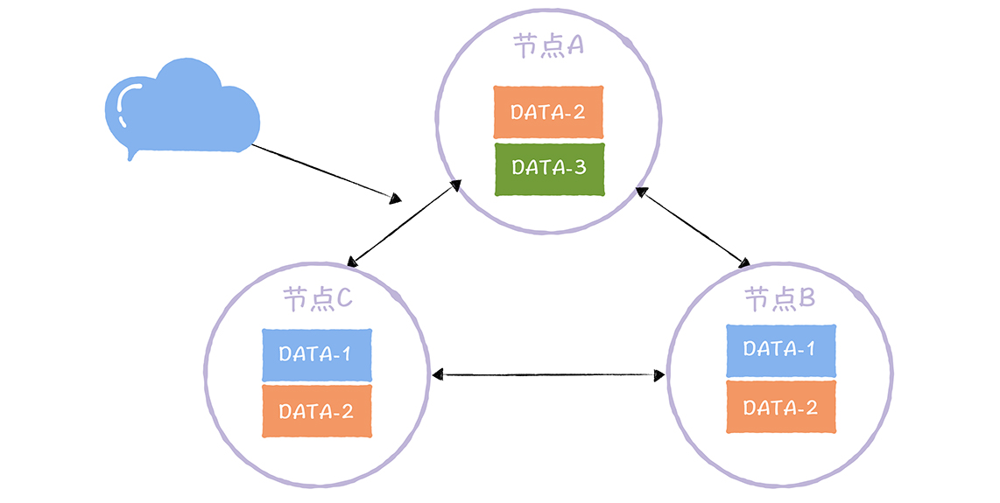

[TOC]

# Quorum NWR算法

**From 极客时间，韩健**

不知道你在工作中有没有遇到这样的事儿：你开发实现了一套 AP 型的分布式系统（我在04 讲提到了 AP 型系统的特点，你可以回顾一下），实现了最终一致性。业务也接入了，运行正常，一起看起来都那么美好。

可是，突然有同事说，我们要拉这几个业务的数据做实时分析，希望数据写入成功后，就能立即读取到新数据，也就是要实现强一致性（Werner Vogels 提出的客户端侧一致性模型，不是指线性一致性），数据更改后，要保证用户能立即查询到。这时你该怎么办呢？首先你要明确最终一致性和强一致性有什么区别。

- **强一致性**能保证写操作完成后，任何后续访问都能读到更新后的值；

- **最终一致性**只能保证如果对某个对象没有新的写操作了，最终所有后续访问都能读到相同的最近更新的值。也就是说，写操作完成后，后续访问可能会读到旧数据。

其实，在我看来，为了一个临时的需求，我们重新开发一套系统，或者迁移数据到新系统，肯定是不合适的。因为工作量比较大，而且耗时也长，而我建议你通过 Quorum NWR 解决这个问题。

也就是说，在原有系统上开发实现一个新功能，就可以满足业务同学的需求了。因为通过 Quorum NWR，你可以自定义一致性级别，通过临时调整写入或者查询的方式，当 W + R > N 时，就可以实现强一致性了。

其实，在 AP 型分布式系统中（比如 Dynamo、Cassandra、InfluxDB 企业版的 DATA 节点集群），Quorum NWR 是通常都会实现的一个功能，很常用。对你来说，掌握 Quorum NWR，不仅是掌握一种常用的实现一致性的方法，更重要的是，后续用户可以根据业务的特点，灵活地指定一致性级别。

为了帮你掌握 Quorum NWR，除了带你了解它的原理外，我还会以 InfluxDB 企业版的实现为例，带你看一下它在实际场景中的实现，这样你可以在理解原理的基础上，掌握 Quorum NWR 的实战技巧。

首先，你需要了解 Quorum NWR 中的三个要素，N、W、R。因为它们是 Quorum NWR 的核心内容，我们就是通过组合这三个要素，实现自定义一致性级别的。

## 1. Quorum NWR 的三要素

**N 表示副本数**，又叫做复制因子（Replication Factor）。也就是说，**N 表示集群中同一份数据有多少个副本**，就像下图的样子：

图1：

从图中你可以看到，在这个三节点的集群中，DATA-1 有 2 个副本，DATA-2 有 3 个副本，DATA-3 有 1 个副本。也就是说，副本数可以不等于节点数，不同的数据可以有不同的副本数。

需要你注意的是，在实现 Quorum NWR 的时候，你需要实现自定义副本的功能。也就是说，用户可以自定义指定数据的副本数，比如，用户可以指定 DATA-1 具有 2 个副本，DATA-2 具有 3 个副本，就像图中的样子。

当我们指定了副本后，就可以对副本数据进行读写操作了。那么这么多副本，你要如何执行读写操作呢？先来看一看写操作，也就是 W。

**W，又称写一致性级别**（Write Consistency Level），**表示成功完成 W 个副本更新，才完成写操作**：

图2：

从图中你可以看到，DATA-2 的写副本数为 2，也就说，对 DATA-2 执行写操作时，完成了 2 个副本的更新（比如节点 A、C），才完成写操作。

那么有的同学会问了，DATA-2 有 3 个数据副本，完成了 2 副本的更新，就完成了写操作，那么如何实现强一致性呢？如果读到了第三个数据副本（比如节点 B），不就可能无法读到更新后的值了吗？别急，我讲完如何执行读操作后，你就明白了。

**R，又称读一致性级别**（Read Consistency Level），**表示读取一个数据对象时需要读 R 个副本**。你可以这么理解，读取指定数据时，要读 R 副本，然后返回 R 个副本中最新的那份数据：

图3：

从图中你可以看到，DATA-2 的读副本数为 2。也就是说，客户端读取 DATA-2 的数据时，需要读取 2 个副本中的数据，然后返回最新的那份数据。

这里需要你注意的是，无论客户端如何执行读操作，哪怕它访问的是写操作未强制更新副本数据的节点（比如节点 B），但因为 W(2) + R(2) > N(3)，也就是说，访问节点 B，执行读操作时，因为要读 2 份数据副本，所以除了节点 B 上的 DATA-2，还会读取节点 A 或节点 C 上的 DATA-2，就像上图的样子（比如节点 C 上的 DATA-2），而节点 A 和节点 C 的 DATA-2 数据副本是强制更新成功的。这个时候，返回给客户端肯定是最新的那份数据。

你看，通过设置 R 为 2，即使读到前面问题中的第三份副本数据（比如节点 B），也能返回更新后的那份数据，实现强一致性了。

除此之外，关于 NWR 需要你注意的是，N、W、R 值的不同组合，会产生不同的一致性效果，具体来说，有这么两种效果：

- 当 W + R > N 的时候，对于客户端来讲，整个系统能保证强一致性，一定能返回更新后的那份数据。

- 当 W + R <= N 的时候，对于客户端来讲，整个系统只能保证最终一致性，可能会返回旧数据。

你可以看到，Quorum NWR 的原理并不复杂，也相对比较容易理解，但在这里，我想强调一下，掌握它的关键在于如何根据不同的场景特点灵活地实现 Quorum NWR，所以接下来，我带你具体问题具体分析，以 InfluxDB 企业版为例讲解一下。

## 2. 如何实现 Quorum NWR

在 InfluxDB 企业版中，可以在创建保留策略时，设置指定数据库（Database）对应的副本数，具体的命令，就像下面的样子：

- create retention policy “rp_one_day” on “telegraf” duration 1d replication 3

通过 replication 参数，指定了数据库 telegraf 对应的副本数为 3。

需要你注意的，在 InfluxDB 企业版中，副本数不能超过节点数据。你可以这么理解，多副本的意义在于冗余备份，如果副本数超过节点数，就意味着在一个节点上会存在多个副本，那么这时冗余备份的意义就不大了。比如机器故障时，节点上的多个副本是同时被影响的。

InfluxDB 企业版，支持“any、one、quorum、all”4 种写一致性级别，具体的含义是这样的。

- any：任何一个节点写入成功后，或者接收节点已将数据写入 Hinted-handoff 缓存（也就是写其他节点失败后，本地节点上缓存写失败数据的队列）后，就会返回成功给客户端。

- one：任何一个节点写入成功后，立即返回成功给客户端，不包括成功写入到 Hinted-handoff 缓存。

- quorum：当大多数节点写入成功后，就会返回成功给客户端。此选项仅在副本数大于 2 时才有意义，否则等效于 all。

- all：仅在所有节点都写入成功后，返回成功。

我想强调一下，对时序数据库而言，读操作常会拉取大量数据，查询性能是挑战，是必须要考虑优化的，因此，在 InfluxDB 企业版中，不支持读一致性级别，只支持写一致性级别。另外，我们可以通过设置写一致性级别为 all，来实现强一致性。

你看，如果我们像 InfluxDB 企业版这样，实现了 Quorum NWR，那么在业务临时需要实现强一致性时，就可以通过设置写一致性级别为 all，来实现了。

## 3. 内容小结

以上就是本节课的全部内容了，本节课我主要带你了解了 Quorum NWR 的原理、InfluxDB 企业版的 Quorum NWR 实现。我希望你明确这样几个重点。

1. 一般而言，不推荐副本数超过当前的节点数，因为当副本数据超过节点数时，就会出现同一个节点存在多个副本的情况。当这个节点故障时，上面的多个副本就都受到影响了。

2. 当 W + R > N 时，可以实现强一致性。另外，如何设置 N、W、R 值，取决于我们想优化哪方面的性能。比如，N 决定了副本的冗余备份能力；如果设置 W = N，读性能比较好；如果设置 R = N，写性能比较好；如果设置 W = (N + 1) / 2、R = (N + 1) / 2，容错能力比较好，能容忍少数节点（也就是 (N - 1) / 2）的故障。

最后，我想说的是，Quorum NWR 是非常实用的一个算法，能有效弥补 AP 型系统缺乏强一致性的痛点，给业务提供了按需选择一致性级别的灵活度，建议你的开发实现 AP 型系统时，也实现 Quorum NWR。

## 4. 思考

我提到实现 Quorum NWR 时，需要实现自定义副本的能力，那么，一般设置几个副本就可以了，为什么呢？
