[TOC]

# Raft算法

通过前两节课，我带你打卡了 Paxos 算法，今天我想和你聊聊最常用的共识算法，Raft 算法。

**Raft 算法属于 Multi-Paxos 算法**，它是在兰伯特 Multi-Paxos 思想的基础上，做了一些简化和限制，比如增加了日志必须是连续的，只支持领导者、跟随者和候选人三种状态，在理解和算法实现上都相对容易许多。

**除此之外，Raft 算法是现在分布式系统开发首选的共识算法**。绝大多数选用 Paxos 算法的系统（比如 Cubby、Spanner）都是在 Raft 算法发布前开发的，当时没得选；而全新的系统大多选择了 Raft 算法（比如 Etcd、Consul、CockroachDB）。

对你来说，掌握这个算法，可以得心应手地处理绝大部分场景的容错和一致性需求，比如分布式配置系统、分布式 NoSQL 存储等等，轻松突破系统的单机限制。

如果要用一句话概括 Raft 算法，我觉得是这样的：**从本质上说，Raft 算法是通过一切以领导者为准的方式，实现一系列值的共识和各节点日志的一致**。这句话比较抽象，我来做个比喻，领导者就是 Raft 算法中的霸道总裁，通过霸道的“一切以我为准”的方式，决定了日志中命令的值，也实现了各节点日志的一致。

我会用三讲的时间，分别以**领导者选举**、**日志复制**、**成员变更**为核心，讲解 Raft 算法的原理，在实战篇中，会带你进一步剖析 Raft 算法的实现，介绍基于 Raft 算法的分布式系统开发实战。那么我希望从原理到实战，在帮助你掌握分布式系统架构设计技巧和开发实战能力的同时，加深你对 Raft 算法的理解。

## 1. 如何选举领导者

### 1.1 从问题开始

在课程开始之前，我们先来看一道思考题。

假设我们有一个由节点 A、B、C 组成的 Raft 集群（如图所示），因为 Raft 算法一切以领导者为准，所以如果集群中出现了多个领导者，就会出现不知道谁来做主的问题。在这样一个有多个节点的集群中，在节点故障、分区错误等异常情况下，Raft 算法如何保证在同一个时间，集群中只有一个领导者呢？带着这个问题，我们正式进入今天的学习。

图1：
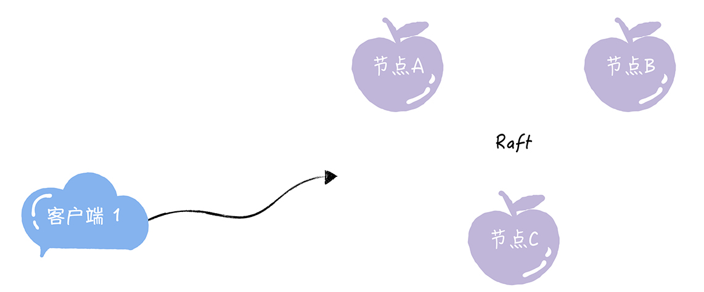

既然要选举领导者，那要从哪些成员中选举呢？除了领导者，Raft 算法还支持哪些成员身份呢？这部分内容是你需要掌握的，最基础的背景知识。

### 1.2 有哪些成员身份

成员身份，又叫做服务器节点状态，Raft 算法支持领导者（Leader）、跟随者（Follower）和候选人（Candidate） 3 种状态。为了方便讲解，我们使用不同的图形表示不同的状态。在任何时候，每一个服务器节点都处于这 3 个状态中的 1 个。

图2：


- 跟随者：就相当于普通群众，默默地接收和处理来自领导者的消息，当等待领导者心跳信息超时的时候，就主动站出来，推荐自己当候选人。

- 候选人：候选人将向其他节点发送请求投票（RequestVote）RPC 消息，通知其他节点来投票，如果赢得了大多数选票，就晋升当领导者。

- 领导者：蛮不讲理的霸道总裁，一切以我为准，平常的主要工作内容就是 3 部分，处理写请求、管理日志复制和不断地发送心跳信息，通知其他节点“我是领导者，我还活着，你们现在不要发起新的选举，找个新领导者来替代我。”

**需要你注意的是，Raft 算法是强领导者模型，集群中只能有一个“霸道总裁”。**

### 1.3 选举领导者的过程

那么这三个成员是怎么选出来领导者的呢？为了方便你理解，我以图例的形式演示一个典型的领导者选举过程。

首先，在初始状态下，集群中所有的节点都是跟随者的状态。

图3：
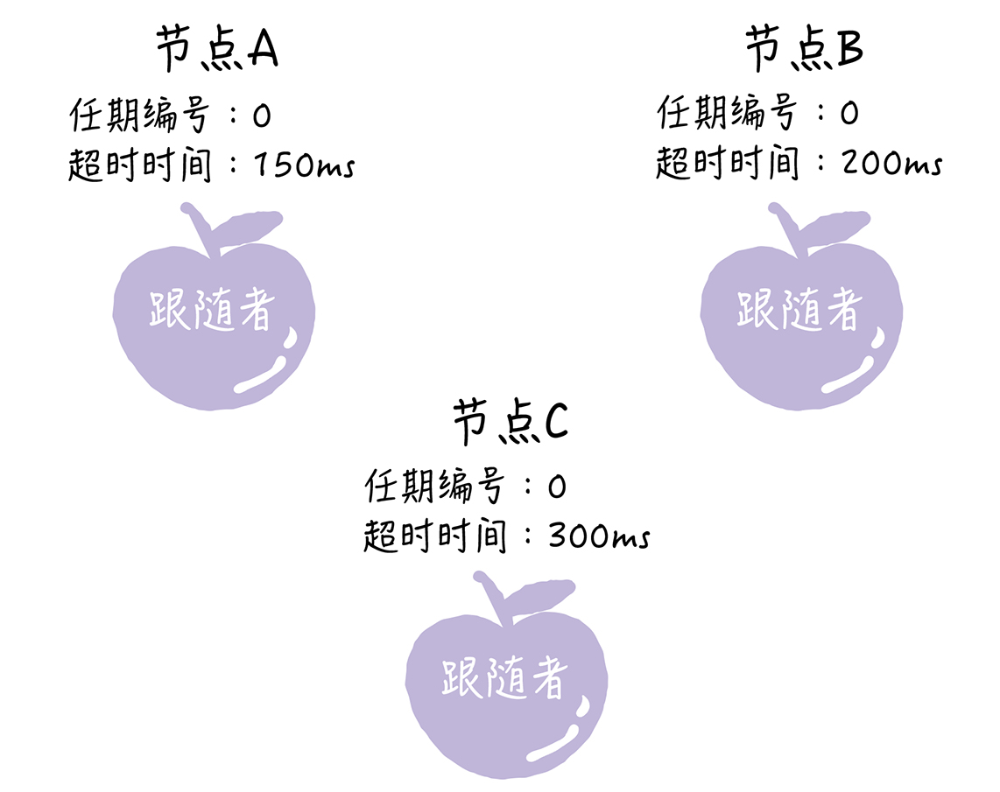

Raft 算法实现了随机超时时间的特性。也就是说，每个节点等待领导者节点心跳信息的超时时间间隔是随机的。通过上面的图片你可以看到，集群中没有领导者，而节点 A 的等待超时时间最小（150ms），它会最先因为没有等到领导者的心跳信息，发生超时。

这个时候，节点 A 就增加自己的任期编号，并推举自己为候选人，先给自己投上一张选票，然后向其他节点发送请求投票 RPC 消息，请它们选举自己为领导者。

图4：
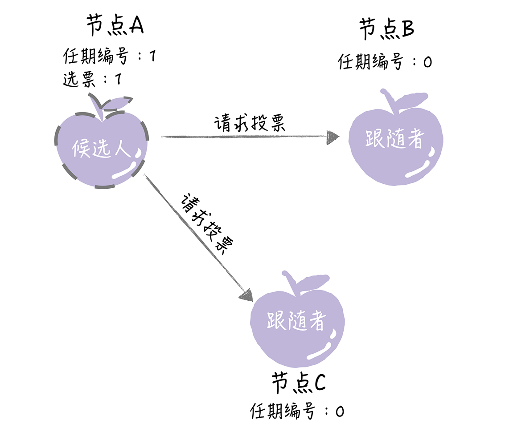

如果其他节点接收到候选人 A 的请求投票 RPC 消息，在编号为 1 的这届任期内，也还没有进行过投票，那么它将把选票投给节点 A，并增加自己的任期编号。

图5：
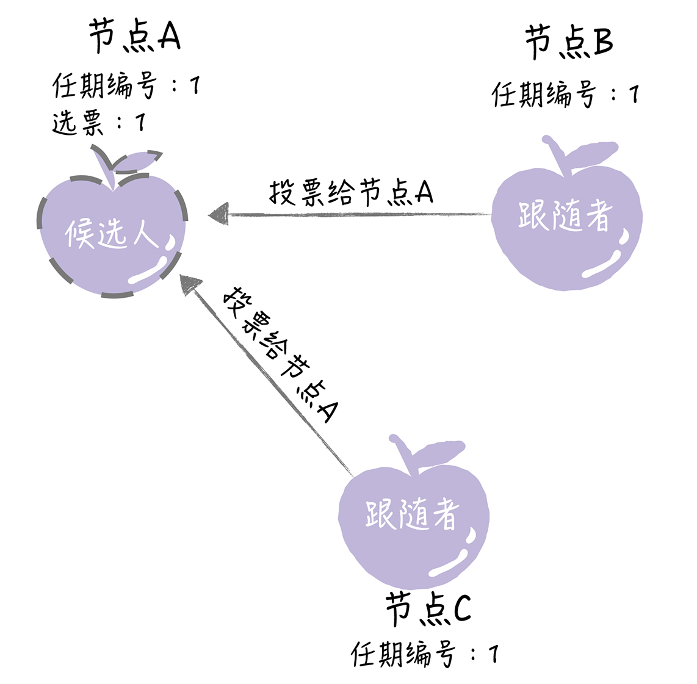

如果候选人在选举超时时间内赢得了大多数的选票，那么它就会成为本届任期内新的领导者。

图6：
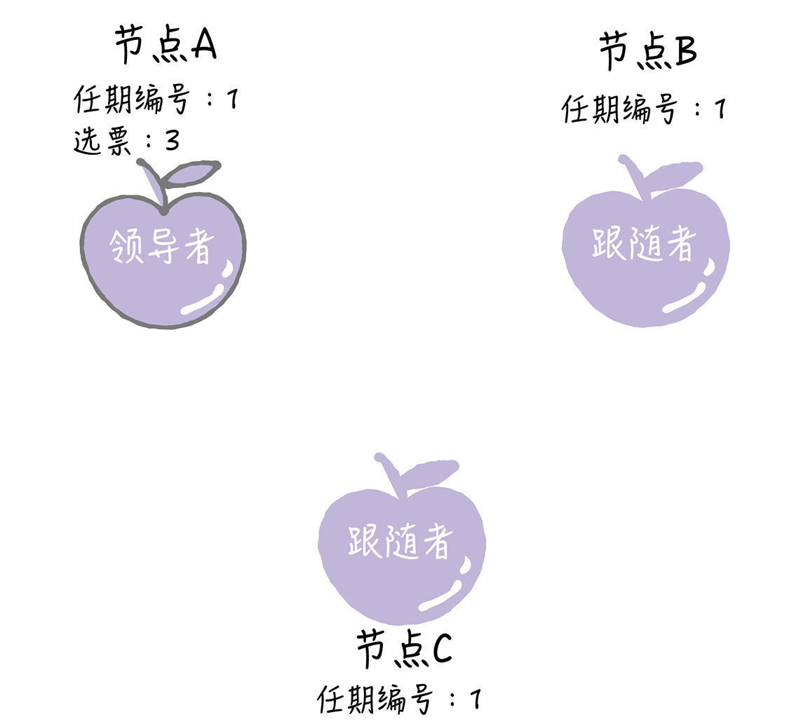

节点 A 当选领导者后，他将周期性地发送心跳消息，通知其他服务器我是领导者，阻止跟随者发起新的选举，篡权。

图7：
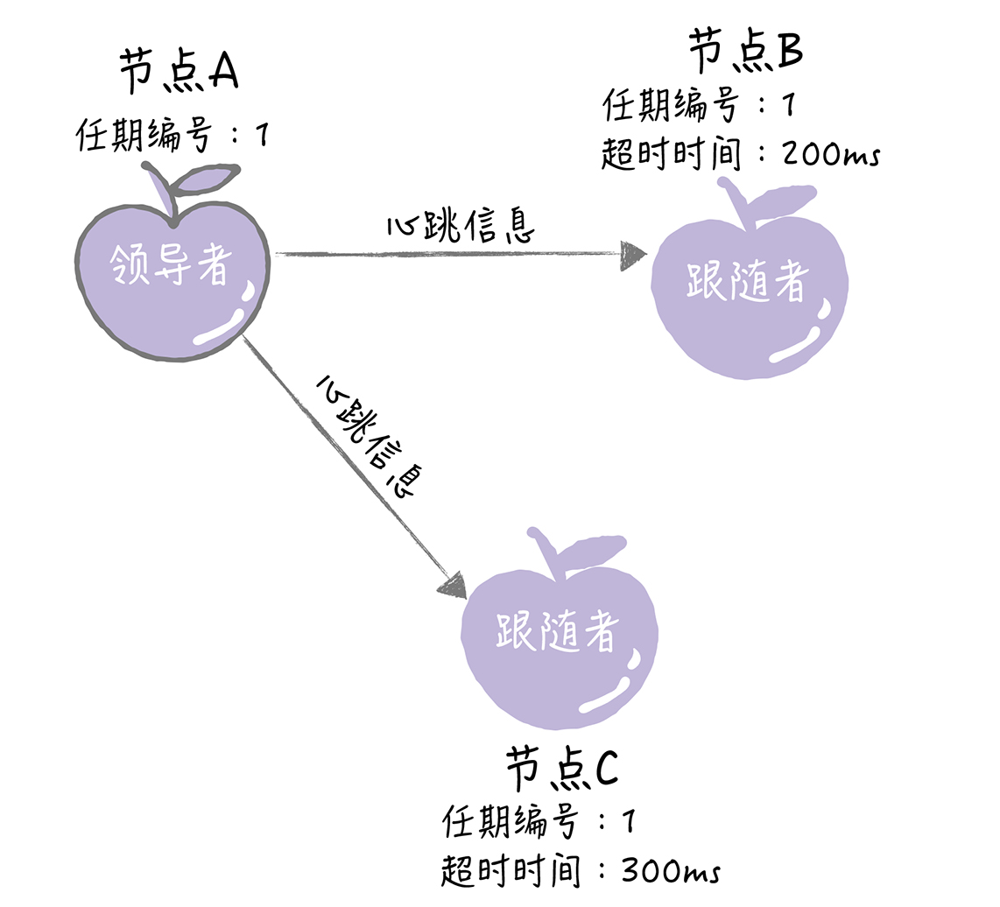

讲到这儿，你是不是发现领导者选举很容易理解？与现实中的议会选举也蛮类似？当然，你可能还是对一些细节产生一些疑问：

- 节点间是如何通讯的呢？
- 什么是任期呢？
- 选举有哪些规则？
- 随机超时时间又是什么？

### 1.4 选举过程四连问

老话说，细节是魔鬼。这些细节也是很多同学在学习 Raft 算法的时候比较难掌握的，所以我认为有必要具体分析一下。咱们一步步来，先来看第一个问题。

#### 1.4.1 节点间如何通讯

在 Raft 算法中，服务器节点间的沟通联络采用的是远程过程调用（RPC），在领导者选举中，需要用到这样两类的 RPC：

1. 请求投票（RequestVote）RPC，是由候选人在选举期间发起，通知各节点进行投票；
2. 日志复制（AppendEntries）RPC，是由领导者发起，用来复制日志和提供心跳消息。

我想强调的是，**日志复制 RPC 只能由领导者发起**，这是实现强领导者模型的关键之一，希望你能注意这一点，后续能更好地理解日志复制，理解日志的一致是怎么实现的。

#### 1.4.2 什么是任期

我们知道，议会选举中的领导者是有任期的，领导者任命到期后，要重新开会再次选举。Raft 算法中的领导者也是有任期的，每个任期由单调递增的数字（任期编号）标识，比如节点 A 的任期编号是 1。任期编号是随着选举的举行而变化的，这是在说下面几点。

1. 跟随者在等待领导者心跳信息超时后，推举自己为候选人时，会增加自己的任期号，比如节点 A 的当前任期编号为 0，那么在推举自己为候选人时，会将自己的任期编号增加为 1。

2. 如果一个服务器节点，发现自己的任期编号比其他节点小，那么它会更新自己的编号到较大的编号值。比如节点 B 的任期编号是 0，当收到来自节点 A 的请求投票 RPC 消息时，因为消息中包含了节点 A 的任期编号，且编号为 1，那么节点 B 将把自己的任期编号更新为 1。

我想强调的是，与现实议会选举中的领导者的任期不同，**Raft 算法中的任期不只是时间段，而且任期编号的大小，会影响领导者选举和请求的处理**。

1. 在 Raft 算法中约定，如果一个候选人或者领导者，发现自己的任期编号比其他节点小，那么它会立即恢复成跟随者状态。比如分区错误恢复后，任期编号为 3 的领导者节点 B，收到来自新领导者的，包含任期编号为 4 的心跳消息，那么节点 B 将立即恢复成跟随者状态。

2. 还约定如果一个节点接收到一个包含较小的任期编号值的请求，那么它会直接拒绝这个请求。比如节点 C 的任期编号为 4，收到包含任期编号为 3 的请求投票 RPC 消息，那么它将拒绝这个消息。

在这里，你可以看到，Raft 算法中的任期比议会选举中的任期要复杂。同样，在 Raft 算法中，选举规则的内容也会比较多。

#### 1.4.3 选举有哪些规则

在议会选举中，比成员的身份、领导者的任期还要重要的就是选举的规则，比如一人一票、弹劾制度等。“无规矩不成方圆”，在 Raft 算法中，也约定了选举规则，主要有这样几点。

1. 领导者周期性地向所有跟随者发送心跳消息（即不包含日志项的日志复制 RPC 消息），通知大家我是领导者，阻止跟随者发起新的选举。

2. 如果在指定时间内，跟随者没有接收到来自领导者的消息，那么它就认为当前没有领导者，推举自己为候选人，发起领导者选举。

3. 在一次选举中，赢得大多数选票的候选人，将晋升为领导者。

4. 在一个任期内，领导者一直都会是领导者，直到它自身出现问题（比如宕机），或者因为网络延迟，其他节点发起一轮新的选举。

5. 在一次选举中，每一个服务器节点**最多会对一个任期编号投出一张选票**，并且按照“先来先服务”的原则进行投票。比如节点 C 的任期编号为 3，先收到了 1 个包含任期编号为 4 的投票请求（来自节点 A），然后又收到了 1 个包含任期编号为 4 的投票请求（来自节点 B）。那么节点 C 将会把唯一一张选票投给节点 A，当再收到节点 B 的投票请求 RPC 消息时，对于编号为 4 的任期，已没有选票可投了。

图8：
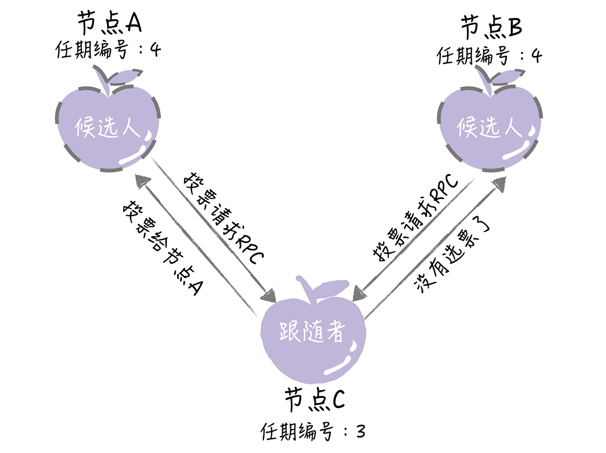

6. 日志完整性高的跟随者（也就是最后一条日志项对应的任期编号值更大，索引号更大），拒绝投票给日志完整性低的候选人。比如节点 B 的任期编号为 3，节点 C 的任期编号是 4，节点 B 的最后一条日志项对应的任期编号为 3，而节点 C 为 2，那么当节点 C 请求节点 B 投票给自己时，节点 B 将拒绝投票。

图9：
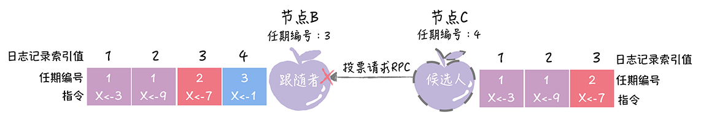

我想强调的是，选举是跟随者发起的，推举自己为候选人；大多数选票是指集群成员半数以上的选票；大多数选票规则的目标，是为了保证在一个给定的任期内最多只有一个领导者。

其实在选举中，除了选举规则外，我们还需要避免一些会导致选举失败的情况，比如同一任期内，多个候选人同时发起选举，导致选票被瓜分，选举失败。那么在 Raft 算法中，如何避免这个问题呢？答案就是**随机超时时间**。

#### 1.4.4 如何理解随机超时时间

在议会选举中，常出现未达到指定票数，选举无效，需要重新选举的情况。在 Raft 算法的选举中，也存在类似的问题，那它是如何处理选举无效的问题呢？

其实，Raft 算法巧妙地使用随机选举超时时间的方法，把超时时间都分散开来，在大多数情况下只有一个服务器节点先发起选举，而不是同时发起选举，这样就能减少因选票瓜分导致选举失败的情况。

我想强调的是，**在 Raft 算法中，随机超时时间是有 2 种含义的，这里是很多同学容易理解出错的地方，需要你注意一下**：

1. 跟随者等待领导者心跳信息超时的时间间隔，是随机的；

2. 如果候选人在一个随机时间间隔内，没有赢得过半票数，那么选举无效了，然后候选人发起新一轮的选举，也就是说，等待选举超时的时间间隔，是随机的。

### 1.5 小结

以上就是本节课的全部内容了，本节课我主要带你了解了 Raft 算法的特点、领导者选举等。我希望你明确这样几个重点。

1. Raft 算法和兰伯特的 Multi-Paxos 不同之处，主要有 2 点。首先，在 Raft 中，不是所有节点都能当选领导者，只有日志较完整的节点（也就是日志完整度不比半数节点低的节点），才能当选领导者；其次，在 Raft 中，日志必须是连续的。

2. Raft 算法通过任期、领导者心跳消息、随机选举超时时间、先来先服务的投票原则、大多数选票原则等，保证了一个任期只有一位领导，也极大地减少了选举失败的情况。

3. 本质上，Raft 算法以领导者为中心，选举出的领导者，以“一切以我为准”的方式，达成值的共识，和实现各节点日志的一致。

在本讲，我们使用 Raft 算法在集群中选出了领导者节点 A，那么选完领导者之后，领导者需要处理来自客户的写请求，并通过日志复制实现各节点日志的一致（下节课我会重点带你了解这一部分内容）。

### 1.6 思考

既然我提到，Raft 算法实现了“一切以我为准”的强领导者模型，那么你不妨思考，这个设计有什么限制和局限呢？

## 2. 如何复制日志

通过上一讲的学习，你应该知道 Raft 除了能实现一系列值的共识之外，还能实现各节点日志的一致，不过你也许会有这样的疑惑：“什么是日志呢？它和我的业务数据有什么关系呢？”

想象一下，一个木筏（Raft）是由多根整齐一致的原木（Log）组成的，而原木又是由木质材料组成，所以你可以认为日志是由多条日志项（Log entry）组成的，如果把日志比喻成原木，那么日志项就是木质材料。

在 Raft 算法中，副本数据是以日志的形式存在的，领导者接收到来自客户端写请求后，处理写请求的过程就是一个复制和应用（Apply）日志项到状态机的过程。

那 Raft 是如何复制日志的呢？又如何实现日志的一致的呢？这些内容是 Raft 中非常核心的内容，也是我今天讲解的重点，我希望你不懂就问，多在留言区提出你的想法。首先，咱们先来理解日志，这是你掌握如何复制日志、实现日志一致的基础。

### 2.1 如何理解日志

刚刚我提到，副本数据是以日志的形式存在的，日志是由日志项组成，日志项究竟是什么样子呢？

其实，日志项是一种数据格式，它主要包含用户指定的数据，也就是指令（Command），还包含一些附加信息，比如索引值（Log index）、任期编号（Term）。那你该怎么理解这些信息呢？

图10：
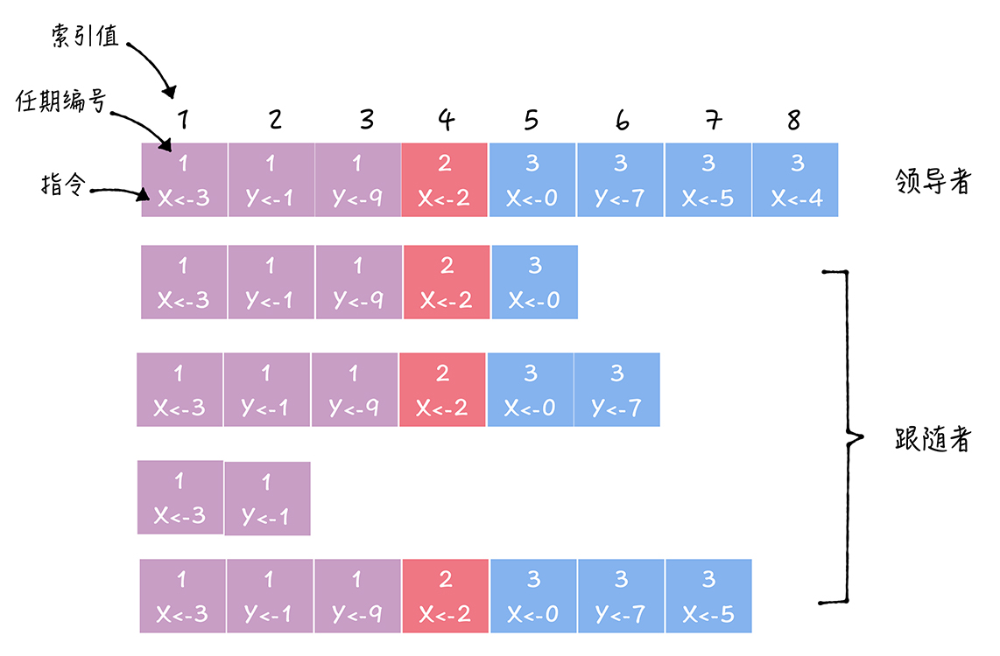

- 指令：一条由客户端请求指定的、状态机需要执行的指令。你可以将指令理解成客户端指定的数据。

- 日志项对应的整数索引值。它其实就是用来标识日志项的，是一个连续的、单调递增的整数号码。

- 任期编号：创建这条日志项的领导者的任期编号。

从图中你可以看到，一届领导者任期，往往有多条日志项。而且日志项的索引值是连续的，这一点你需要注意。

讲到这儿你可能会问：不是说 Raft 实现了各节点间日志的一致吗？那为什么图中 4 个跟随者的日志都不一样呢？日志是怎么复制的呢？又该如何实现日志的一致呢？别着急，接下来咱们就来解决这几个问题。先来说说如何复制日志。

### 2.2 如何复制日志

你可以把 Raft 的日志复制理解成一个优化后的二阶段提交（将二阶段优化成了一阶段），减少了一半的往返消息，也就是降低了一半的消息延迟。那日志复制的具体过程是什么呢？

首先，领导者进入第一阶段，通过日志复制（AppendEntries）RPC 消息，将日志项复制到集群其他节点上。

接着，如果领导者接收到大多数的“复制成功”响应后，它将日志项应用到它的状态机，并返回成功给客户端。如果领导者没有接收到大多数的“复制成功”响应，那么就返回错误给客户端。

学到这里，有同学可能有这样的疑问了，领导者将日志项应用到它的状态机，怎么没通知跟随者应用日志项呢？

这是 Raft 中的一个优化，领导者不直接发送消息通知其他节点应用指定日志项。因为领导者的日志复制 RPC 消息或心跳消息，包含了当前最大的，将会被提交（Commit）的日志项索引值。所以通过日志复制 RPC 消息或心跳消息，跟随者就可以知道领导者的日志提交位置信息。

因此，当其他节点接受领导者的心跳消息，或者新的日志复制 RPC 消息后，就会将这条日志项应用到它的状态机。而这个优化，降低了处理客户端请求的延迟，将二阶段提交优化为了一段提交，降低了一半的消息延迟。

为了帮你理解，我画了一张过程图，然后再带你走一遍这个过程，这样你可以更加全面地掌握日志复制。

图11：
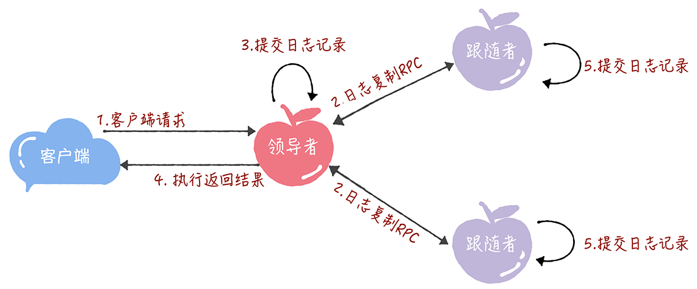

1. 接收到客户端请求后，领导者基于客户端请求中的指令，创建一个新日志项，并附加到本地日志中。

2. 领导者通过日志复制 RPC，将新的日志项复制到其他的服务器。

3. 当领导者将日志项，成功复制到大多数的服务器上的时候，领导者会将这条日志项应用到它的状态机中。

4. 领导者将执行的结果返回给客户端。

5. 当跟随者接收到心跳信息，或者新的日志复制 RPC 消息后，如果跟随者发现领导者已经提交了某条日志项，而它还没应用，那么跟随者就将这条日志项应用到本地的状态机中。

不过，这是一个理想状态下的日志复制过程。在实际环境中，复制日志的时候，你可能会遇到进程崩溃、服务器宕机等问题，这些问题会导致日志不一致。那么在这种情况下，Raft 算法是如何处理不一致日志，实现日志的一致的呢？

### 2.3 如何实现日志的一致

在 Raft 算法中，领导者通过强制跟随者直接复制自己的日志项，处理不一致日志。也就是说，Raft 是通过以领导者的日志为准，来实现各节点日志的一致的。具体有 2 个步骤。

- 首先，领导者通过日志复制 RPC 的一致性检查，找到跟随者节点上，与自己相同日志项的最大索引值。也就是说，这个索引值之前的日志，领导者和跟随者是一致的，之后的日志是不一致的了。

- 然后，领导者强制跟随者更新覆盖的不一致日志项，实现日志的一致。

我带你详细地走一遍这个过程（为了方便演示，我们引入 2 个新变量）。

- PrevLogEntry：表示当前要复制的日志项，前面一条日志项的索引值。比如在图中，如果领导者将索引值为 8 的日志项发送给跟随者，那么此时 PrevLogEntry 值为 7。

- PrevLogTerm：表示当前要复制的日志项，前面一条日志项的任期编号，比如在图中，如果领导者将索引值为 8 的日志项发送给跟随者，那么此时 PrevLogTerm 值为 4。

图12：
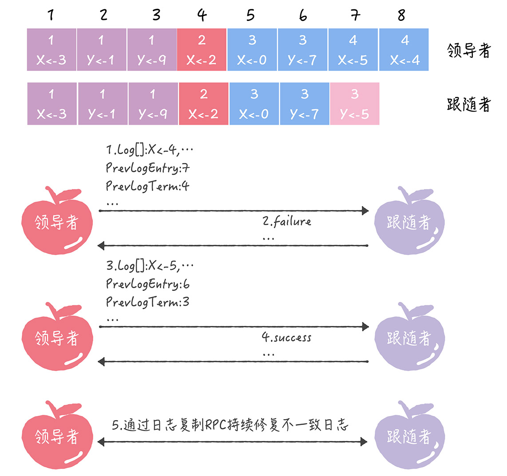

1. 领导者通过日志复制 RPC 消息，发送当前最新日志项到跟随者（为了演示方便，假设当前需要复制的日志项是最新的），这个消息的 PrevLogEntry 值为 7，PrevLogTerm 值为 4。

2. 如果跟随者在它的日志中，找不到与 PrevLogEntry 值为 7、PrevLogTerm 值为 4 的日志项，也就是说它的日志和领导者的不一致了，那么跟随者就会拒绝接收新的日志项，并返回失败信息给领导者。

3. 这时，领导者会递减要复制的日志项的索引值，并发送新的日志项到跟随者，这个消息的 PrevLogEntry 值为 6，PrevLogTerm 值为 3。

4. 如果跟随者在它的日志中，找到了 PrevLogEntry 值为 6、PrevLogTerm 值为 3 的日志项，那么日志复制 RPC 返回成功，这样一来，领导者就知道在 PrevLogEntry 值为 6、PrevLogTerm 值为 3 的位置，跟随者的日志项与自己相同。

5. 领导者通过日志复制 RPC，复制并更新覆盖该索引值之后的日志项（也就是不一致的日志项），最终实现了集群各节点日志的一致。

从上面步骤中你可以看到，领导者通过日志复制 RPC 一致性检查，找到跟随者节点上与自己相同日志项的最大索引值，然后复制并更新覆盖该索引值之后的日志项，实现了各节点日志的一致。需要你注意的是，跟随者中的不一致日志项会被领导者的日志覆盖，而且领导者从来不会覆盖或者删除自己的日志。

### 2.4 总结

本节课我主要带你了解了在 Raft 中什么是日志、如何复制日志、以及如何处理不一致日志等内容。我希望你明确这样几个重点。

- 在 Raft 中，副本数据是以日志的形式存在的，其中日志项中的指令表示用户指定的数据。

- 兰伯特的 Multi-Paxos 不要求日志是连续的，但在 Raft 中日志必须是连续的。而且在 Raft 中，日志不仅是数据的载体，日志的完整性还影响领导者选举的结果。也就是说，日志完整性最高的节点才能当选领导者。

- Raft 是通过以领导者的日志为准，来实现日志的一致的。

学完本节课你可以看到，值的共识和日志的一致都是由领导者决定的，领导者的唯一性很重要，那么如果我们需要对集群进行扩容或缩容，比如将 3 节点集群扩容为 5 节点集群，这时候是可能同时出现两个领导者的。这是为什么呢？在 Raft 中，又是如何解决这个问题的呢？我会在下一讲带你了解。

### 2.5 思考

我提到，领导者接收到大多数的“复制成功”响应后，就会将日志应用到它自己的状态机，然后返回“成功”响应客户端。如果此时有个节点不在“大多数”中，也就是说它接收日志项失败，那么在这种情况下，Raft 会如何处理实现日志的一致呢？

## 3. 如何解决成员变更的问题

在日常工作中，你可能会遇到服务器故障的情况，这时你就需要替换集群中的服务器。如果遇到需要改变数据副本数的情况，则需要增加或移除集群中的服务器。总的来说，在日常工作中，集群中的服务器数量是会发生变化的。

讲到这儿，也许你会问：“老韩，Raft 是共识算法，对集群成员进行变更时（比如增加 2 台服务器），会不会因为集群分裂，出现 2 个领导者呢？”

在我看来，的确会出现这个问题，因为 Raft 的领导者选举，建立在“大多数”的基础之上，那么当成员变更时，集群成员发生了变化，就可能同时存在新旧配置的 2 个“大多数”，出现 2 个领导者，破坏了 Raft 集群的领导者唯一性，影响了集群的运行。

而关于成员变更，不仅是 Raft 算法中比较难理解的一部分，非常重要，也是 Raft 算法中唯一被优化和改进的部分。比如，最初实现成员变更的是联合共识（Joint Consensus），但这个方法实现起来难，后来 Raft 的作者就提出了一种改进后的方法，单节点变更（single-server changes）。

为了帮你掌握这块内容，今天我除了带你了解成员变更问题的本质之外，还会讲一下如何通过单节点变更的方法，解决成员变更的问题。学完本讲内容之后，你不仅能理解成员变更的问题和单节点变更的原理，也能更好地理解 Raft 源码实现，掌握解决成员变更问题的方法。

在开始今天内容之前，我先介绍一下“配置”这个词儿。因为常听到有同学说，自己不理解配置（Configuration）的含义，从而不知道如何理解论文中的成员变更。

的确，配置是成员变更中一个非常重要的概念，我建议你这么理解：它就是在说集群是哪些节点组成的，是集群各节点地址信息的集合。比如节点 A、B、C 组成的集群，那么集群的配置就是[A, B, C]集合。

理解了这一点之后，咱们先来看一道思考题。

假设我们有一个由节点 A、B、C 组成的 Raft 集群，现在我们需要增加数据副本数，增加 2 个副本（也就是增加 2 台服务器），扩展为由节点 A、B、C、D、E， 5 个节点组成的新集群：

图13：
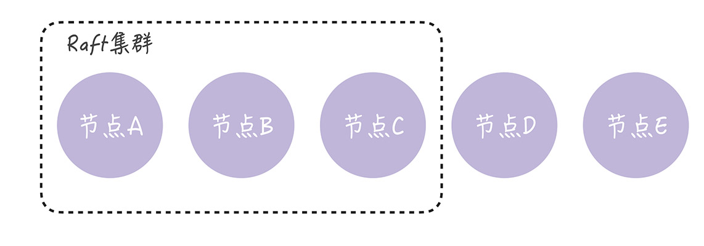

那么 Raft 算法是如何保障在集群配置变更时，集群能稳定运行，不出现 2 个领导者呢？带着这个问题，我们正式进入今天的学习。

那么 Raft 算法是如何保障在集群配置变更时，集群能稳定运行，不出现 2 个领导者呢？带着这个问题，我们正式进入今天的学习。

### 3.1 成员变更的问题

在我看来，在集群中进行成员变更的最大风险是，可能会同时出现 2 个领导者。比如在进行成员变更时，节点 A、B 和 C 之间发生了**分区错误**，节点 A、B 组成旧配置中的“大多数”，也就是变更前的 3 节点集群中的“大多数”，那么这时的领导者（节点 A）依旧是领导者。

另一方面，节点 C 和新节点 D、E 组成了新配置的“大多数”，也就是变更后的 5 节点集群中的“大多数”，它们可能会选举出新的领导者（比如节点 C）。那么这时，就出现了同时存在 2 个领导者的情况。

图14：
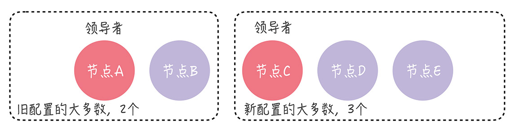

如果出现了 2 个领导者，那么就违背了“领导者的唯一性”的原则，进而影响到集群的稳定运行。你要如何解决这个问题呢？也许有的同学想到了一个解决方法。

因为我们在启动集群时，配置是固定的，不存在成员变更，在这种情况下，Raft 的领导者选举能保证只有一个领导者。也就是说，这时不会出现多个领导者的问题，那我可以先将集群关闭再启动新集群啊。也就是先把节点 A、B、C 组成的集群关闭，然后再启动节点 A、B、C、D、E 组成的新集群。

在我看来，这个方法不可行。 为什么呢？因为你每次变更都要重启集群，意味着在集群变更期间服务不可用，肯定不行啊，太影响用户体验了。想象一下，你正在玩王者荣耀，时不时弹出一个对话框通知你：系统升级，游戏暂停 3 分钟。这体验糟糕不糟糕？

既然这种方法影响用户体验，根本行不通，那到底怎样解决成员变更的问题呢？最常用的方法就是**单节点变更**。

### 3.2 如何通过单节点变更解决成员变更的问题

单节点变更，就是通过一次变更一个节点实现成员变更。如果需要变更多个节点，那你需要执行多次单节点变更。比如将 3 节点集群扩容为 5 节点集群，这时你需要执行 2 次单节点变更，先将 3 节点集群变更为 4 节点集群，然后再将 4 节点集群变更为 5 节点集群，就像下图的样子。

图15：
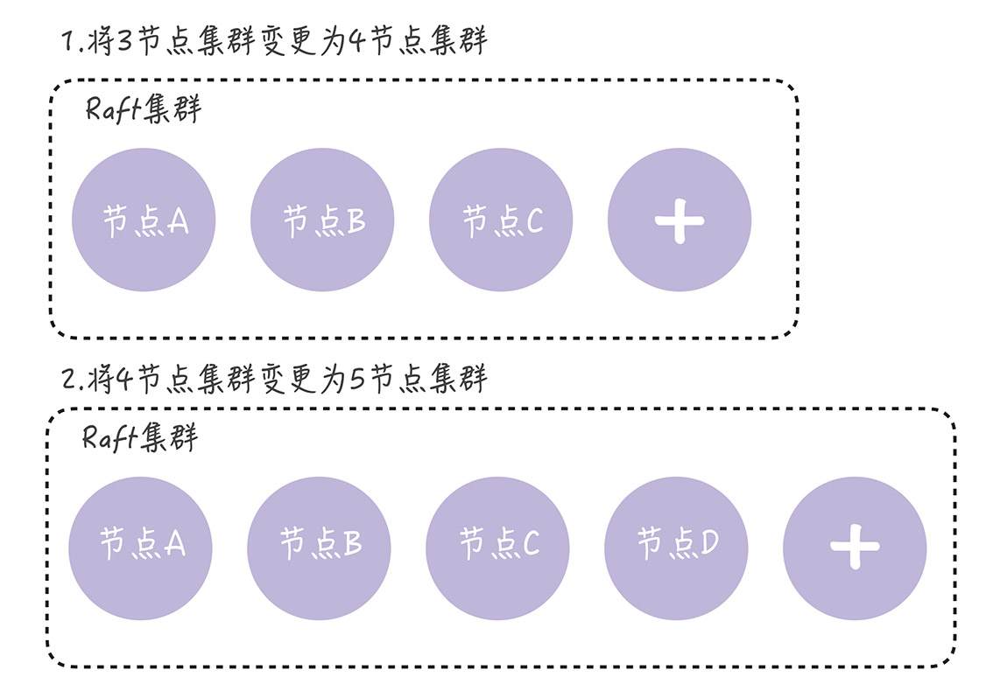

现在，让我们回到开篇的思考题，看看如何用单节点变更的方法，解决这个问题。为了演示方便，我们假设节点 A 是领导者：

图16：
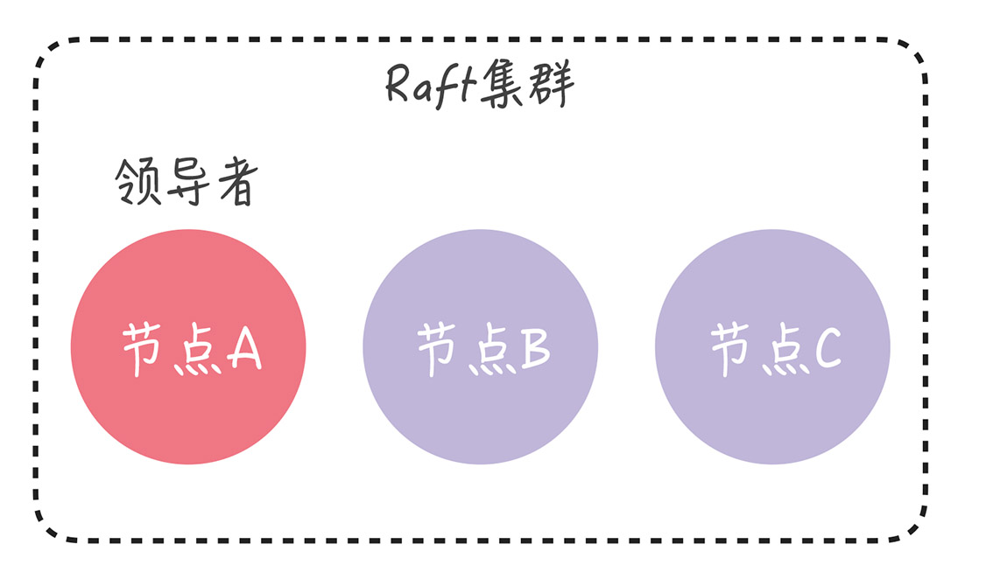

目前的集群配置为[A, B, C]，我们先向集群中加入节点 D，这意味着新配置为[A, B, C, D]。成员变更，是通过这么两步实现的：

- 第一步，领导者（节点 A）向新节点（节点 D）同步数据；

- 第二步，领导者（节点 A）将新配置[A, B, C, D]作为一个日志项，复制到新配置中所有节点（节点 A、B、C、D）上，然后将新配置的日志项应用（Apply）到本地状态机，完成单节点变更。

图17：
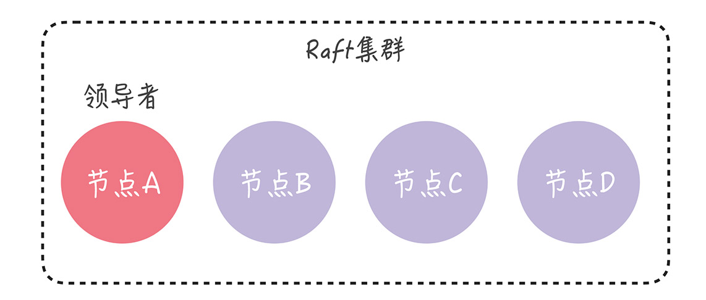

在变更完成后，现在的集群配置就是[A, B, C, D]，我们再向集群中加入节点 E，也就是说，新配置为[A, B, C, D, E]。成员变更的步骤和上面类似：

- 第一步，领导者（节点 A）向新节点（节点 E）同步数据；

- 第二步，领导者（节点 A）将新配置[A, B, C, D, E]作为一个日志项，复制到新配置中的所有节点（A、B、C、D、E）上，然后再将新配置的日志项应用到本地状态机，完成单节点变更。

图18：
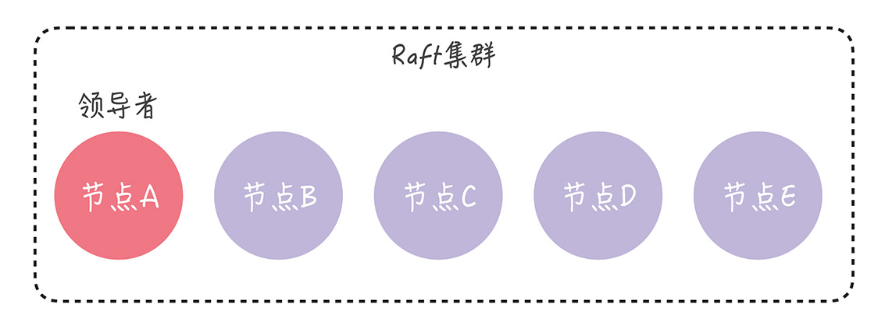

这样一来，我们就通过一次变更一个节点的方式，完成了成员变更，保证了集群中始终只有一个领导者，而且集群也在稳定运行，持续提供服务。

我想说的是，在正常情况下，不管旧的集群配置是怎么组成的，旧配置的“大多数”和新配置的“大多数”都会有一个节点是重叠的。 也就是说，不会同时存在旧配置和新配置 2 个“大多数”：

图19：
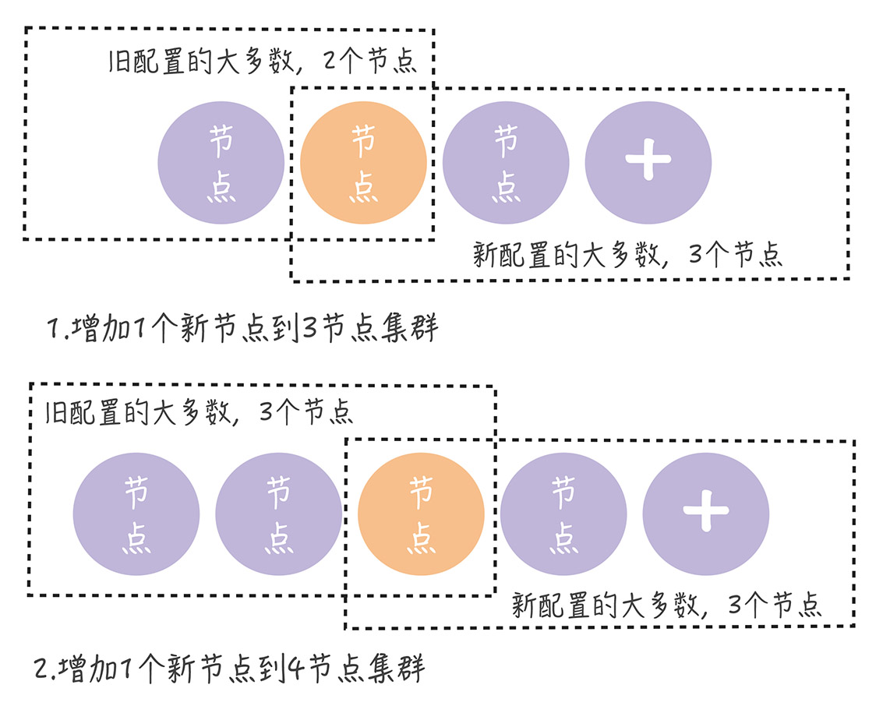
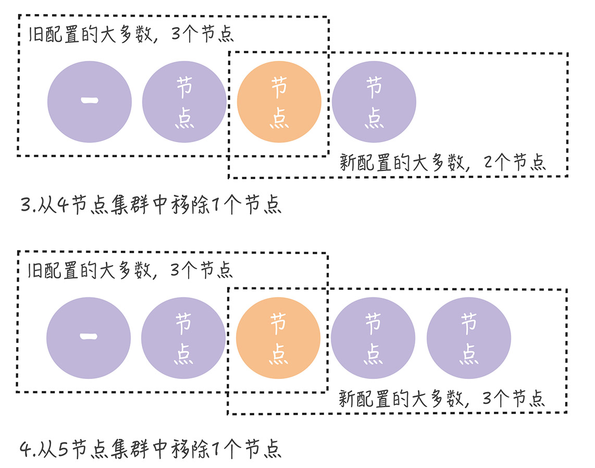

从上图中你可以看到，不管集群是偶数节点，还是奇数节点，不管是增加节点，还是移除节点，新旧配置的“大多数”都会存在重叠（图中的橙色节点）。

需要你注意的是，在分区错误、节点故障等情况下，如果我们并发执行单节点变更，那么就可能出现一次单节点变更尚未完成，新的单节点变更又在执行，导致集群出现 2 个领导者的情况。

如果你遇到这种情况，可以在领导者启动时，创建一个 NO_OP 日志项（也就是空日志项），只有当领导者将 NO_OP 日志项应用后，再执行成员变更请求。这个解决办法，你记住就可以了，可以自己在课后试着研究下。具体的实现，可参考 Hashicorp Raft 的源码，也就是 runLeader() 函数中：

```go
noop := &logFuture{
        log: Log{
               Type: LogNoop,
        },
}
r.dispatchLogs([]*logFuture{noop})
```

当然，有的同学会好奇“联合共识”，在我看来，因为它难以实现，很少被 Raft 实现采用。比如，除了 Logcabin 外，未见到其他常用 Raft 实现采用了它，所以这里我就不多说了。如果你有兴趣，可以自己去阅读论文，加深了解。

### 3.3 内容小结

以上就是本节课的全部内容了，本节课我主要带你了解了成员变更的问题和单节点变更的方法，我希望你明确这样几个重点。

1. 成员变更的问题，主要在于进行成员变更时，可能存在新旧配置的 2 个“大多数”，导致集群中同时出现两个领导者，破坏了 Raft 的领导者的唯一性原则，影响了集群的稳定运行。

2. 单节点变更是利用“一次变更一个节点，不会同时存在旧配置和新配置 2 个‘大多数’”的特性，实现成员变更。

3. 因为联合共识实现起来复杂，不好实现，所以绝大多数 Raft 算法的实现，采用的都是单节点变更的方法（比如 Etcd、Hashicorp Raft）。其中，Hashicorp Raft 单节点变更的实现，是由 Raft 算法的作者迭戈·安加罗（Diego Ongaro）设计的，很有参考价值。

除此之外，考虑到本节课是 Raft 算法的最后一讲，所以在这里，我想多说几句，帮助你更好地理解 Raft 算法。

**有很多同学把 Raft 当成一致性算法，其实 Raft 不是一致性算法而是共识算法，是一个 Multi-Paxos 算法**，实现的是如何就一系列值达成共识。并且，Raft 能容忍少数节点的故障。虽然 Raft 算法能实现强一致性，也就是线性一致性（Linearizability），但需要客户端协议的配合。在实际场景中，我们一般需要根据场景特点，在一致性强度和实现复杂度之间进行权衡。比如 Consul 实现了三种一致性模型。

- default：客户端访问领导者节点执行读操作，领导者确认自己处于稳定状态时（在 leader leasing 时间内），返回本地数据给客户端，否则返回错误给客户端。在这种情况下，客户端是可能读到旧数据的，比如此时发生了网络分区错误，新领导者已经更新过数据，但因为网络故障，旧领导者未更新数据也未退位，仍处于稳定状态。

- consistent：客户端访问领导者节点执行读操作，领导者在和大多数节点确认自己仍是领导者之后返回本地数据给客户端，否则返回错误给客户端。在这种情况下，客户端读到的都是最新数据。

- stale：从任意节点读数据，不局限于领导者节点，客户端可能会读到旧数据。

一般而言，在实际工程中，Consul 的 consistent 就够用了，可以不用线性一致性，只要能保证写操作完成后，每次读都能读到最新值就可以了。比如为了实现冥等操作，我们使用一个编号 (ID) 来唯一标记一个操作，并使用一个状态字段（nil/done）来标记操作是否已经执行，那么只要我们能保证设置了 ID 对应状态值为 done 后，能立即和一直读到最新状态值就可以了，也就通过防止操作的重复执行，实现了冥等性。

总的来说，Raft 算法能很好地处理绝大部分场景的一致性问题，我推荐你在设计分布式系统时，优先考虑 Raft 算法，当 Raft 算法不能满足现有场景需求时，再去调研其他共识算法。

比如我负责过多个 QQ 后台的海量服务分布式系统，其中配置中心、名字服务以及时序数据库的 META 节点，采用了 Raft 算法。在设计时序数据库的 DATA 节点一致性时，基于水平扩展、性能和数据完整性等考虑，就没采用 Raft 算法，而是采用了 Quorum NWR、失败重传、反熵等机制。这样安排不仅满足了业务的需求，还通过尽可能采用最终一致性方案的方式，实现系统的高性能，降低了成本。

### 3.4 思考

在最后，我给你留了一个思考题，强领导者模型会限制集群的写性能，那你想想看，有什么办法能突破 Raft 集群的写性能瓶颈呢？
