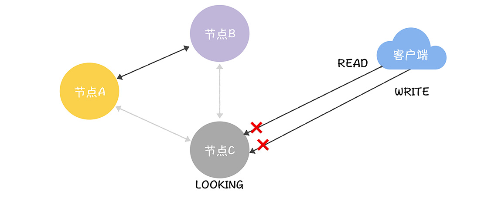
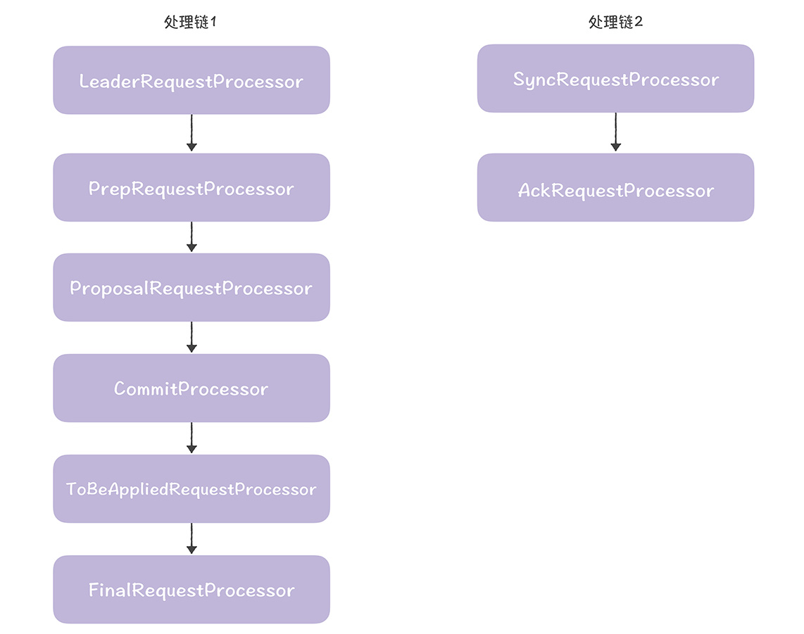

[TOC]

# ZAB协议

**From 极客时间，韩健**

很多同学应该使用过 ZooKeeper，它是一个开源的分布式协调服务，比如你可以用它进行配置管理、名字服务等等。在 ZooKeeper 中，数据是以节点的形式存储的。如果你要用 ZooKeeper 做配置管理，那么就需要在里面创建指定配置，假设创建节点"/geekbang"和"/geekbang/time"，步骤如下：

```txt
[zk: 192.168.0.10:2181(CONNECTED) 0] create /geekbang 123
Created /geekbang
[zk: 192.168.0.10:2181(CONNECTED) 1] create /geekbang/time 456
Created /geekbang/time
```

我们分别创建了配置"/geekbang"和"/geekbang/time"，对应的值分别为 123 和 456。那么在这里我提个问题：你觉得在 ZooKeeper 中，能用兰伯特的 Multi-Paxos 实现各节点数据的共识和一致吗？

当然不行。因为兰伯特的 Multi-Paxos，虽然能保证达成共识后的值不再改变，但它不关心达成共识的值是什么，也无法保证各值（也就是操作）的顺序性。而这就是 Zookeeper 没有采用 Multi-Paxos 的原因，又是 ZAB 协议着力解决的，也是你理解 ZAB 协议的关键。

那么为了帮你更好地理解这个协议，接下来，我将分别以如何实现操作的顺序性、领导者选举、故障恢复、处理读写请求为例，具体讲解一下。希望你能在全面理解 ZAB 协议的同时，加深对 Paxos 算法的理解。

今天这节课，我会从 ZAB 协议的最核心设计目标（如何实现操作的顺序性）出发，带你了解它的基础原理。

老规矩，在开始今天的内容之前，我们先来看一道思考题：

假如节点 A、B、C 组成的一个分布式集群，我们要设计一个算法，来保证指令（比如 X、Y）执行的顺序性，比如，指令 X 在指令 Y 之前执行，那么我们该如何设计这个算法呢？

图 1：


带着这个问题，我们进入今天的内容。

## 1. 为什么 Multi-Paxos 无法保证操作顺序性

刚刚我提到“Multi-Paxos 无法保证操作的顺序性”。为了让你真正理解这个问题，我举个具体的例子演示一下（为了演示方便，我们假设当前所有节点上的被选定指令，最大序号都为 100，那么新提议的指令对应的序号就会是 101）。

首先节点 A 是领导者，提案编号为 1，提议了指令 X、Y，对应的序号分别为 101 和 102，但是因为网络故障，指令只成功复制到了节点 A。

图 2：


假设这时节点 A 故障了，新当选的领导者为节点 B。节点 B 当选领导者后，需要先作为学习者了解目前已被选定的指令。节点 B 学习之后，发现当前被选定指令的最大序号为 100（因为节点 A 故障了，它被选定指令的最大序号 102，无法被节点 B 发现），那么它可以从序号 101 开始提议新的指令。这时它接收到客户端请求，并提议了指令 Z，指令 Z 被成功复制到节点 B、C。

图 3：


假设这时节点 B 故障了，节点 A 恢复了，选举出领导者 C 后，节点 B 故障也恢复了。节点 C 当选领导者后，需要先作为学习者了解目前已被选定的指令，这时它执行 Basic Paxos 的准备阶段，就会发现之前选定的值（比如 Z、Y），然后发送接受请求，最终在序号 101、102 处达成共识的指令是 Z、Y。就像下图的样子。

图 4：


在这里，你可以看到，原本预期的指令是 X、Y，最后变成了 Z、Y。讲到这儿，你应该可以知道，为什么用 Multi-Paxos 不能达到我们想要的结果了吧？

这个过程，其实很明显的验证了“Multi-Paxos 虽然能保证达成共识后的值不再改变，但它不关心达成共识的值是什么。”

那么咱们接着回到开篇的问题，假设在 ZooKeeper 中直接使用了兰伯特的 Multi-Paxos，这时创建节点"/geekbang"和"/geekbang/time"，那么就可能出现，系统先创建了节点"/geekbang/time"，这样肯定就出错了：

```txt
[zk: 192.168.0.10:2181(CONNECTED) 0] create /geekbang/time 456
Node does not exist: /geekbang/time
```

因为创建节点"/geekbang/time"时，找不到节点"/geekbang"，所以就会创建失败。

在这里我多说几句，除了 Multi-Paxos，兰伯特还有很多关于分布式的理论，这些理论都很经典（比如拜占庭将军问题），但也因为太早了，与实际场景结合的不多，所以后续的众多算法是在这个基础之上做了大量的改进（比如，PBFT、Raft 等）。关于这一点，我在 13 讲也强调过，你需要注意一下。

另外我再延伸一下，其实在ZAB 论文中，关于 Paxos 问题（Figure 1 ​​​​）的分析是有争议的。因为 ZooKeeper 当时应该考虑的是 Multi-Paxos，而不是有多个提议者的 Basic Paxos。而在 Multi-Paxos 中，领导者作为唯一提议者，是不存在同时多个提议者的情况。也就是说，Paxos（更确切的说是 Multi-Paxos）无法保证操作的顺序性的问题是存在的，但原因不是 ZAB 论文中演示的原因，本质上是因为 Multi-Paxos 实现的是一系列值的共识，不关心最终达成共识的值是什么，不关心各值的顺序，就像我们在上面演示的过程那样。

那既然 Multi-Paxos 不行，ZooKeeper 怎么实现操作的顺序性的呢? 答案是它实现了 ZAB 协议。

你可能会说了：Raft 可以实现操作的顺序性啊，为什么 ZooKeeper 不用 Raft 呢？这个问题其实比较简单，因为 Raft 出来的比较晚，直到 2013 年才正式提出，在 2007 年开发 ZooKeeper 的时候，还没有 Raft 呢。

## 2. ZAB 是如何实现操作的顺序性的

如果用一句话解释 ZAB 协议到底是什么，我觉得它是：**能保证操作顺序性的，基于主备模式的原子广播协议**。

接下来，我还是以 X、Y 指令为例具体演示一下，帮助你更好理解为什么 ZAB 能实现操作的顺序性（为了演示方便，我们假设节点 A 为主节点，节点 B、C 为备份节点）。

首先，需要你注意的是，在 ZAB 中，写操作必须在主节点（比如节点 A）上执行。如果客户端访问的节点是备份节点（比如节点 B），它会将写请求转发给主节点。如图所示：

图 5：


接着，当主节点接收到写请求后，它会基于写请求中的指令（也就是 X，Y），来创建一个提案（Proposal），并使用一个唯一的 ID 来标识这个提案。这里我说的唯一的 ID 就是指**事务标识符**（Transaction ID，也就是 zxid），就像下图的样子。

图 6：


从图中你可以看到，X、Y 对应的事务标识符分别为 <1, 1> 和 <1, 2>，这两个标识符是什么含义呢？

你可以这么理解，事务标识符是 64 位的 long 型变量，有任期编号 epoch 和计数器 counter 两部分组成（为了形象和方便理解，我把 epoch 翻译成任期编号），格式为 ，高 32 位为任期编号，低 32 位为计数器：

- 任期编号，就是创建提案时领导者的任期编号，需要你注意的是，当新领导者当选时，任期编号递增，计数器被设置为零。比如，前领导者的任期编号为 1，那么新领导者对应的任期编号将为 2。

- 计数器，就是具体标识提案的整数，需要你注意的是，每次领导者创建新的提案时，计数器将递增。比如，前一个提案对应的计数器值为 1，那么新的提案对应的计数器值将为 2。

为什么要设计的这么复杂呢？因为事务标识符必须按照顺序、唯一标识一个提案，也就是说，事务标识符必须是唯一的、递增的。

在创建完提案之后，主节点会基于 TCP 协议，并按照顺序将提案**广播**到其他节点。这样就能保证先发送的消息，会先被收到，保证了消息接收的顺序性。

图 7：


你看这张图，X 一定在 Y 之前到达节点 B、C。

然后，当主节点接收到指定提案的“大多数”的确认响应后，该提案将处于提交状态（Committed），主节点会通知备份节点提交该提案。

图 8：


在这里，需要你注意的是，主节点提交提案是有顺序性的。主节点根据事务标识符大小，按照顺序提交提案，如果前一个提案未提交，此时主节点是不会提交后一个提案的。也就是说，指令 X 一定会在指令 Y 之前提交。

最后，主节点返回执行成功的响应给节点 B，节点 B 再转发给客户端。你看，这样我们就实现了操作的顺序性，保证了指令 X 一定在指令 Y 之前执行。

最后我想补充的是，当写操作执行完后，接下来你可能需要执行读操作了。你需要注意，为了提升读并发能力，Zookeeper 提供的是最终一致性，也就是读操作可以在任何节点上执行，客户端会读到旧数据：

图 9：


如果客户端必须要读到最新数据，怎么办呢？Zookeeper 提供了一个解决办法，那就是 sync 命令。你可以在执行读操作前，先执行 sync 命令，这样客户端就能读到最新数据了：

```txt
[zk: 192.168.0.10:2181(CONNECTED) 2] sync /geekbang/time
[zk: 192.168.0.10:2181(CONNECTED) 3] Sync returned 0
[zk: 192.168.0.10:2181(CONNECTED) 3] get /geekbang/time
456
cZxid = 0x100000005
ctime = Mon Apr 20 21:19:28 HKT 2020
mZxid = 0x100000005
mtime = Mon Apr 20 21:19:28 HKT 2020
pZxid = 0x100000005
cversion = 0
dataVersion = 0
aclVersion = 0
ephemeralOwner = 0x0
dataLength = 3
numChildren = 0
[zk: 192.168.0.10:2181(CONNECTED) 4]
```

## 3. 小结

本节课我主要带你了解了为什么 Multi-Paxos 无法实现操作的顺序性，以及 ZAB 协议如何保证操作的顺序性。我希望你明确这样几个重点。

1. 兰伯特的 Multi-Paxos 只考虑了如何实现共识，也就是如何就一系列值达成共识，未考虑如何实现各值（也就是操作）的顺序性。

2. ZAB 是通过“一切以领导者为准”的强领导者模型和严格按照顺序处理、提交提案，来实现操作的顺序性的。

那么说到 ZAB，很多同学可能有这样的疑问：为什么 ZAB 作者宣称ZAB 不是 Paxos 算法，但又有很多资料提到 ZAB 是 Multi-Paxos 算法呢？到底该怎么理解呢？

我的看法是，你可以把它理解为 Multi-Paxos 算法。因为技术是发展的，概念的内涵也在变化。Raft 算法（主备、强领导者模型）与 ZAB 协议非常类似，它是作为共识算法和 Multi-Paxos 算法提出的。当它被广泛接受和认可后，共识算法的内涵也就丰富和发展了，不仅能实现一系列值的共识，还能保证值的顺序性。同样，Multi-Paxos 算法不仅指代多次执行 Basic Paxos 的算法，还指代主备、强领导者模型的共识算法。

当然了，在学习技术过程中，我们不可避免的会遇到有歧义、有争议的信息，就像在 11 讲留言区中，有同学提到“从网上搜了搜相关资料，发现大部分资料将谣言传播等同于 Gossip 协议，也有把反熵等同于 Gossip 协议的，感到很迷惑”。

这就需要我们不仅要在平时工作和学习中，认真、全面的学习理论，掌握概念的内涵，还要能“包容”和“发展”着理解技术。

最后，在本节课我们了解了 ZAB 协议的最核心设计目标（如何实现操作的顺序性），那么既然“所有数据都是以主节点的数据为准的”，主节点（也就是领导者）那么重要，那当它崩溃了，该怎么处理呢？下节课，我会重点带你了解这部分内容。

## 4. 思考

既然我提到在 ZAB 协议中，主节点是基于 TCP 协议来广播消息的，并保证了消息接收的顺序性。那么你不妨想想，如果 ZAB 采用的是 UDP 协议，能保证消息接收的顺序性吗？为什么呢？

## 5. ZAB协议关于主节点的内容

咱们都知道，系统在运行中，不可避免会出现各种各样的问题，比如进程崩溃了、服务器死机了，这些问题会导致很严重的后果，让系统没办法运行。学完了 15 讲后，你应该还记得，在 ZAB 中，写请求是必须在主节点上处理的，而且提案的广播和提交，也是由主节点来完成的。既然主节点那么重要，如果它突然崩溃宕机了，该怎么办呢？

答案是选举出新的领导者（也就是新的主节点）。

在我看来，领导者选举，关乎着节点故障容错能力和集群可用性，是 ZAB 协议非常核心的设计之一。你想象一下，如果没有领导者选举，主节点故障了，整个集群都无法写入了，这将是极其严重的灾难性故障。

而对你来说，理解领导者选举（也就是快速领导者选举，Fast Leader Election），能更加深刻地理解 ZAB 协议，并在日常工作中，游刃有余地处理集群的可用性问题。比如如果写请求持续失败，可以先排查下集群的节点状态。

既然领导者选举这么重要，那么 ZAB 是如何选举领导者的呢？带着这个问题，我们进入今天的学习。

### 5.1 ZAB 如何选举领导者

既然要选举领导者，那就涉及成员身份变更，那么在 ZAB 中，支持哪些成员身份呢？

**有哪些成员身份？**

ZAB 支持 3 种成员身份（领导者、跟随者、观察者）。

- 领导者（Leader）： 作为主（Primary）节点，在同一时间集群只会有一个领导者。需要你注意的是，所有的写请求都必须在领导者节点上执行。

- 跟随者（Follower）：作为备份（Backup）节点， 集群可以有多个跟随者，它们会响应领导者的心跳，并参与领导者选举和提案提交的投票。需要你注意的是，跟随者可以直接处理并响应来自客户端的读请求，但对于写请求，跟随者需要将它转发给领导者处理。

- 观察者（Observer）：作为备份（Backup）节点，类似跟随者，但是没有投票权，也就是说，观察者不参与领导者选举和提案提交的投票。你可以对比着 Paxos 中的学习者来理解。

需要你注意的是，虽然 ZAB 支持 3 种成员身份，但是它定义了 4 种成员状态。

- LOOKING：选举状态，该状态下的节点认为当前集群中没有领导者，会发起领导者选举。

- FOLLOWING ：跟随者状态，意味着当前节点是跟随者。

- LEADING ：领导者状态，意味着当前节点是领导者。

- OBSERVING： 观察者状态，意味着当前节点是观察者。

为什么多了一种成员状态呢？这是因为 ZAB 支持领导者选举，在选举过程中，涉及了一个过渡状态（也就是选举状态）。

现在，你已经了解了成员身份，那么在 ZAB 中是如何变更成员身份，来选举领导者呢？接下来，我们就来看一下领导者的具体选举过程。

**如何选举？**

为了帮你更好地理解 ZAB 的领导者选举，我举个例子演示一下，为了演示方便和更容易理解（我们聚焦最核心的领导者 PK），假设投票信息的格式是 <proposedLeader, proposedEpoch, proposedLastZxid，node>，其中：

- proposedLeader，节点提议的，领导者的集群 ID，也就是在集群配置（比如 myid 配置文件）时指定的 ID。

- proposedEpoch，节点提议的，领导者的任期编号。

- proposedLastZxid，节点提议的，领导者的事务标识符最大值（也就是最新提案的事务标识符）。

- node，投票的节点，比如节点 B。

假设一个 ZooKeeper 集群，由节点 A、B、C 组成，其中节点 A 是领导者，节点 B、C 是跟随者（为了方便演示，假设 epoch 分别是 1 和 1，lastZxid 分别是 101 和 102，集群 ID 分别为 2 和 3）。那么如果节点 A 宕机了，会如何选举呢？

图 10：


首先，当跟随者检测到连接领导者节点的读操作等待超时了，跟随者会变更节点状态，将自己的节点状态变更成 LOOKING，然后发起领导者选举（为了演示方便，我们假设这时节点 B、C 都已经检测到了读操作超时）：

图 11：


接着，每个节点会创建一张选票，这张选票是投给自己的，也就是说，节点 B、C 都“自告奋勇”推荐自己为领导者，并创建选票 <2, 1, 101, B> 和 <3, 1, 102, C>，然后各自将选票发送给集群中所有节点，也就是说，B 发送给 B、C，C 也发送给 B、C。

一般而言，节点会先接收到自己发送给自己的选票（因为不需要跨节点通讯，传输更快），也就是说，B 会先收到来自 B 的选票，C 会先收到来自 C 的选票：

图 12：


需要你注意的是，集群的各节点收到选票后，为了选举出数据最完整的节点，对于每一张接收到选票，节点都需要进行领导者 PK，也就将选票提议的领导者和自己提议的领导者进行比较，找出更适合作为领导者的节点，约定的规则如下：

- 优先检查任期编号（Epoch），任期编号大的节点作为领导者；

- 如果任期编号相同，比较事务标识符的最大值，值大的节点作为领导者；

- 如果事务标识符的最大值相同，比较集群 ID，集群 ID 大的节点作为领导者。

如果选票提议的领导者，比自己提议的领导者，更适合作为领导者，那么节点将调整选票内容，推荐选票提议的领导者作为领导者。

当节点 B、C 接收到的选票后，因为选票提议的领导者与自己提议的领导者相同，所以，领导者 PK 的结果，是不需要调整选票信息，那么节点 B、C，正常接收和保存选票就可以了。

图 13：


接着节点 B、C 分别接收到来自对方的选票，比如 B 接收到来自 C 的选票，C 接收到来自 B 的选票：

图 14：


对于 C 而言，它提议的领导者是 C，而选票（<2, 1, 101, B>）提议的领导者是 B，因为节点 C 的任期编号与节点 B 相同，但节点 C 的事务标识符的最大值比节点 B 的大，那么，按照约定的规则，相比节点 B，节点 C 更适合作为领导者，也就是说，节点 C 不需要调整选票信息，正常接收和保存选票就可以了。

但对于对于节点 B 而言，它提议的领导者是 B，选票（<3, 1, 102, C>）提议的领导者是 C，因为节点 C 的任期编号与节点 B 相同，但节点 C 的事务标识符的最大值比节点 B 的大，那么，按照约定的规则，相比节点 B，节点 C 应该作为领导者，所以，节点 B 除了接收和保存选票信息，还会更新自己的选票为 <3, 1, 102, B>，也就是推荐 C 作为领导者，并将选票重新发送给节点 B、C：

图 15：


接着，当节点 B、C 接收到来自节点 B，新的选票时，因为这张选票（<3, 1, 102, B>）提议的领导者，与他们提议的领导者是一样的，都是节点 C，所以，他们正常接收和存储这张选票，就可以。

图 16：


最后，因为此时节点 B、C 提议的领导者（节点 C）赢得大多数选票了（2 张选票），那么，节点 B、C 将根据投票结果，变更节点状态，并退出选举。比如，因为当选的领导者是节点 C，那么节点 B 将变更状态为 FOLLOWING，并退出选举，而节点 C 将变更状态为 LEADING，并退出选举。

图 17：


你看，这样我们就选举出新的领导者（节点 C），这个选举的过程，很容易理解，我在这里只是假设了一种选举的情况，还会存在节点间事务标识符相同、节点在广播投票信息前接收到了其他节点的投票等情况，这里你可以思考一下，课下自己动手操作一下。

为了帮你在线下更好的阅读代码，自我学习，我想补充一下，逻辑时钟（logicclock）（也就是选举的轮次），会影响选票的有效性，具体来说，逻辑时钟大的节点不会接收来自值小的节点的投票信息。比如，节点 A、B 的逻辑时钟分别为 1 和 2，那么，节点 B 将拒绝接收来自节点 A 的投票信息。

在这里，我想强调的是，领导者选举的目标，是从大多数节点中选举出数据最完整的节点，也就是大多数节点中，事务标识符值最大的节点。另外，ZAB 本质上是通过“见贤思齐，相互推荐”的方式来选举领导者的。也就说，根据领导者 PK，节点会重新推荐更合适的领导者，最终选举出了大多数节点中数据最完整的节点。

当然了，文字和代码是 2 种不同的表达，一些细节，仅仅通过文字是无法表达出来的，所以，为了帮你更通透地理解领导者选举的实现，接下来，我将以最新稳定版的ZooKeeper为例（也就是 3.6.0），具体说一说代码的实现。

### 5.2 ZooKeeper 是如何实现的

首先，我们来看看，在 ZooKeeper 中是如何实现成员身份的？

在 ZooKeeper 中，成员状态是在 QuorumPeer.java 中实现的，为枚举型变量，就像下面的样子。

```java
public enum ServerState {
    LOOKING,
    FOLLOWING,
    LEADING,
    OBSERVING
}
```

其实，在 ZooKeeper 中，没有直接定义成员身份，而是用了对应的成员状态来表示，比如，处于 FOLLOWING 状态的节点为跟随者。

在这里，我想补充一点，如果你想研究相关成员的功能和实现，那么你可以把对应的成员状态作为切入点来研究，比如，你想研究领导者的功能实现，那么，你可以在代码中搜索 LEADING 关键字，然后研究相应的上下文逻辑，就能得到自己想要的答案了。

如果跟随者将自己的状态从跟随者状态变更为选举状态，这就表示跟随者在发起领导者选举，那么，在 ZooKeeper 中，领导者选举是如何实现的呢？

### 5.3 如何实现选举

领导者选举，是在 FastLeaderElection.lookForLeader() 中实现的。我来讲一下核心的流程，大概的流程，就像下面的样子。

图 18：


为帮助你更好的理解这个流程，我们来一起走读下核心代码，加深下印象。

1. 在集群稳定运行时，处于跟随者状态的节点，在 Follower.followLeader() 函数中，周期性地读数据包和处理数据包：

```java
QuorumPacket qp = new QuorumPacket();
while (this.isRunning()) {
    // 读取数据包
    readPacket(qp);
    // 处理数据包
    processPacket(qp);
}
```

2. 当跟随者检测到连接到领导者的读操作超时了（比如领导者节点故障了），这时会抛出异常（Exception），跳出上面的读取数据包和处理数据包的循环，并最终跟随者将节点状态变更为选举状态。

```java
public void run() {
    case FOLLOWING:
        ......
        finally {
            // 关闭跟随者节点
            follower.shutdown();
            setFollower(null);
            // 设置状态为选举状态
            updateServerState();
        }
        break;
    ......
}
```

3. 当节点处于选举状态时，将调用 makeLEStrategy().lookForLeader() 函数（实际对应的函数为 FastLeaderElection.lookForLeader()），发起领导者选举。

```java
setCurrentVote(makeLEStrategy().lookForLeader());
```

4. 在 FastLeaderElection.lookForLeader() 函数中，节点需要对逻辑时钟（也就是选举的轮次）的值执行加 1 操作，表示我们开启一轮的领导者选举，然后创建投票提案（默认推荐自己为领导者），并通知所有节点：

```java
synchronized (this) {
  // 对逻辑时钟的值执行加一操作
  logicalclock.incrementAndGet();
  // 创建投票提案，并默认推荐自己为领导者
  updateProposal(getInitId(), getInitLastLoggedZxid(),    
                 getPeerEpoch());
}
// 广播投票信息给所有节点
sendNotifications();
```

5. 当节点处于选举状态时，会周期性地从队列中读取接收到的投票信息，直到选举成功。

```java
while ((self.getPeerState() == ServerState.LOOKING) && (!stop)) {
   // 从队列中读取接收到的投票信息
   Notification n = recvqueue.poll(notTimeout, TimeUnit.MILLISECONDS);
   ......
}
```

6. 当接收到新的投票信息时，节点会进行领导者 PK，来判断谁更适合当领导者，如果投票信息中提议的节点比自己提议的节点，更适合当领导者，更新投票信息，推荐投票信息中提议的节点作为领导者，并广播给所有节点：

```java
else if (totalOrderPredicate(n.leader, n.zxid, n.peerEpoch, proposedLeader, proposedZxid, proposedEpoch)) {
  // 投票信息中提议的节点比自己提议的节点更适合作为领导者，更新投票信息，并推荐投票信息中提议的节点
  updateProposal(n.leader, n.zxid, n.peerEpoch);
  // 将新的投票信息广播给所有节点
  sendNotifications();
}
```

7. 如果自己提议的领导者赢得大多数选票，则执行步骤 8，变更节点状态，退出选举；如果自己提议的领导者仍未赢得大多数选票，则执行步骤 5，继续从接收队列中读取新的投票信息。

8. 最后，当节点提议的领导者赢得大多数选票时，根据投票结果，判断当前节点的状态，领导者或跟随者，并变更节点状态，退出选举。

```java
if (voteSet.hasAllQuorums()) {
  ......
    // 根据投票结果，判断并设置节点状态
    setPeerState(proposedLeader, voteSet);
    // 退出领导者选举
    Vote endVote = new Vote(proposedLeader, proposedZxid, logicalclock.get(), proposedEpoch);
    leaveInstance(endVote);
    return endVote;
  ......
}
```

需要你注意的是，在这里，我们只是演示一种选举情况，更多的情况，比如接收到来自逻辑时钟比当前节点小的节点的投票信息，再比如接收到来自领导者的投票信息，你可以在课下自己研究一下，遇到问题时，欢迎留言，咱们一起讨论。

### 5.4 内容小结

本节课我主要带你了解了 ZAB 是如何选举领导者的，以及在 ZooKeeper 中是如何实现的。我希望你明确这样几个重点。

1. 领导者选举的目标，是选举出大多数节点中**数据最完整的节点**，也就是大多数节点中事务标识符值最大的节点。

2. 任期编号、事务标识符最大值、集群 ID 的值的大小，决定了哪个节点更适合作为领导者，按照顺序，值大的节点更适合作为领导者。

学到这里，有同学可能会说：“老韩，我研究了一下，领导者是大多数节点中，已提交提案事务标识符最大的节点，因为在领导者选举的实现中，事务标识符采用的是 dataTree.lastProcessedZxid 的值，而这个变量标记的是已提交提案的事务标识符最大值。到底要怎么理解呢？”

我要先为你的探索和思考点个赞，我想说的是，在领导者选举的实现中，事务标识符采用的是 dataTree.lastProcessedZxid 的值。需要你特别注意的是，在跟随者节点正常运行时，dataTree.lastProcessedZxid 表示的是已提交提案的事务标识符最大值，但当跟随者检测到异常，退出跟随者状态时（在 follower.shutdown() 函数中），ZooKeeper 会将所有未提交提案提交，并使用 lastProcessedZxid 表示节点上提案（包括刚提交的提案）的事务标识符的最大值，在接下来的领导者选举中，使用的也是该值，也就是说，ZAB 的领导者选举，选举出的是大多数节点中数据最完整的节点。

为了方便你理解，我举个具体的例子。

A、B、C 三节点，A 是领导者，B、C 是跟随者，B 有 2 个已提交提案 (<1, 1>，<1, 2>)，C 有 4 个未提交提案 (<1, 1>，<1, 2>，<1, 3>，<1, 4>)，那么当 A 故障后，C 就会当选领导者。因为 C 的 dataTree.lastProcessedZxid 值（也就是 <1, 4>）大于 B 的 dataTree.lastProcessedZxid 值（也就是 <1, 2>）。

**选举出了新领导者，它是不是就可以处理写请求了呢？当然不可以**，因为 ZAB 集群还需要通过**成员发现**（Discovery）和**数据同步**（Synchronization）来恢复故障，然后领导者才能行使“领导”的职能，处理写请求，这也是我会在下一讲重点带你了解的。

### 5.5 思考

既然我提到在 ZAB 协议中，ZAB 协议是通过快速领导者选举，来选举出新的领导者的。那么你不妨想想，在选举中，会出现选票被瓜分、选举失败的问题吗？为什么呢？

## 6. 如何从故障中恢复

我们上一讲提到了 ZAB 的领导者选举，在我看来，它只是选举了一个适合当领导者的节点，然后把这个节点的状态设置成 LEADING 状态。此时，这个节点还不能作为主节点处理写请求，也不能使用领导职能（比如，它没办法阻止其他“领导者”广播提案）。也就是说，集群还没有从故障中恢复过来，而成员发现和数据同步会解决这个问题。

总的来说，成员发现和数据同步不仅让新领导者正式成为领导者，确立了它的领导关系，还解决了各副本的数据冲突，实现了数据副本的一致性。这样一来，集群就能正常处理写请求了。在这句话里：

- 确立领导关系，也就是在成员发现（DISCOVERY）阶段，领导者和大多数跟随者建立连接，并再次确认各节点对自己当选领导者没有异议，确立自己的领导关系；

- 处理冲突数据，也就是在数据同步（SYNCHRONIZATION）阶段，**领导者以自己的数据为准，解决各节点数据副本的不一致**。

对你来说，理解这两点，可以更好地理解 ZooKeeper 怎么恢复故障，以及当主节点崩溃了，哪些数据会丢失，哪些不会，以及背后的原因。也就是说，你能更加深刻地理解 ZooKeeper 的节点故障容错能力。

那么说了这么多，集群具体是怎么从故障中恢复过来的呢？带着这个问题，我们进入今天的学习。

### 6.1 ZAB 集群怎么从故障中恢复过来

如果我们想把 ZAB 集群恢复到正常状态，那么新领导者就要确立自己的领导关系，成为唯一有效的领导者，然后作为主节点“领导”各备份节点一起处理读写请求。

**如何确立领导关系？**

那么通过开篇，你可以知道，选举出的领导者，是在**成员发现阶段确立领导关系**的。

在当选后，领导者会递增自己的任期编号，并基于任期编号值的大小，来和跟随者协商，最终建立领导关系。具体说的话，就是跟随者会选择任期编号值最大的节点，作为自己的领导者，而被大多数节点认同的领导者，将成为真正的领导者。

我举个例子，具体帮你理解一下。

假设一个 ZooKeeper 集群，由节点 A、B、C 组成。其中，领导者 A 已经宕机，C 是新选出来的领导者，B 是新的跟随者（为了方便演示，假设 B、C 已提交提案的事务标识符最大值分别是 <1, 10> 和 <1, 11>，其中 1 是任期编号，10、11 是事务标识符中的计数器值，A 宕机前的任期编号也是 1）。那么 B、C 如何协商建立领导关系呢？

图 19：


首先，B、C 会把自己的 ZAB 状态设置为成员发现（DISCOVERY），这就表明，选举（ELECTION）阶段结束了，进入了下一个阶段：

图 20：


在这里，我想补充一下，**ZAB 定义了 4 种状态，来标识节点的运行状态**。

- ELECTION（选举状态）：表明节点在进行领导者选举；

- DISCOVERY（成员发现状态）：表明节点在协商沟通领导者的合法性；

- SYNCHRONIZATION（数据同步状态）：表明集群的各节点以领导者的数据为准，修复数据副本的一致性；

- BROADCAST（广播状态）：表明集群各节点在正常处理写请求。

关于这 4 种状态，你知道它们是做什么的就可以了。我就强调一点，**只有当集群大多数节点处于广播状态的时候，集群才能提交提案**。

接下来，B 会主动联系 C，发送给它包含自己接收过的领导者任期编号最大值（也就是前领导者 A 的任期编号，1）的 FOLLOWINFO 消息。

图 21：


当 C 接收来自 B 的信息时，会将响应包含自己事务标识符最大值的 LEADINFO 消息发给跟随者。

你要注意，**领导者进入到成员发现阶段后，会对任期编号加 1，创建新的任期编号**，然后基于新任期编号，创建新的事务标识符（也就是 <2, 0>）。

图 22：


当接收到领导者的响应后，跟随者会判断领导者的任期编号是否最新，如果不是，就发起新的选举；如果是，跟随者返回 ACKEPOCH 消息给领导者。在这里，C 的任期编号（也就是 2）大于 B 接受过的其他领导任期编号（也就是旧领导者 A 的任期编号，1），所以 B 返回确认响应给 C，并设置 ZAB 状态为数据同步。

图 23：


最后，当领导者接收到来自大多数节点的 ACKEPOCH 消息时，就设置 ZAB 状态为数据同步。在这里，C 接收到了 B 的消息，再加上 C 自己，就是大多数了，所以，在接收到来自 B 的消息后，C 设置 ZAB 状态为数据同步。

图 24：


现在，ZAB 在成员发现阶段确立了领导者的领导关系，之后领导者就可以行使领导职能了。而这时**它首先要解决的就是数据冲突**，实现各节点数据的一致性，那么它是怎么做的呢？

**如何处理冲突数据？**

当进入到数据同步状态后，领导者会根据跟随者的事务标识符最大值，判断以哪种方式处理不一致数据（有 DIFF、TRUNC、SNAP 这 3 种方式，后面我会具体说一说）。

因为 C 已提交提案的事务标识符最大值（也就是 <1, 11>）大于 B 已提交提案的事务标识符最大值（也就是 <1, 10>），所以 C 会用 DIFF 的方式修复数据副本的不一致，并返回差异数据（也就是事务标识符为 <1, 11> 的提案）和 NEWLEADER 消息给 B。

图 25：


在这里，我想强调一点：**B 已提交提案的最大值，也是它最新提案的最大值**。因为在 ZooKeeper 实现中，节点退出跟随者状态时（也就是在进入选举前），所有未提交的提案都会被提交。这是 ZooKeeper 的设计，你知道有这么个事就可以了。

然后，B 修复不一致数据，返回 NEWLEADER 消息的确认响应给领导者。

图 26：


接着，当领导者接收到来自大多数节点的 NEWLEADER 消息的确认响应，将设置 ZAB 状态为广播。在这里，C 接收到 B 的确认响应，加上 C 自己，就是大多数确认了。所以，在接收到来自 B 的确认响应后，C 设置自己的 ZAB 状态为广播，并发送 UPTODATE 消息给所有跟随者，通知它们数据同步已经完成了。

图 27：


最后当 B 接收到 UPTODATE 消息时，它就知道数据同步完成了，就设置 ZAB 状态为广播。

图 28：


这个时候，集群就可以正常处理写请求了。

现在，我已经讲完了故障恢复的原理，那接下来，我们就来看一看 ZooKeeper 到底是怎么实现的吧。

### 6.2 ZooKeeper 恢复故障的实现

**成员发现**

成员发现是通过跟随者和领导者交互来完成的，目标是确保大多数节点对领导者的领导关系没有异议，也就是确立领导者的领导地位。

大概的实现流程，就像下面这样：

图 29：


为帮你更好地理解这个流程，我们来走一遍核心代码的流程，加深下印象。

**第一步**，领导者选举结束，节点进入跟随者状态或者领导者状态后，它们会分别设置 ZAB 状态为成员发现。具体来说就是：

- 跟随者会进入到 Follower.followLeader() 函数中执行，设置 ZAB 状态为成员发现。

```java
self.setZabState(QuorumPeer.ZabState.DISCOVERY);
```

- 领导者会进入到 Leader.lead() 函数中执行，并设置 ZAB 状态为成员发现。

```java
self.setZabState(QuorumPeer.ZabState.DISCOVERY);
```

**第二步**，跟随者会主动联系领导者，发送自己已接受的领导者任期编号最大值（也就是 acceptedEpoch）的 FOLLOWINFO 消息给领导者。

```java
// 跟领导者建立网络连接
connectToLeader(leaderServer.addr, leaderServer.hostname);
connectionTime = System.currentTimeMillis();
// 向领导者报道，并获取领导者的事务标识符最大值
long newEpochZxid = registerWithLeader(Leader.FOLLOWERINFO);
```

**第三步**，接收到来自跟随者的 FOLLOWINFO 消息后，在 LearnerHandler.run() 函数中，领导者将创建包含自己事务标识符最大值的 LEADINFO 消息，并响应给跟随者。

```java
// 创建LEADINFO消息
QuorumPacket newEpochPacket = new
QuorumPacket(Leader.LEADERINFO, newLeaderZxid, ver, null);
// 发送LEADINFO消息给跟随者
oa.writeRecord(newEpochPacket, "packet");
```

**第四步**，接收到来自领导者的 LEADINFO 消息后，跟随者会基于领导者的任期编号，判断领导者是否合法，如果领导者不合法，跟随者发起新的选举，如果领导者合法，响应 ACKEPOCH 消息给领导者。

```java
// 创建ACKEPOCH消息，包含已提交提案的事务标识符最大值
QuorumPacket ackNewEpoch = new QuorumPacket(Leader.ACKEPOCH, lastLoggedZxid, epochBytes, null);
// 响应ACKEPOCH消息给领导者
writePacket(ackNewEpoch, true);
```

**第五步**，跟随者设置 ZAB 状态为数据同步。

```java
self.setZabState(QuorumPeer.ZabState.SYNCHRONIZATION);
```

**第六步**，需要你注意的是，在 LearnerHandler.run() 函数中（以及 Leader.lead() 函数），领导者会调用 waitForEpochAck() 函数，来阻塞和等待来自大多数节点的 ACKEPOCH 消息。

```java
ss = new StateSummary(bbepoch.getInt(), ackEpochPacket.getZxid());
learnerMaster.waitForEpochAck(this.getSid(), ss);
```

**第七步**，当领导者接收到来自大多数节点的 ACKEPOCH 消息后，在 Leader.lead() 函数中，领导者将设置 ZAB 状态为数据同步。

```java
self.setZabState(QuorumPeer.ZabState.SYNCHRONIZATION);
```

这样，ZooKeeper 就实现了成员发现，各节点就领导者的领导关系达成了共识。

当跟随者和领导者设置 ZAB 状态为数据同步，它们也就是进入了数据同步阶段，那在 ZooKeeper 中数据同步是如何实现的呢？

**数据同步**

数据同步也是通过跟随者和领导者交互来完成的，目标是确保跟随者节点上的数据与领导者节点上数据是一致的。大概的实现流程，如图所示：

图 30：


为了方便你理解，咱们一起走一遍核心代码的流程，加深下印象。

**第一步**，在 LearnerHandler.run() 函数中，领导者调用 syncFollower() 函数，根据跟随者的事务标识符值最大值，判断用哪种方式处理不一致数据，把已经提交提案和未提交提案都同步给跟随者：

```java
peerLastZxid = ss.getLastZxid();
boolean needSnap = syncFollower(peerLastZxid, learnerMaster);
```

在这里，需要你了解领导者向跟随者同步数据的三种方式（TRUNC、DIFF、SNAP），它们是什么含义呢？要想了解这部分内容，你首先要了解一下 syncFollower() 中，3 个关键变量的含义。

- peerLastZxid：跟随者节点上，提案的事务标识符最大值。

- maxCommittedLog、minCommittedLog：领导者节点内存队列中，已提交提案的事务标识符最大值和最小值。需要你注意的是，maxCommittedLog、minCommittedLog 与 ZooKeeper 的设计有关。在 ZooKeeper 中，为了更高效地复制提案到跟随者上，领导者会将一定数量（默认值为 500）的已提交提案放在内存队列里，而 maxCommittedLog、minCommittedLog 分别标识的是内存队列中，已提交提案的事务标识符最大值和最小值。

说完 3 个变量的含义，我来说说 3 种同步方式。

- TRUNC：当 peerLastZxid 大于 maxCommittedLog 时，领导者会通知跟随者丢弃超出的那部分提案。比如，如果跟随者的 peerLastZxid 为 11，领导者的 maxCommittedLog 为 10，那么领导者将通知跟随者丢弃事务标识符值为 11 的提案。

- DIFF：当 peerLastZxid 小于 maxCommittedLog，但 peerLastZxid 大于 minCommittedLog 时，领导者会同步给跟随者缺失的已提交的提案，比如，如果跟随者的 peerLastZxid 为 9，领导者的 maxCommittedLog 为 10，minCommittedLog 为 9，那么领导者将同步事务标识符值为 10 的提案，给跟随者。

- SNAP：当 peerLastZxid 小于 minCommittedLog 时，也就是说，跟随者缺失的提案比较多，那么，领导者同步快照数据给跟随者，并直接覆盖跟随者本地的数据。

在这里，我想补充一下，领导者先就已提交提案和跟随者达成一致，然后调用 learnerMaster.startForwarding()，将未提交提案（如果有的话）也缓存在发送队列（queuedPackets），并最终复制给跟随者节点。也就是说，**领导者以自己的数据为准，实现各节点数据副本的一致的**。

需要你注意的是，在 syncFolower() 中，领导者只是将需要发送的差异数据缓存在发送队列（queuedPackets），这个时候还没有发送。

**第二步**，在 LearnerHandler.run() 函数中，领导者创建 NEWLEADER 消息，并缓存在发送队列中。

```java
// 创建NEWLEADER消息
QuorumPacket newLeaderQP = new QuorumPacket(Leader.NEWLEADER, newLeaderZxid, learnerMaster.getQuorumVerifierBytes(), null);
// 缓存NEWLEADER消息到发送队列中
queuedPackets.add(newLeaderQP);
```

**第三步**，在 LearnerHandler.run() 函数中，领导者调用 startSendingPackets() 函数，启动一个新线程，并将缓存的数据发送给跟随者。

```java
// 发送缓存队列中的数据
startSendingPackets();
```

**第四步**，跟随者调用 syncWithLeader() 函数，处理来自领导者的数据同步。

```java
// 处理数据同步
syncWithLeader(newEpochZxid);
```

**第五步**，在 syncWithLeader() 函数，跟随者接收到来自领导者的 NEWLEADER 消息后，返回确认响应给领导者。

```java
writePacket(new QuorumPacket(Leader.ACK, newLeaderZxid, null, null), true);
```

**第六步**，在 LearnerHandler.run() 函数中（以及 Leader.lead() 函数），领导者等待来自大多数节点的 NEWLEADER 消息的响应。

```java
learnerMaster.waitForNewLeaderAck(getSid(), qp.getZxid());
```

**第七步**，当领导者接收到来自大多数节点的 NEWLEADER 消息的响应时，在 Leader.lead() 函数中，领导者设置 ZAB 状态为广播状态。

```java
self.setZabState(QuorumPeer.ZabState.BROADCAST);
```

并在 LearnerHandler.run() 中发送 UPTODATE 消息给所有跟随者，通知它们数据同步已完成了。

```java
queuedPackets.add(new QuorumPacket(Leader.UPTODATE, -1, null, null));
```

**第八步**，当跟随者接收到 UPTODATE 消息时，就知道自己修复完数据不一致了，可以处理写请求了，就设置 ZAB 状态为广播。

```java
// 数据同步完成后，也就是可以正常处理来自领导者的广播消息了，设置ZAB状态为广播
self.setZabState(QuorumPeer.ZabState.BROADCAST);
```

你看，这样就确保各节点数据的一致了，接下来，就可以以领导者为主，向其他节点广播消息了。

### 6.3 内容总结

本节课我主要带你了解了 ZAB 如何恢复故障，我希望你明确这样几个重点。

1. 成员发现，是为了建立跟随者和领导者之间的领导者关系，并通过任期编号来确认这个领导者是否为最合适的领导者。

2. 数据同步，是通过以领导者的数据为准的方式，来实现各节点数据副本的一致，需要你注意的是，基于“大多数”的提交原则和选举原则，能确保被复制到大多数节点并提交的提案，就不再改变。

在这里，我想特别强调一下，在 ZooKeeper 的代码实现中，处于提交（Committed）状态的提案是可能会改变的，为什么呢？

在 ZooKeeper 中，一个提案进入提交（Committed）状态，有两种方式：

1. 被复制到大多数节点上，被领导者提交或接收到来自领导者的提交消息（leader.COMMIT）而被提交。在这种状态下，提交的提案是不会改变的。

2. 另外，在 ZooKeeper 的设计中，在节点退出跟随者状态时（在 follower.shutdown() 函数中），会将所有本地未提交的提案都提交。需要你注意的是，此时提交的提案，可能并未被复制到大多数节点上，而且这种设计，就会导致 ZooKeeper 中出现，处于“提交”状态的提案可能会被删除（也就是接收到领导者的 TRUNC 消息而删除的提案）。

更准确的说，在 ZooKeeper 中，被复制到大多数节点上的提案，最终会被提交，并不会再改变；而只在少数节点存在的提案，可能会被提交和不再改变，也可能会被删除。为了帮助你理解，我来举个具体的例子。

- 如果写请求对应的提案“SET X = 1”已经复制到大多数节点上，那么它是最终会被提交，之后也不会再改变。也就是说，在没有新的 X 赋值操作的前提下，不管节点怎么崩溃、领导者如何变更，你查询到的 X 的值都为 1。

- 如果写请求对应的提案“SET X = 1”未被复制到大多数节点上，比如在领导者广播消息过程中，领导者崩溃了，那么，提案“SET X = 1”，可能被复制到大多数节点上，并提交和之后就不再改变，也可能会被删除。这个行为是未确定的，取决于新的领导者是否包含该提案。

另外，我想补充下，在 ZAB 中，选举出了新的领导者后，该领导者不能立即处理写请求，还需要通过成员发现、数据同步 2 个阶段进行故障恢复。这是 ZAB 协议的设计决定的，不是所有的共识算法都必须这样，比如 Raft 选举出新的领导者后，领导者是可以立即处理写请求的。

最后，完成数据同步后，节点将进入广播状态，那 ZAB 是如何处理读写请求，又是如何广播消息的呢？下节课，我会重点带你了解这部分内容。

### 6.4 思考

我提到在 ZAB 中，提案提交的大多数原则和领导者选举的大多数原则，确保了被复制到大多数节点的提案就不再改变了。那么你不妨思考和推演一下，这是为什么呢？

## 7. 如何处理写请求

你应该有这样的体会，如果你想了解一个网络服务，执行的第一个功能肯定是写操作，然后才执行读操作。比如，你要了解 ZooKeeper，那么肯定会在 zkCli.sh 命令行中执行写操作（比如“create /geekbang 123”）写入数据，然后再是读操作（比如“get /geekbang”）查询数据。这样一来，你才会直观地理解 ZooKeeper 是如何使用的了。

在我看来，任何网络服务最重要的功能就是处理读写请求，**因为我们访问网络服务本质上都是在执行读写操作，ZooKeeper 也不例外。而且对 ZooKeeper 而言，这些功能更为重要，因为在 ZooKeeper 中，如何处理写请求，关乎着操作的顺序性，而操作的顺序性会影响节点的创建；如何处理读请求，关乎着一致性，它们又影响着客户端是否会读到旧数据。**

接下来，我会从 ZooKeeper 系统的角度，全面地分析整个读写请求的流程，帮助你更加全面、透彻地理解读写请求背后的原理。

你肯定知道，在 ZooKeeper 中，写请求是必须在领导者上处理，如果跟随者接收到了写请求，它需要将写请求转发给领导者，当写请求对应的提案被复制到大多数节点上时，领导者会提交提案，并通知跟随者提交提案。而读请求可以在任何节点上处理，也就是说，**ZooKeeper 实现的是最终一致性**。

对你来说，理解了如何处理读写请求，不仅能理解读写这个最重要功能的核心原理，还能更好地理解 ZooKeeper 的性能和一致性。这样一来，当你在实际场景中安装部署 ZooKeeper 的时候，就能游刃有余地做资源规划了。比如，如果读请求比较多，你可以增加节点，配置 5 节点集群，而不是常见的 3 节点集群。

话不多说，我们进入今天的内容，一起探究 ZooKeeper 处理读写请求的背后原理和代码实现。

### 7.1 ZooKeeper 处理读写请求的原理

其实，我在15 讲演示“如何实现操作顺序性”时，就已经介绍了 ZooKeeper 是如何处理读写请求的了。所以在这里我就不啰嗦了，只是在此基础上，再补充几点。

首先，在 ZooKeeper 中，与领导者“失联”的节点，是不能处理读写请求的。比如，如果一个跟随者与领导者的连接发生了读超时，设置了自己的状态为 LOOKING，那么此时它既不能转发写请求给领导者处理，也不能处理读请求，只有当它“找到”领导者后，才能处理读写请求。

举个例子：当发生分区故障了，C 与 A（领导者）、B 网络不通了，那么 C 将设置自己的状态为 LOOKING，此时在 C 节点上既不能执行读操作，也不能执行写操作。

图 31：


其次，当大多数节点进入到广播阶段的时候，领导者才能提交提案，因为提案提交，需要来自大多数节点的确认。

最后，**写请求只能在领导者节点上处理，所以 ZooKeeper 集群写性能约等于单机**。而读请求是可以在所有的节点上处理的，所以，读性能是能水平扩展的。也就是说，你可以通过分集群的方式来突破写性能的限制，并通过增加更多节点，来扩展集群的读性能。

熟悉了 ZooKeeper 处理读写请求的过程和原理后，相信你应该好奇这些功能在 ZooKeeper 代码中是如何实现的呢？

### 7.2 ZooKeeper 代码是如何实现读写操作的呢

**如何实现写操作？**

我先来说一说写操作，在 ZooKeeper 代码中，处理写请求的核心流程就像下图一样（为了帮你更好的理解这部分内容，我来演示一下复杂的情况，也就是**跟随者接收到写请求的情况**）。

图 32：


接下来，咱们一起走一遍核心代码的流程，加深一下印象。

1. 跟随者在 FollowerRequestProcessor.processRequest() 中接收到写请求。具体来说，写请求是系统在 ZooKeeperServer.submitRequestNow() 中发给跟随者的。

```java
firstProcessor.processRequest(si);
```

而 firstProcessor，是在 FollowerZooKeeperServer.setupRequestProcessors() 中创建的。

```java
protected void setupRequestProcessors() {
  // 创建finalProcessor，提交提案或响应查询
  RequestProcessor finalProcessor = new FinalRequestProcessor(this);
  // 创建commitProcessor，处理提案提交或读请求
  commitProcessor = new CommitProcessor(finalProcessor,   Long.toString(getServerId()), true, getZooKeeperServerListener());
  commitProcessor.start();
  // 创建firstProcessor，接收发给跟随者的请求
  firstProcessor = new FollowerRequestProcessor(this, commitProcessor);
  ((FollowerRequestProcessor) firstProcessor).start();
  // 创建syncProcessor，将提案持久化存储，并返回确认响应给领导者
  syncProcessor = new SyncRequestProcessor(this, new SendAckRequestProcessor(getFollower()));
  syncProcessor.start();
}
```

需要你注意的是，跟随者节点和领导者节点的 firstProcessor 是不同的，这样当 firstProcessor 在 ZooKeeperServer.submitRequestNow() 中被调用时，就分别进入了跟随者和领导者的代码流程。另外，setupRequestProcessors() 创建了 2 条处理链，就像下图的样子。

图 33：


其中，处理链 1 是核心处理链，最终实现了提案提交和读请求对应的数据响应。处理链 2 实现了提案持久化存储，并返回确认响应给领导者。

2. 跟随者在 FollowerRequestProcessor.run() 中将写请求转发给领导者。

```java
// 调用learner.request()将请求发送给领导者
zks.getFollower().request(request);
```

3. 领导者在 LeaderRequestProcessor.processRequest() 中接收写请求，并最终调用 pRequest() 创建事务（也就是提案），并持久化存储。

```java
// 创建事务
pRequest2Txn(request.type, zks.getNextZxid(), request, create2Request, true);
......
// 分配事务标识符
request.zxid = zks.getZxid();
// 调用ProposalRequestProcessor.processRequest()处理写请求，并将事务持久化存储
nextProcessor.processRequest(request);
```

在这里，需要你注意的是，写请求也是在 ZooKeeperServer.submitRequestNow() 中发给领导者的。

```java
firstProcessor.processRequest(si);
```

而 firstProcessor，是在 LeaderZooKeeperServer.setupRequestProcessors() 中创建的。

```java
protected void setupRequestProcessors() {
  // 创建finalProcessor，最终提交提案和响应查询
  RequestProcessor finalProcessor = new FinalRequestProcessor(this);
  // 创建toBeAppliedProcessor，存储可提交的提案，并在提交提案后，从toBeApplied队列移除已提交的
  RequestProcessor toBeAppliedProcessor = new Leader.ToBeAppliedRequestProcessor(finalProcessor, getLeader());
  // 创建commitProcessor，处理提案提交或读请求      
  commitProcessor = new CommitProcessor(toBeAppliedProcessor, Long.toString(getServerId()), false, getZooKeeperServerListener());
  commitProcessor.start();
  // 创建proposalProcessor，按照顺序广播提案给跟随者
  ProposalRequestProcessor proposalProcessor = new ProposalRequestProcessor(this, commitProcessor);
        proposalProcessor.initialize();
  // 创建prepRequestProcessor，根据请求创建提案      
  prepRequestProcessor = new PrepRequestProcessor(this, proposalProcessor);
  prepRequestProcessor.start();
  // 创建firstProcessor，接收发给领导者的请求
  firstProcessor = new LeaderRequestProcessor(this, prepRequestProcessor);
  ......
}
```

需要你注意的是，与跟随者类似，setupRequestProcessors() 给领导者也创建了 2 条处理链（其中处理链 2 是在创建 proposalRequestProcessor 时创建的）。

图 34：


其中，处理链 1 是核心处理链，最终实现了写请求处理（创建提案、广播提案、提交提案）和读请求对应的数据响应。处理链 2 实现了提案持久化存储，并返回确认响应给领导者自己。

4. 领导者在 ProposalRequestProcessor.processRequest() 中，调用 propose() 将提案广播给集群所有节点。

```java
zks.getLeader().propose(request);
```

5. 跟随者在 Follower.processPacket() 中接收到提案，持久化存储，并返回确认响应给领导者。

```java
// 接收、持久化、返回确认响应给领导者
fzk.logRequest(hdr, txn, digest);
```

6. 当领导者接收到大多数节点的确认响应（Leader.processAck()）后，最终在 CommitProcessor.tryToCommit() 提交提案，并广播 COMMIT 消息给跟随者。

```java
// 通知跟随者提交
commit(zxid);
// 自己提交
zk.commitProcessor.commit(p.request);
```

7. 当跟随者接收到 COMMIT 消息后，在 FollowerZooKeeperServer.commit() 中提交提案，如果最初的写请求是自己接收到的，返回成功响应给客户端。

```java
// 必须顺序提交
long firstElementZxid = pendingTxns.element().zxid;
if (firstElementZxid != zxid) {
  LOG.error("Committing zxid 0x" + Long.toHexString(zxid)
            + " but next pending txn 0x" + 
            Long.toHexString(firstElementZxid));
  ServiceUtils.requestSystemExit(ExitCode.UNMATCHED_TXN_COMMIT.getValue());
}
// 将准备提交的提案从pendingTxns队列移除
Request request = pendingTxns.remove();
request.logLatency(ServerMetrics.getMetrics().COMMIT_PROPAGATION_LATENCY);
// 最终调用FinalRequestProcessor.processRequest()提交提案，并如果最初的写请求是自己接收到的，返回成功响应给客户端
commitProcessor.commit(request);
```

这样，ZooKeeper 就完成了写请求的处理。你要特别注意一下，在分布式系统中，消息或者核心信息的持久化存储很关键，也很重要，因为这是保证集群能稳定运行的关键。

当然了，写入数据，最终还是为了后续的数据读取，那么在 ZooKeeper 中，是如何实现读操作的呢？

**如何实现读操作？**

相比写操作，读操作的处理要简单很多，因为接收到读请求的节点，只需要查询本地数据，然后响应数据给客户端就可以了。读操作的核心代码流程，如图所示。

图 35：


咱们一起走一遍核心代码的流程，加深一下印象。

1. 跟随者在 FollowerRequestProcessor.processRequest() 中接收到读请求。

2. 跟随者在 FinalRequestProcessor.processRequest() 中查询本地数据，也就是 dataTree 中的数据。

```java
// 处理读请求
case OpCode.getData: {
  ......
  // 查询本地dataTree中的数据
  rsp = handleGetDataRequest(getDataRequest, cnxn, request.authInfo);
  ......
  break;
}
```

3. 然后跟随者响应查询到数据给客户端。

```java
case OpCode.getData : {
  ......
  // 响应查询到的数据给客户端
  cnxn.sendResponse(hdr, rsp, "response", path, stat, opCode);
  break;
}
```

你看，这样 ZooKeeper 就完成读操作的处理。在这里，我想补充一点，你可以 dataTree 理解为 Raft 的状态机，提交的数据，最终存放在 dataTree 中。

### 7.3 内容小结

本节课我主要带你了解了 ZooKeeper 处理读写请求的过程，以及 ZooKeeper 的代码实现和核心流程。我希望你明确这样几个重点。

1. 与领导者“失联”的跟随者（比如发生分区故障时），是既不能处理写请求，也不能处理读请求的。

2. 在 ZooKeeper 中，写请求只能在领导者节点上处理，读请求可以在所有节点上处理，实现的是最终一致性。

因为本讲是 ZAB 协议的最后一讲，为了帮你后续学习本课程没有提到的内容，我想补充几点。

首先，ZAB 的术语众多，而且有些术语表达的是同一个含义，这些术语有些在文档中出现，有些在代码中出现。而你只有准确理解术语，才能更好地理解 ZAB 协议的原理，所以，我补充一些内容。

- 提案（Proposal）：进行共识协商的基本单元，你可以理解为操作（Operation）或指令（Command），常出现在文档中。

- 事务（Transaction）：也是指提案，常出现在代码中。比如，pRequest2Txn() 将接收到的请求转换为事务；再比如，未提交提案会持久化存储在事务日志中。在这里需要你注意的是，这个术语很容易引起误解，因为它不是指更广泛被接受的含义，具有 ACID 特性的操作序列。

其次，在我看来，Raft 算法和 ZAB 协议很类似，比如主备模式（也就是领导者、跟随者模型）、日志必须是连续的、以领导者的日志为准来实现日志一致等等。那为什么它们会比较类似呢？

我的看法是，“英雄所见略同”。比如 ZAB 协议要实现操作的顺序性，而 Raft 的设计目标，不仅仅是操作的顺序性，而是线性一致性，这两个目标，都决定了它们不能允许日志不连续，要按照顺序提交日志，那么，它们就要通过上面的方法实现日志的顺序性，并保证达成共识（也就是提交）后的日志不会再改变。

最后，我想就 ZAB 和 Raft 做个对比，来具体说说 ZAB 和 Raft 的异同。既然我们要做对比，那么首先要定义对比标准，我是这么考虑的：你应该有这样的体会，同一个功能，不同的同学实现的代码都会不一样（比如数据结构、代码逻辑），所以过于细节的比较，尤其是偏系统实现方面的，意义不大（比如跟随者是否转发写请求到领导者，不仅意义不大，而且这是 ZAB 和 Raft 都没有约定的，是集群系统需要考虑的），我们可以从核心原理上做对比。

- 领导者选举：ZAB 采用的“见贤思齐、相互推荐”的快速领导者选举（Fast Leader Election），Raft 采用的是“一张选票、先到先得”的自定义算法。在我看来，Raft 的领导者选举，需要通讯的消息数更少，选举也更快。

- 日志复制：Raft 和 ZAB 相同，都是以领导者的日志为准来实现日志一致，而且日志必须是连续的，也必须按照顺序提交。

- 读操作和一致性：ZAB 的设计目标是操作的顺序性，在 ZooKeeper 中默认实现的是最终一致性，读操作可以在任何节点上执行；而 Raft 的设计目标是强一致性（也就是线性一致性），所以 Raft 更灵活，Raft 系统既可以提供强一致性，也可以提供最终一致性。

- 写操作：Raft 和 ZAB 相同，写操作都必须在领导者节点上处理。

- 成员变更：Raft 和 ZAB 都支持成员变更，其中 ZAB 以动态配置（dynamic configuration）的方式实现的。那么当你在节点变更时，不需要重启机器，集群是一直运行的，服务也不会中断。

- 其他：相比 ZAB，Raft 的设计更为简洁，比如 Raft 没有引入类似 ZAB 的成员发现和数据同步阶段，而是当节点发起选举时，递增任期编号，在选举结束后，广播心跳，直接建立领导者关系，然后向各节点同步日志，来实现数据副本的一致性。**在我看来，ZAB 的成员发现，可以和领导者选举合到一起，类似 Raft，在领导者选举结束后，直接建立领导者关系，而不是再引入一个新的阶段；数据同步阶段，是一个冗余的设计，可以去除的，因为 ZAB 不是必须要先实现数据副本的一致性，才可以处理写请求，而且这个设计是没有额外的意义和价值的。**

另外，ZAB 和 ZooKeeper 强耦合，你无法在实际系统中独立使用；而 Raft 的实现（比如 Hashicorp Raft）是可以独立使用的，编程友好。

### 7.4 思考

我提到 ZooKeeper 提供的是最终一致性，读操作可以在任何节点上执行。那么如果读操作访问的是备份节点，为什么无法保证每次都能读到最新的数据呢？
