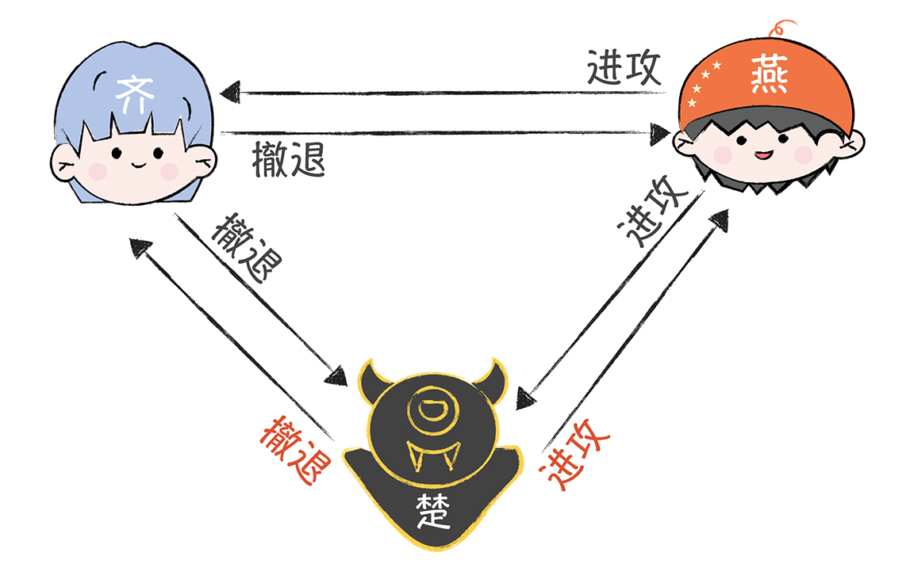
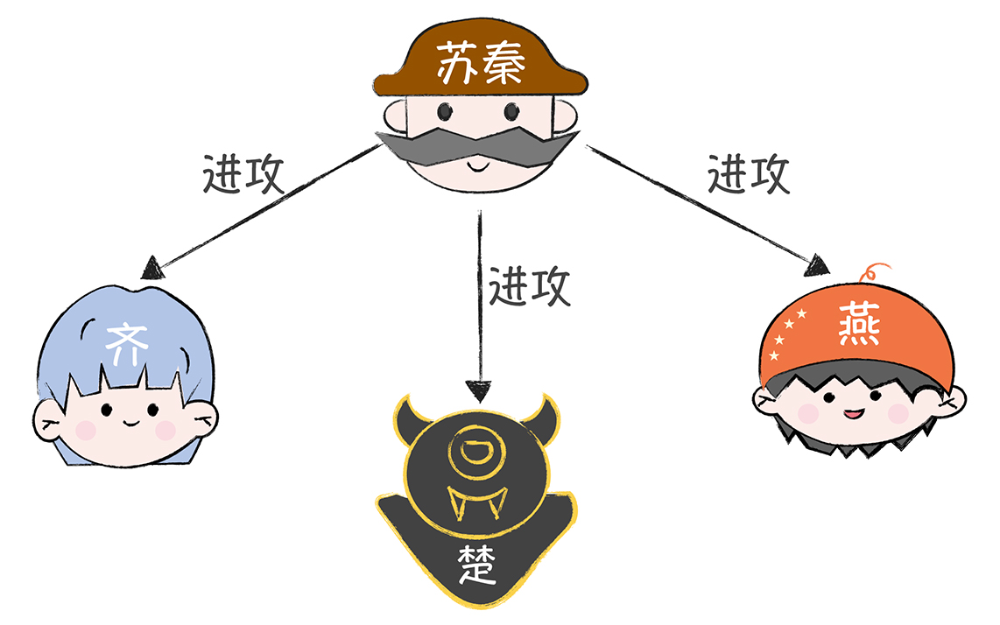
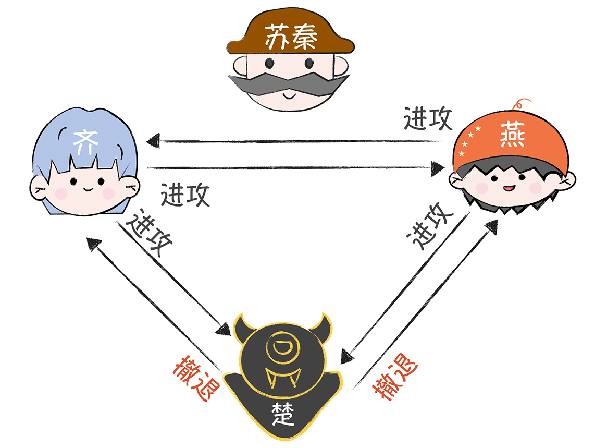
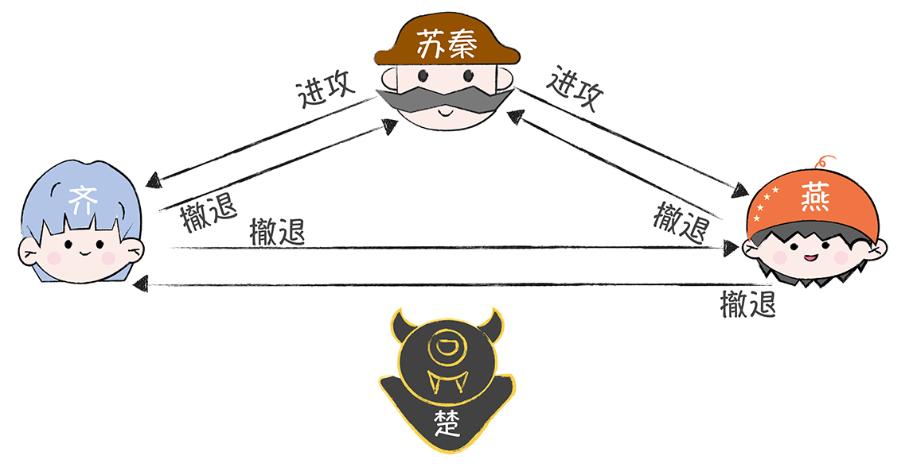
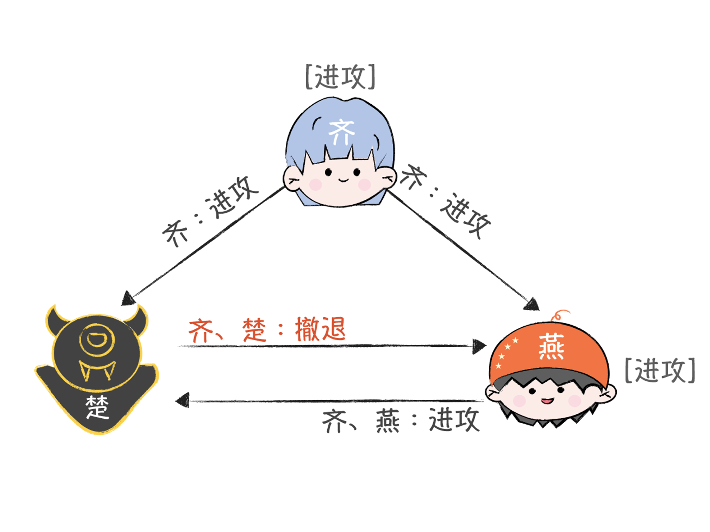
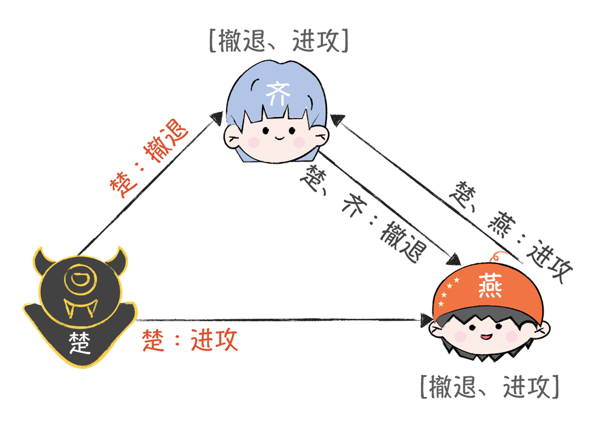

[TOC]

# 拜占庭问题

一下内容源于极客时间，讲师韩健。

在日常工作中，我常听到有人吐槽“没看懂拜占庭将军问题”“中文的文章看不懂，英文论文更看不下去”。想必你也跟他们一样，有类似的感受。

在我看来，拜占庭将军问题（The Byzantine Generals Problem），它其实是借拜占庭将军的故事展现了分布式共识问题，还探讨和论证了解决的办法。而大多数人觉得它难理解，除了因为分布式共识问题比较复杂之外，还与莱斯利·兰伯特（Leslie Lamport）的讲述方式有关，他在一些细节上（比如，口信消息型拜占庭问题之解的算法过程上）没有说清楚。

实际上，它是分布式领域最复杂的一个容错模型，一旦搞懂它，你就能掌握分布式共识问题的解决思路，还能更深刻地理解常用的共识算法，在设计分布式系统的时候，也能根据场景特点选择适合的算法，或者设计适合的算法了。而我把拜占庭将军的问题放到第一讲，主要是因为它很好地抽象了分布式系统面临的共识问题，理解了这个问题，会为你接下来的学习打下基础。

那么接下来，我就以战国时期六国抗秦的故事为主线串联起整篇文章，让你读懂、学透。

## 1. 苏秦困境

战国时期，齐、楚、燕、韩、赵、魏、秦七雄并立，后来秦国的势力不断强大起来，成了东方六国的共同威胁。于是，这六个国家决定联合，全力抗秦，免得被秦国各个击破。一天，苏秦作为合纵长，挂六国相印，带着六国的军队叩关函谷，驻军在了秦国边境，为围攻秦国作准备。但是，因为各国军队分别驻扎在秦国边境的不同地方，所以军队之间只能通过信使互相联系，这时，苏秦面临了一个很严峻的问题：如何统一大家的作战计划？

万一一些诸侯国在暗通秦国，发送误导性的作战信息，怎么办？如果信使被敌人截杀，甚至被敌人间谍替换，又该怎么办？这些都会导致自己的作战计划被扰乱，然后出现有的诸侯国在进攻，有的诸侯国在撤退的情况，而这时，秦国一定会趁机出兵，把他们逐一击破的。

**所以，如何达成共识，制定统一的作战计划呢？苏秦他很愁。**

这个故事，是拜占庭将军问题的一个简化表述，苏秦面临的就是典型的共识难题，也就是如何在可能有误导信息的情况下，采用合适的通讯机制，让多个将军达成共识，制定一致性的作战计划？

你可以先停下来想想，这个问题难在哪儿？我们又是否有办法，帮助诸侯国们达成共识呢？

### 1.1 二忠一叛的难题

为了便于你理解和层层深入，我先假设只有 3 个国家要攻打秦国，这三个国家的三位将军，咱们简单点儿，分别叫齐、楚、燕。同时，又因为秦国很强大，所以只有半数以上的将军参与进攻，才能击败敌人（注意，这里是假设哈，你别较真），在这个期间，将军们彼此之间需要通过信使传递消息，然后协商一致之后，才能在同一时间点发动进攻。

举个例子，有一天，这三位将军各自一脸严肃地讨论明天是进攻还是撤退，并让信使传递信息，按照“少数服从多数”的原则投票表决，两个人意见一致就可以了，比如：

1. 齐根据侦查情况决定撤退；
2. 楚和燕根据侦查信息，决定进攻。

那么按照原则，齐也会进攻。最终，3 支军队同时进攻，大败秦军。

可是，问题来了： 一旦有人在暗通秦国，就会出现作战计划不一致的情况。比如齐向楚、燕分别发送了“撤退”的消息，燕向齐和楚发送了“进攻”的消息。撤退：进攻 =1:1，无论楚投进攻还是撤退，都会成为 2:1，这个时候还是会形成一个一致性的作战方案。

但是，楚这个叛徒在暗中配合秦国，让信使向齐发送了“撤退”，向燕发送了“进攻”，那么：

- 燕看到的是，撤退：进攻 =1:2；
- 齐看到的是，撤退：进攻 =2:1。

按照“少数服从多数”的原则，就会出现燕单独进攻秦军，当然，最后肯定是因为寡不敌众，被秦军给灭了。

在这里，你可以看到，叛将楚通过发送误导信息，非常轻松地干扰了齐和燕的作战计划，导致这两位忠诚将军被秦军逐一击败。这就是所说的二忠一叛难题。 那么苏秦应该怎么解决这个问题呢？我们来帮苏秦出出主意。

**苏秦该怎么办？**

**解决办法一：口信消息型拜占庭问题之解**
先来说说第一个解决办法。首先，三位将军都分拨一部分军队，由苏秦率领，苏秦参与作战计划讨论并执行作战指令。这样，3位将军的作战讨论，就变为了4位将军的作战讨论，这能够增加讨论中忠诚将军的数量。

然后呢，4位将军还约定了，如果没有收到命令，就执行预设的默认命令，比如“撤退”。除此之外，还约定一些流程来发送作战信息、执行作战指令，比如，进行两轮作战信息协商。为什么要执行两轮呢？先卖个关子，你一会儿就知道了。

**第一轮：**

- 先发送作战信息的将军作为指挥官，其他的将军作为副官；
- 指挥官将他的作战信息发送给每位副官；
- 每位副官，将从指挥官处收到的作战信息，作为他的作战指令；
- 如果没有收到作战信息，将把默认的“撤退”作为作战指令。

**第二轮：**

- 除了第一轮的指挥官外，剩余的 3 位将军将分别作为指挥官，向另外 2 位将军发送作战信息；
- 然后，这 3 位将军按照“少数服从多数”，执行收到的作战指令。

为了帮助你直观地理解苏秦的整个解决方案，我来演示一下作战信息协商过程。而且，我会分别以忠诚将军和叛将先发送作战信息为例来演示， 这样可以完整地演示叛将对作战计划干扰破坏的可能性。

首先是 3 位忠诚的将军先发送作战信息的情况。

为了演示方便，假设苏秦先发起作战信息，作战指令是“进攻”。那么在第一轮作战信息协商中，苏秦向齐、楚、燕发送作战指令“进攻”。

在第二轮作战信息协商中，齐、楚、燕分别作为指挥官，向另外 2 位发送作战信息“进攻”，因为楚已经叛变了，所以，为了干扰作战计划，他就对着干，发送“撤退”作战指令。

最终，齐和燕收到的作战信息都是“进攻、进攻、撤退”，按照原则，齐和燕与苏秦一起执行作战指令“进攻”，实现了作战计划的一致性，保证了作战的胜利。

那么，如果是叛徒楚先发送作战信息，干扰作战计划，结果会有所不同么？我们来具体看一看。在第一轮作战信息协商中，楚向苏秦发送作战指令“进攻”，向齐、燕发送作战指令“撤退”。

然后，在第二轮作战信息协商中，苏秦、齐、燕分别作为指挥官，向另外两位发送作战信息。

最终，苏秦、齐和燕收到的作战信息都是“撤退、撤退、进攻”，按照原则，苏秦、齐和燕一起执行作战指令“撤退”，实现了作战计划的一致性。也就是说，无论叛将楚如何捣乱，苏秦、齐和燕，都执行一致的作战计划，保证作战的胜利。

这个解决办法，其实是兰伯特在论文《The Byzantine Generals Problem》中提到的口信消息型拜占庭问题之解：**如果叛将人数为 m，将军人数不能少于 3m + 1 ，那么拜占庭将军问题就能解决了**。 不过，作者在论文中没有讲清楚一些细节，为了帮助你阅读和理解论文，在这里我补充一点：

这个算法有个前提，也就是叛将人数 m，或者说能容忍的叛将数 m，是已知的。在这个算法中，叛将数 m 决定递归循环的次数（也就是说，叛将数 m 决定将军们要进行多少轮作战信息协商），即 m+1 轮（所以，你看，只有楚是叛变的，那么就进行了两轮）。你也可以从另外一个角度理解：n 位将军，最多能容忍 (n - 1) / 3 位叛将。关于这个公式，你只需要记住就好了，推导过程你可以参考论文。

不过，这个算法虽然能解决拜占庭将军问题，但它有一个限制：如果叛将人数为 m，那么将军总人数必须不小于 3m + 1。

在二忠一叛的问题中，在存在 1 位叛将的情况下，必须增加 1 位将军，将 3 位将军协商共识，转换为 4 位将军协商共识，这样才能实现忠诚将军的一致性作战计划。那么有没有办法，在不增加将军人数的时候，直接解决二忠一叛的难题呢？

**解决办法二：签名消息型拜占庭问题之解**

其实，苏秦还可以通过签名的方式，在不增加将军人数的情况下，解决二忠一叛的难题。首先，苏秦要通过印章、虎符等信物，实现这样几个特性：

- 忠诚将军的签名无法伪造，而且对他签名消息的内容进行任何更改都会被发现；
- 任何人都能验证将军签名的真伪。

这时，如果忠诚的将军，比如齐先发起作战信息协商，一旦叛将小楚修改或伪造收到的作战信息，那么燕在接收到楚的作战信息的时候，会发现齐的作战信息被修改，楚已叛变，这时他将忽略来自楚的作战信息，最终执行齐发送的作战信息。

如果叛变将军楚先发送误导的作战信息，那么，齐和燕将按照一定规则（比如取中间的指令）在排序后的所有已接收到的指令中（比如撤退、进攻）中选取一个指令，进行执行，最终执行一致的作战计划。

这个解决办法，是兰伯特在论文中提到的签名消息型拜占庭问题之解。而通过签名机制约束叛将的叛变行为，任何叛变行为都会被发现，也就会实现无论有多少忠诚的将军和多少叛将，忠诚的将军们总能达成一致的作战计划。

我想，如果当时苏秦能够具备分布式系统设计的思维，掌握这几种算法，应该就不用担心作战计划被干扰了吧。

## 2. 内容小结

本节课，为了帮助你理解拜占庭将军问题，我讲了苏秦协商作战的故事，现在让我们跳回现实世界，回到计算机世界的分布式场景中：

- 故事里的各位将军，你可以理解为计算机节点；
- 忠诚的将军，你可以理解为正常运行的计算机节点；
- 叛变的将军，你可以理解为出现故障并会发送误导信息的计算机节点；
- 信使被杀，可以理解为通讯故障、信息丢失；
- 信使被间谍替换，可以理解为通讯被中间人攻击，攻击者在恶意伪造信息和劫持通讯。

这样一来，你是不是就理解了计算机分布式场景中面临的问题，并且知道了解决的办法呢？

那么我想强调的是，拜占庭将军问题描述的是最困难的，也是最复杂的一种分布式故障场景，除了存在故障行为，还存在恶意行为的一个场景。你要注意，在存在恶意节点行为的场景中（比如在数字货币的区块链技术中），必须使用拜占庭容错算法（Byzantine Fault Tolerance，BFT）。除了故事中提到两种算法，常用的拜占庭容错算法还有：PBFT 算法，PoW 算法（为了重点突出，这些内容我会在后面讲解）。

而在计算机分布式系统中，最常用的是非拜占庭容错算法，即故障容错算法（Crash Fault Tolerance，CFT）。CFT 解决的是分布式的系统中存在故障，但不存在恶意节点的场景下的共识问题。 也就是说，这个场景可能会丢失消息，或者有消息重复，但不存在错误消息，或者伪造消息的情况。常见的算法有 Paxos 算法、Raft 算法、ZAB 协议（这些内容我同样会在后面讲解）。

那么，如何在实际场景选择合适的算法类型呢？答案是：如果能确定该环境中各节点是可信赖的，不存在篡改消息或者伪造消息等恶意行为（例如 DevOps 环境中的分布式路由寻址系统），推荐使用非拜占庭容错算法；反之，推荐使用拜占庭容错算法，例如在区块链中使用 PoW 算法。

## 3. 思考

文中我提了两类容错算法，分别是拜占庭容错算法和非拜占庭容错算法，那么在常见的分布式软件系统中，哪些场景必须要使用拜占庭容错算法呢？哪些场景使用非拜占庭容错算法就可以了呢？
