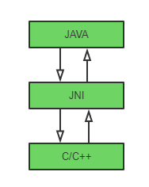

[TOC]

# Java本地接口

Java Native Interface。JNI的作用就是允许本地程序(比如C/C++，也就是编译依赖本地硬件和系统)和Java程序之间相互访问。

## JNI与JNA

## JNI官方文档

[Java Native Interface Specification Content](https://docs.oracle.com/en/java/javase/12/docs/specs/jni/index.html)
