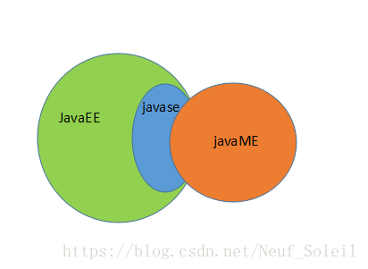

[TOC]

# JavaEE & JavaSE & JavaME

- Java SE(Java Platform,Standard Edition)，应该先说这个，因为这个是标准版本。
- Java EE (Java Platform，Enterprise Edition)，java 的企业版本。
- Java ME(Java Platform，Micro Edition)，java的微型版本。

se写桌面应用，ee写web应用，me写移动应用。但现在me被安卓取代了。ee用的很少，用的都是在ee上面衍生出来的spring。

JavaSE 可以开发和部署在桌面、服务器、嵌入式环境和实时环境中使用的 Java 应用程序。是EE，和ME的基础。一般就是指JDK。就是Java的基础语法（变量、方法、类之间的调用、关系，继承、接口、线程之类的），工具包（java.util.*  ）,或者其他的一些封装。

JavaEE，其实是一套规范，就是用java语言做企业开发（目前看来就是开发一些动态网站，或者对外提供调用服务的网站，或者其他没接触过的）中的一整套规范，比如类怎么封装，网页的请求要用什么方法处理，语言编码一类的处理，拦截器啊什么的定义，请求返回得有什么信息（具体看servlet的接口就知道了）比如：tomcat就是按照这套规范开发的容器软件，还有什么weblogic，JBoss、Resin等等正因为我们开发网站（使用JSP，Servelet..或者封装了这些的框架：SSH...）可以放在tomcat，也可以放在JBoss...，因为都是按照一个规范开发的东西，实际使用的还是JavaSE的那些东西，多出来的就是EE的一些规范类的封装代码。JavaEE 是在 JavaSE 的基础上构建的，是对 JavaSE 的扩展，增加了一些更加便捷的应用框架。

JavaME 是微型版本，顾名思义，使用在手机啊，小设备啊上面的Java版本，特点就是小，相比JavaSE精简了很大一部分东西。

三者的关系可以用下集合关系图表示：

## JavaEE

Java刚开始的时候，因为各种应用和生态不成熟，很多东西需要有人牵头制定强制规范引导Java的发展，于是Java EE曾经引领了企业级应用的开发。

但随着时代的进步，以及越来越多的公司和组织参与到Java世界，出现了各种各样的Java EE组件的代替者，比如Hibernate、Spring就是其中两个典型。相反，Java官方制定的各种Java EE规范反而不太受欢迎，他们制定了JSF规范，但实际企业开发喜欢用Struts 2、Spring MVC；他们制定了EJB规范，但实际企业开发往往还是喜欢用Spring；他们制定了JPA规范，但实际企业开发往往还是喜欢直接用Hibernate、MyBatis。

现代企业级应用常用的各种框架和工具，比如Struts 2、Spring、Hibernate、jBPM、Activiti、Lucene、Hadoop、Drools、CXF等这些大家耳熟能详的组件，全部都不是来自Oracle官方，但是却在企业应用中开发经常用到的。

现在企业里面，真正常用的JavaEE规范有什么？Servlet、JSP、JMS、JNDI。这些技术都只是充当了一个程序的入口而已。

Oracle之所以可能考虑放弃Java EE，正体现了Oracle对丧失Java控制权的无奈。企业的本质是逐利，Oracle每年为制定Java EE规范投入不少人力、财力，但制定的规范最终并没有获得市场的青睐，所以Oracle可能放弃这种吃亏不讨好的事情。

但Java不同，2016年6月，Java在商业语言排行榜上的市场份额将近21%，庞大到恐怖的市场份额，背后隐藏着巨大各种专利使用费和盈利商机，任何一个理智的公司都不会放弃这个会下金蛋的母鸡。

由此可见，oracle上提供的java EE是官方指定的javaEE规范，里面都是符合官方指定的javaEE组件，我们用SSM，SSH开发后台时使用到的只有Servlet、JSP、JMS等少量的java EE规范，没有必要使用orcale提供的java EE版本，直接使用jdk就可以（当然还需要maven等管理第三方的jar包来实现功能）

## JavaEE的13中规范

一、JDBC：Java Data Base Connectivity,数据库连接

　　大家对微软的ODBC数据库访问的接口比较熟悉，而在java中创建数据库连接使用的是JDBC，学习过程中，JDBC和ODBC很相似，甚至JDBC比ODBC更好用，这是因为JDBC是在ODBC的基础上开发的，集成的ODBC的很多优点，同时他也是独立平台的。

二、JNDI：Java Naming and Directory Interfaces,Java的命名和目录接口

　　JNDI是一个Java应用程序设计接口，它为我们提供了查找和访问各种命名和目录服务的通用、统一方式。JNDI避免了程序与数据库之间的紧耦合，使应用更加易于配置，便于部署。有了JNDI，我们就不要关心“具体的数据库后台是什么？JDBC驱动程序是什么？JDBC URL格式是什么？访问数据库的用户名和密码是什么？”这些问题了。我们编写的程序不用关心对JDBC驱动的引用。我们只需要在J2EE容器中定义一个数据源，然后通过这个数据源访问后台数据库。
　　参考：http://blog.csdn.net/zhaosg198312/article/details/3979435

三、EJB：Enterprise Java Beans，企业级Java Beans、EJB是实现分布式业务逻辑的Java组件。

　　它以一个标准自动处理了如数据持久化、事务集成、安全对策等问题，为后台业务提供了一个标准方式。EJB规范讨论了四中对象类型：无状态会话bean、有状态会话bean、实体bean、消息驱动bean。Stateless Session Beans是一类不包含状态信息的分布式对象，允许来自多个客户端的并发访问。无状态回话Bean没有资源集约性，访问的实例变量内容页不会被保存。举个例子：一个发送邮件的EJB就可以设计为一个无状态回话Bean。整个会话期，用户指向服务器提交一个动作：发送指定邮件到我的地址。Stateful Session Beans是包含状态的实例对象。比如在淘宝买完东西结账时，就需要一个有状态会话bean，因为服务器必须随时了解用户进行到了哪一步。尽管有状态会话bean可以被保存，但始终只能同时由一个用户来访问。Entity Beans用于实现O/R映射，负责将数据库中的表记录映射为内存中的Entity对象，事实上，创建一个Entity Bean对象，相当于新建一条记录，删除一个Entity Bean会同时从数据库中删除对应记录，修改时，容器会自动将Entity Bean的状态和数据库同步。MessageDrven Bean支持异步行为的分布式对象。消息驱动Bean的示例有监控应用错误队列并向email寻呼机发送非常要重错误的EJB；处理servlet发回的网站反馈信息的EJB；打印从订单队列到仓库打印机的订单EJB……

四、RMI：Remote Method Invocation，远程方法调用
　　RMI是一种机制，能够让在某个Java虚拟机上的对象调用另一个Java虚拟机中的对象上的方法，它使得客户机上运行的程序可以调用远程服务器上的对象。
参考：http://www.cnblogs.com/ninahan0419/archive/2009/06/25/javarmi.html#top

五、Java IDL/CORBA：Java Interface Definiyion Language/Common Object Request  Broker Architecture ，Java接口定义语言/公用对象请求代理程序体系结构
　　CORBA是一个分布式的面向对象应用架构规范，定义了分布式对象如何实现互操作。CORBA对象的接口使用IDL语言来定义。对象的接口定义了对象的类型，对象的方法和引用参数以及对象方法可能返回的异常结果。

六、JSP：Java Server Pages
　　JSP页面有HTML代码和嵌入其中的Java代码组成。它将网页逻辑与网页设计显示分离，支持可重用的基于组件的设计，是的java开发快速、容易。JSP是一种动态页面技术，它主要目的是将表示逻辑从Servlet中分离出来。

七、Servlet
　　Servlet是服务端的Java应用程序，可以生成动态的页面，在客户端Session中保存客户的数据。它定义了动态生成HTML、XML或其他格式文档的Web网页的技术标准。JSP以Java语言作为脚本语言，将java代码和特定的预定义动作嵌入到静态页面中。
下面是Serlvet八大内置对象：

八、XML：Extensible Markup Language，可扩展标记语言
　　在学习donet时，我们就学习过XML。它是一种与平台无关的通用数据交换格式。所以说，XML与跨平台运行的Java结合，绝对件完美的事情。

九、JMS：Java Message Service，Java消息服务
　　JMS是java平台上有关面向消息中间件的技术规范。
　　JMS对象模型包含六个要素：连接工厂、JMS连接、JMS会话、JMS目的、JMS生产者和消费者、JMS消息类型（点对点、发布/订阅）。

- 连接工厂：由管理员创建，绑定到JNDI树种。客户端使用JNDI查找连接工厂，然后利用连接工厂创建一个JMS连接。
- JMS连接：JMS会话表示JMS客户与JMS服务器之间的会话状态。JMS会话建立在JMS连接上，表示客户与服务器之间的一个会话线程。
- JMS目的：消息队列，是实际的消息源。
- 生产者和消费者：由Session对象创建，用于发送和接受消息。
- 点对点消息类型：消息发送给一个单独的使用者。
- 发布/订阅消息类型：支持一个事件驱动模型，生产者和消费者都残余消息的传递。

十、JTA：Java Transaction API，Java事务API
　　JTA允许应用程序执行分布式事务处理，在多个网络计算机资源上访问并且更新数据，极大地增强了数据访问能力。

十一、JTS：Java Transaction Service，Java事务服务
　　JTS是一个组件事务监视器。JTS和JTA为J2EE提供了分布式事务服务。

十二、JavaMail
　　为我们提供了电子邮件的开发接口。它可以方便的执行一些常用的邮件传输。JavaMail包中用于处理电子邮件的核心类是：　　　　Session,Message,Address,Authenticator,Transport,Store,Folder等。Session定义了一个基本的邮件会话，它需要从Properties中读取类似于邮件服务器，用户名和密码等信息。

十三、JAF：JavaBeans Activation Framework，JavaBeans活动床架
　　JAF是一个专用的数据处理框架，它用于封装数据，并为应用程序访问和操作数据的接口。JFA主要作用在于让Java应用层序知道如何对一个数据源进行查看、编辑和打印等操作。应用程序通过JAF提供的接口可以完成：访问数据源中的数据、获取数据源数据类型、获知可对数据进行的操作、用户执行操作时，自动创建该操作的软件部件的实例对象。

## JSR

[JSR：Java Spec. Requests](https://jcp.org/en/jsr/platform)
