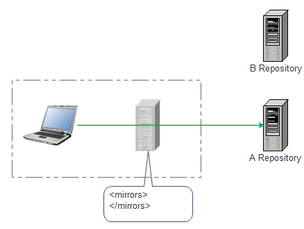
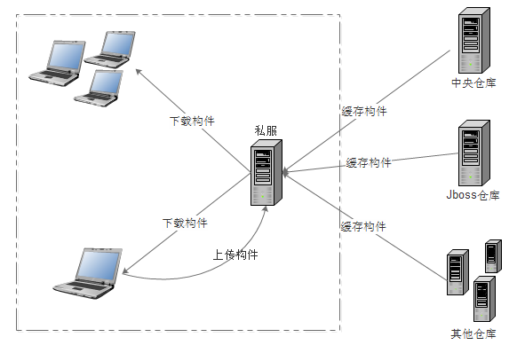
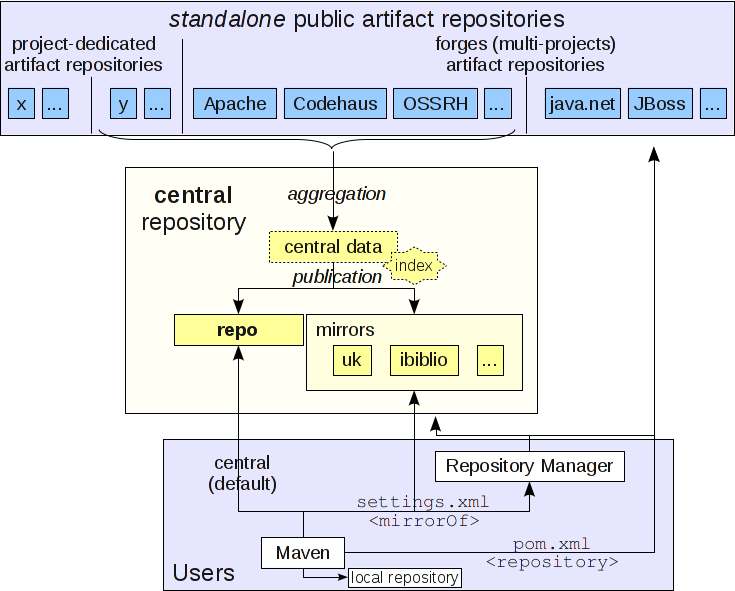

[TOC]

# Maven的mirror和repository的区别

如果看maven的配置文件，对于新手而言很容易被其中的mirror、repository两个相关配置和概念给搞糊涂。下面分别对二者做介绍，并介绍二者之间的关系。

## Repository

中文名称仓库，顾名思义，就是真正存放jar包、plugin的地方。它有两种：

- remote repository: 公共的远程仓库，大家都可以访问，一般以URL的方式访问。
- local repository: 本地的存放从远程仓库下载下来的jar包和plugin，就是本地的一个目录，maven程序加载依赖时，优先从本地查找，如果没有找到，就会从远程仓库下载，然后在缓存到本地供下次使用。

远程仓库主要有三种：

- 中央仓库：http://repo1.maven.org/maven2/ 和 http://repo2.maven.org/maven2，maven仓库的根仓库，也是默认下载内容的仓库。
- 私服：内网中构建的maven repository。
- 其他公共仓库：比如jboss repository等

## Mirror

相当于一个拦截器，会把对一个remote repository的请求重定向到另一个repository。

比如，没有配置mirror时：

此时maven的配置文件中的mirror配置如下：

```xml
<mirrors>
</mirrors>
```

如下配置了mirrors:

```xml
<mirrors>
    <mirror>
      <id>brepository</id>
      <name>b repository</name>
      <url>http://maven.B.com/</url>
      <mirrorOf>A</mirrorOf>
    </mirror>
</mirrors>
```

此时B就是A的镜像，所有访问A repository的请求都会被重定向给B repository。

mirrorOf中是放置被镜像的repository id，关于mirrorOf的几种用法：

1. 表示匹配所有远程仓库

```xml
<mirrorOf>*</mirrorOf>
```

2. 表示匹配repo1和repo2，多个用逗号隔开

```xml
<mirrorOf>repo1,repo2</mirrorOf>
```

3. 匹配除了repo1之外的其他

```xml
<mirrorOf>*,!repo1</mirrorOf>
```

## mirror的目的

两种：默认访问的repository无法访问，比如无法上网的内网中，这个时候需要通过mirror来将请求重定向到内部的repository；还有一种是为了提速，比如中央仓库过于慢。

**注意**：由于mirror会完全屏蔽被镜像的仓库，所以如果镜像仓库无法访问了，那么maven便无法下载内容了。

## 私服

一种特殊的远程镜像仓库，假设在局域网内。一般被设置为互联网仓库的镜像供内网用户使用。

maven下载内容时，先向私服请求，如果私服上不存在，那么私服从外部仓库下载，同时缓存到私服上。同时，内部的jar包也可以上传到私服上供内部使用。




## 参考

[mirror和repository的区别](https://www.cnblogs.com/bollen/p/7143551.html)
