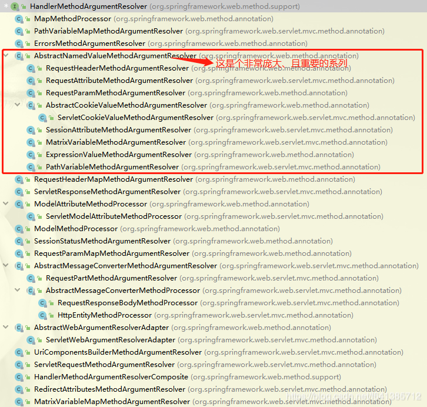
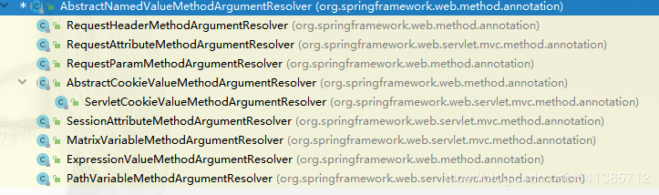
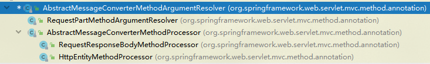

[TOC]

# Controller参数解析

我们在使用Spring MVC框架时，通过简单的几个注解就可以将一个函数声明为一个Handler，而且可以通过诸如：@PathVariable、@RequestParam、@RequestBody、@PathVariable等注解完成函数调用时的参数自动注入。Spring MVC是怎么做到的呢？

**答案就是HandlerMethodArgumentResolver。**

## 1. HandlerMethodArgumentResolver

HandlerMethodArgumentResovler是一个接口，我们先来看看这个接口约定的参数解析方式。

```java
// @since 3.1   HandlerMethod 方法中 参数解析器
public interface HandlerMethodArgumentResolver {

    // 判断 HandlerMethodArgumentResolver 是否支持 MethodParameter
    // (PS: 一般都是通过 参数上面的注解|参数的类型)
    boolean supportsParameter(MethodParameter parameter);

    // 从NativeWebRequest中获取数据，ModelAndViewContainer用来提供访问Model
    // MethodParameter parameter：请求参数
    // WebDataBinderFactory用于创建一个WebDataBinder用于数据绑定、校验
    @Nullable
    Object resolveArgument(MethodParameter parameter, @Nullable ModelAndViewContainer mavContainer, NativeWebRequest webRequest, @Nullable WebDataBinderFactory binderFactory) throws Exception;
}
```

Spring MVC针对这个接口的实现类也很多：


这些实现类根据解析参数方法的不同可以分为四类：

- 基于Name
- 基于类型是Map的
- 基于固定参数类型
- 基于ContentType的消息转换器

## 2. 基于Name

从URI（路径变量）、HttpServletRequest、HttpSession、Header、Cookie...等中根据名称key来获取值。

这种类型的参数解析器都是通过继承抽象类AbstractNamedValueMethodArgumentResolver来实现的。

继承这个抽象类的Resolver包含：


里面覆盖了常用的参数解析器。

## 3. 参数类型是Map

对上面基于Name的参数解析的补充，**满足以下需求**：我们希望通过同样的注解：@RequestParam、@RequestHeader、@PathVariable、@MatrixVariable等，实现将相应的所有key-value值都放到一个Map中供后面方法使用。

```java
 @ResponseBody
@GetMapping("/test")
public Object test(@RequestParam Map<String,Object> params) {
    System.out.println(params);
    return params;
}
```

请求：**/test?name=fsx&age=18&age=28**，输出：{name=fsx, age=18}

从结果可以知道：

- 它不能传一key多值情况
- 若出现相同的key，以在最前面的key的值为准。
- Map实例是一个LinkedHashMap<String,String>实例

## 4. 固定参数类型

参数比如是SessionStatus, ServletResponse, OutputStream, Writer, WebRequest, MultipartRequest, HttpSession, Principal, InputStream等。

这种方式使用得其实还比较多的。比如平时我们需要用Servlet源生的API：HttpServletRequest, HttpServletResponse肿么办？ 在Spring MVC内就特别特别简单，只需要在入参上声明：就可以直接使用啦。

## 5. 基于ContentType

我们使用非常频繁的@RequestBody是怎么封装请求体的呢？方法就是这一节要说的基于ContentType来解析参数的相关Resolver。

这类参数解析器的基类是AbstractMessageConverterMethodArgumentResolver。


### 5.1 RequestPartMethodArgumentResolver

它用于解析参数被@RequestPart修饰，或者参数类型是MultipartFile | Servlet 3.0提供的javax.servlet.http.Part类型（并且没有被@RequestParam修饰），数据通过 HttpServletRequest获取。

当属性被标注为@RequestPart的话，那就会经过HttpMessageConverter结合Content-Type来解析，它和多部分文件上传有关。

### 5.2 AbstractMessageConverterMethodProcessor

命名为Processor说明它既能处理入参，也能处理返回值，当然本文的关注点是方法入参（和HttpMessageConverter相关）。

#### 5.2.1 RequestResponseBodyMethodProcessor

顾名思义，它负责处理@RequestBody这个注解的参数。

#### 5.2.2 HttpEntityMethodProcessor

用于处理HttpEntity和RequestEntity类型的入参的。

## 6. HandlerMethodArgumentResolver使用场景

内置的Resovler基本上可以满足常规需求，以下场景也可以通过自定义Resolver来满足。

- 获取登录用户的基本信息
- 调整数据结构

### 6.1 获取用户登录信息

1. 自定义一个参数注解（注解并不是100%必须的，可完全根据类型来决策）

```java
/**
 * 用于获取当前登陆人信息的注解,配合自定义的参数处理器使用
 *
 * @see CurrUserArgumentResolver
 */
@Target({ElementType.PARAMETER})
@Retention(RetentionPolicy.RUNTIME)
@Documented
public @interface CurrUser {
}

// 待封装的Vo
@Getter
@Setter
@ToString
public class CurrUserVo {
    private Long id;
    private String name;
}
```

2. 自定义参数解析器CurrUserArgumentResolver并完成注册

```java
public class CurrUserArgumentResolver implements HandlerMethodArgumentResolver {

    // 只有标注有CurrUser注解，并且数据类型是CurrUserVo/Map/Object的才给与处理
    @Override
    public boolean supportsParameter(MethodParameter parameter) {
        CurrUser ann = parameter.getParameterAnnotation(CurrUser.class);
        Class<?> parameterType = parameter.getParameterType();
        return (ann != null &&
                (CurrUserVo.class.isAssignableFrom(parameterType)
                        || Map.class.isAssignableFrom(parameterType)
                        || Object.class.isAssignableFrom(parameterType)));
    }

    @Override
    public Object resolveArgument(MethodParameter parameter, ModelAndViewContainer container, NativeWebRequest webRequest, WebDataBinderFactory binderFactory) throws Exception {
        HttpServletRequest request = webRequest.getNativeRequest(HttpServletRequest.class);
        // 从请求头中拿到token
        String token = request.getHeader("Authorization");
        if (StringUtils.isEmpty(token)) {
            return null; // 此处不建议做异常处理，因为校验token的事不应该属于它来做，别好管闲事
        }

        // 此处作为测试：new一个处理（写死的）
        CurrUserVo userVo = new CurrUserVo();
        userVo.setId(1L);
        userVo.setName("fsx");

        // 判断参数类型进行返回
        Class<?> parameterType = parameter.getParameterType();
        if (Map.class.isAssignableFrom(parameterType)) {
            Map<String, Object> map = new HashMap<>();
            BeanUtils.copyProperties(userVo, map);
            return map;
        } else {
            return userVo;
        }

    }
}

// 注册进Spring组件内
@Configuration
@EnableWebMvc
public class WebMvcConfig extends WebMvcConfigurerAdapter {

    @Override
    public void addArgumentResolvers(List<HandlerMethodArgumentResolver> argumentResolvers) {
        argumentResolvers.add(new CurrUserArgumentResolver());
    }
}
```

3. 测试用例

```java
@Controller
@RequestMapping
public class HelloController {

    @ResponseBody
    @GetMapping("/test/curruser")
    public Object testCurrUser(@CurrUser CurrUserVo currUser) {
        return currUser;
    }
    @ResponseBody
    @GetMapping("/test/curruser/map")
    public Object testCurrUserMap(@CurrUser Map<String,Object> currUser) {
        return currUser;
    }
    @ResponseBody
    @GetMapping("/test/curruser/object")
    public Object testCurrUserObject(@CurrUser Object currUser) {
        return currUser;
    }
}
```

如何使用Spring容器内的Bean？
在本例中，为了方便，我在CurrUserArgumentResolver里写死的自己new的一个CurrUserVo作为返回。实际应用场景中，此部分肯定是需要根据token去访问DB/Redis的，因此就需要使用到Spring容器内的Bean。

有的小伙伴就想当然了，在本例上直接使用@Autowired HelloService helloService;来使用，经测试发现这是注入不进来的，helloService值为null。那么本文就教你正确的使用姿势：

1. 姿势一：把自定义的参数解析器也放进容器

```java
@Configuration
@EnableWebMvc
public class WebMvcConfig extends WebMvcConfigurerAdapter {

    @Bean
    public CurrUserArgumentResolver currUserArgumentResolver(){
        return new CurrUserArgumentResolver();
    }
    @Override
    public void addArgumentResolvers(List<HandlerMethodArgumentResolver> argumentResolvers) {
        argumentResolvers.add(currUserArgumentResolver());
    }
}
```

这样，你在CurrUserArgumentResolver就可以顺理成章的注入想要的组件了，形如这样：

```java
public class CurrUserArgumentResolver implements HandlerMethodArgumentResolver {

    @Autowired
    HelloService helloService;
    @Autowired
    StringRedisTemplate stringRedisTemplate;
    ...
}
```

这种方案的优点是：在Spring容器内它几乎能解决大部分类似问题，在组件不是很多的情况下，推荐新手使用，因为无需过多的理解Spring内部机制便可轻松使用。

2. 姿势二：借助AutowireCapableBeanFactory给对象赋能

本着"减轻"Spring容器"负担"的目的，"手动"精细化控制Spring内的Bean组件。像本文的这种解析器其实是完全没必要放进容器内的，需要什么组件让容器帮你完成注入即可，自己本文就没必要放进去喽：

```java
@Configuration
@EnableWebMvc
public class WebMvcConfig extends WebMvcConfigurerAdapter {

    @Autowired
    private ApplicationContext applicationContext;
    @Override
    public void addArgumentResolvers(List<HandlerMethodArgumentResolver> argumentResolvers) {
        CurrUserArgumentResolver resolver = new CurrUserArgumentResolver();
        // 利用工厂给容器外的对象注入所需组件
        applicationContext.getAutowireCapableBeanFactory().autowireBean(resolver);
        argumentResolvers.add(resolver);
    }
}
```

本姿势的技巧是利用了AutowireCapableBeanFactory巧妙完成了给外部对象赋能，从而即使自己并不是容器内的Bean，也能自由注入、使用容器内Bean的能力（同样可以随意使用@Autowired注解了~）。
这种方式是侵入性最弱的，是我推荐的方式。当然这需要你对Spring容器有一定的了解才能运用自如，做到心中有数才行，否则不建议你使用~

总结
自定义参数解析器HandlerMethodArgumentResolver最重要不是它本身的实现，而是它的指导思想：分离关注，业务解耦。当然本文我摘出来的两个使用场景案例只是冰山一角，各位需要举一反三，才能融会贯通。

既然我们可以自定义参数处理器HandlerMethodArgumentResolver，自然也就可以自定义返回值处理器HandlerMethodReturnValueHandler。

## 参考

1. [HandlerMethodArgumentResolver(二)：Map参数类型和固定参数类型](https://blog.csdn.net/f641385712/article/details/99980042)
2. [HandlerMethodArgumentResolver(四)：自定参数解析器处理特定场景需求](https://blog.csdn.net/f641385712/article/details/100183979?ops_request_misc=%257B%2522request%255Fid%2522%253A%2522159471440419195239812947%2522%252C%2522scm%2522%253A%252220140713.130102334.pc%255Fblog.%2522%257D&request_id=159471440419195239812947&biz_id=0&utm_medium=distribute.pc_search_result.none-task-blog-2~blog~first_rank_v1~rank_blog_v1-3-100183979.pc_v1_rank_blog_v1&utm_term=handlermethodargumentresolver)
