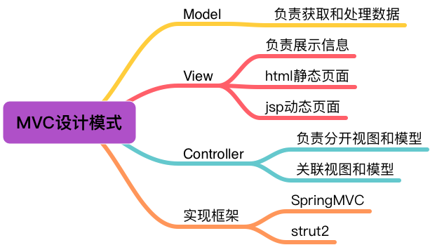

[TOC]

# MVC

MVC，Model View Controller，模型——视图——控制器。MVC是一种开发Web应用程序的设计模式，帮助更好的设计、组织代码结构。按照MVC模式设计的代码，减少了代码间的耦合，便于代码的维护和复用。

## 1. Model

业务模型，主要负责业务的处理，包括DAO和DTO类型的代码。

在SpringMVC中，就是DAO层和Service层。dao层，直接操作数据库，
service层，调用dao层来实现业务。

## 2. View

将处理的结果写入到response中，负责用户与后端系统的交互，把后端的结果经过加工，以某种用户需要的方式返回给用户。

## 3. Controller

用于连接Model和View，根据View的请求，从Model中获取需要的数据，或者执行某些操作，然后如果需要，在把结果响应给View。

## 4. 关于MVC的思考

1. 代码的解耦体现在哪？

用于完成一个业务服务的代码之间必定会存在相互依赖的关系，将存在关联性的业务逻辑按照一定的设计独立成一定的模块，这就是解耦的一种体现。

所谓解耦，其实就是“理清”，把相关联的系统按照一定的指导原则理顺，而不是把它们交织、杂糅到一起。

2. MVC的本质意义

MVC是一种归纳总结的设计代码的思路，一个系统总是可以分为“前中后”三部分的。“前”，就是为了让这个系统应对系统的使用者，为了让系统装饰门面，以一种合理的、满足用户需求的方式提供服务。“中”即为内部的协调管理者，用于调度资源、协调任务，起到连接的作用。“后”，就是底层封装，用于做具体的事，和具体的内容打交道。

不同的系统，MVC具体是什么内容也是有区别的，针对不同的系统，具体思考MVC分别对应于什么功能。

## 5. MVC应用场景

目前MVC在以下几个场景依然有广泛的应用：

第一：Web开发领域。由于Web开发的特殊性，采用MVC进行结构划分一方面会提升团队的协同开发效率，另一方面也有利于日后软件产品的维护和升级，同时能够提升软件模块的复用性，所以不论是开源框架还是独有的开发架构往往都是基于MVC的。在当前云计算技术逐渐普及的情况下，尤其是PaaS的应用，MVC框架得到了进一步的细化，模型部分与控制器和视图之间全面采用了资源接口的编程方式，微服务趋势还是比较明显的。

第二：移动互联开发。目前移动互联开发包括Android开发、iOS开发以及各种小程序开发也在采用MVC框架，尤其是在事件处理机制上往往普遍会采用MVC的处理方式，由于Android开发大都会采用Java语言，所以体现得尤其明显一些。

第三：与交互相关的开发。相对于平台开发任务更专注于算法设计不同，应用级开发往往比较关注于资源的调用和响应，这个过程要与用户完成大量的交互，而此时采用MVC结构会明显提升系统的稳定性和可扩展性，这也是为什么在交互比较多的开发任务中，往往会更愿意采用MVC框架的原因。

其实，MVC作为比较经典的开发框架，目前在大量的项目中都有所采用，作为软件开发人员来说，应该熟练掌握基于MVC的开发过程。
