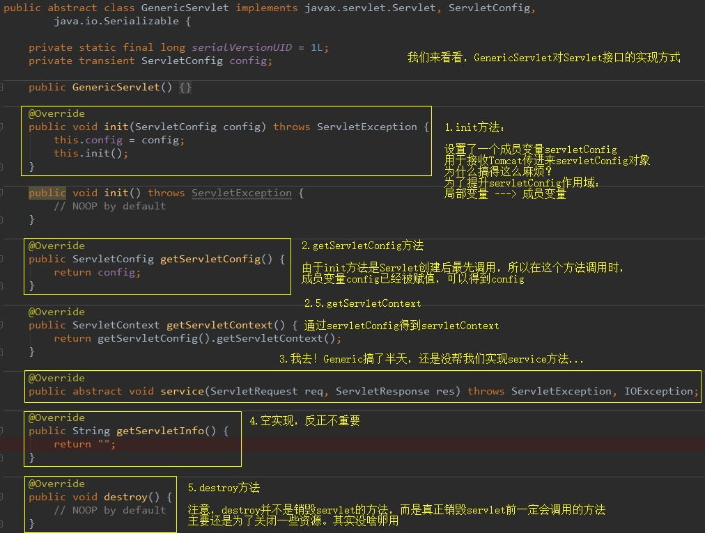
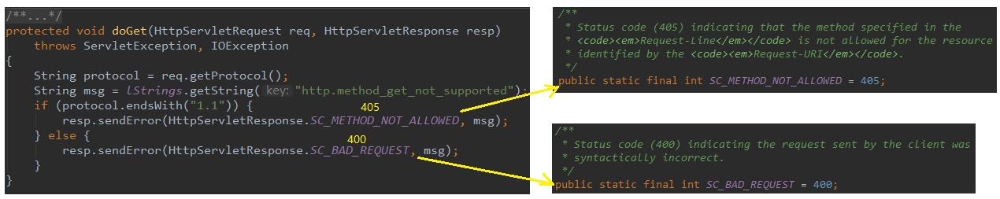

[TOC]

# Servlet

从程序层面讲Servlet就是一个接口：

```java
public interface Servlet {
    void init(ServletConfig config);
    ServletConfig getServletConfig();
    void service(ServletRequest, ServletResponse);
    String getServletInfo();
    void destroy();
}
```

接口的作用就是规范，按照接口的定义实现的类，能够纳入一个处理框架中。

Servlet无法处理来自用户的直接请求，它需要借助于Servlet容器，比如Tomcat(Tomcat是Web服务器和Servlet容器的结合)。Servlet容器的作用就是把上层和下层的通用的工作做了，只留具体的业务操作给具体的Servlet来做。

## 1. 为什么需要Servlet

Servlet，Server Applet，即运行在服务端的小程序。

先简单介绍一下Tomcat，Tomcat其实就是一个Web服务器，通过它可以构建Web服务，通过HTTP协议对外提供服务。

比如我们通过HTTP协议访问很多网站。


Web服务端涉及到很多的操作，比如暴露端口，与客户端构建连接，传入数据，解析HTTP协议的内容。这些Web服务端标准的处理过程都交由Tomcat这种Web服务器来实现。

但是针对不同的请求进行的操作是不同的Web服务根据自己的业务编写的，Java Web为此抽象成了Servlet，用Servlet来规范业务处理逻辑的编写。


题外话，Servlet不擅长处理HTML页面，所以又出现了JSP。

等Spring家族出现后，Servlet开始退居幕后，取而代之的是方便的SpringMVC。SpringMVC的核心组件DispatcherServlet其实本质就是一个Servlet。但它已经自立门户，在原来HttpServlet的基础上，又封装了一条逻辑。

PS. Java Web三大组件：Servlet、Filter、Listener。

## 2. 如何编写一个Servlet

前面说了，Servlet是一个接口，所以我们先来看看这个接口的内容：


接下来我们先理解接口中的三个类：ServletConfig、ServletRequest、ServletResponse。

### 2.1 ServletConfig

Tomcat解析web.xml得到的配置。

### 2.2 Request/Response

HTTP请求到了Tomcat后，Tomcat通过字符串解析，把各个请求头（Header），请求地址（URL），请求参数（QueryString）都封装进了Request对象中。通过调用

```java
request.getHeader();
request.getUrl()；
request.getQueryString();
...
```

等等方法，都可以得到浏览器当初发送的请求信息。

至于Response，Tomcat传给Servlet时，它还是空的对象。Servlet逻辑处理后得到结果，最终通过response.write()方法，将结果写入response内部的缓冲区。Tomcat会在servlet处理结束后，拿到response，遍历里面的信息，组装成HTTP响应发给客户端。

### 2.3 直接实现Servlet接口

Servlet接口5个方法，其中init、service、destroy是生命周期方法。init和destroy各自只执行一次，即servlet创建和销毁时。而service会在每次有新请求到来时被调用。也就是说，我们主要的业务代码需要写在service中。

但是，浏览器发送请求最基本的有两种：Get/Post，于是我们必须这样写：


直接实现javax.servlet接口还是会有很多麻烦的重复操作，如何解决呢？

### 2.4 继承GenericServlet抽象类



我们发现GenericServlet只是简单做了改良：

- 提升了init方法中原本是形参的servletConfig对象的作用域（成员变量），方便其他方法使用

- init方法中还调用了一个init空参方法，如果我们希望在servlet创建时做一些什么初始化操作，可以继承GenericServlet后，覆盖init空参方法

- 由于其他方法内也可以使用servletConfig，于是写了一个getServletContext方法

- service竟然没实现...要它何用

但是，GenericServlet做的工作太少了，接下来我们使用HttpServlet，它继承自GenericServlet。

### 2.5 继承HttpServlet抽象类


它继承了GenericServlet。GenericServlet本身是一个抽象类，有一个抽象方法service。查看源码发现，HttpServlet已经实现了service方法：


HttpServlet的service方法已经替我们完成了复杂的请求方法判断。

HttpServlet抽象出了七个方法，并提供了默认实现：报405、400错误，提示请求不支持。




到这一层基本上就是我们最后可以继承的抽象类了，继承之后，实现相应的doXXX方法。

## 3. ServletContext

ServletContext用来管理Servlet的上下文信息，方便整个Web应用之间共享数据。比如A-Servlet向ServletContext对象中保存了一个值，那么B-Servlet就可以通过ServletContext获取这个值。

每个应用一个ServletContext，ServletContext对象的创建是在服务器启动时完成的，销毁则是在服务关闭时完成。

实现共享数据的对象，在JavaWeb中共有4个，而且更习惯被称为域对象：

- ServletContext域（Servlet间共享数据）
- Session域（一次会话间共享数据，也可以理解为多次请求间共享数据）
- Request域（同一次请求共享数据）
- Page域（JSP页面内共享数据）

它们都可以看做是map，都有getAttribute()/setAttribute()方法。

### 3.1 获取ServletContext

在GenericServlet中，有一个getServletContext()方法，它从ServletConfig中获取ServletContext，但是这并不意味这ServletConfig对象包含着ServletContext对象，而是ServletConfig维系着ServletContext的引用。

其实这也很好理解：servletConfig是servletContext的一部分，就像他儿子。你问它父亲是谁，它当然能告诉你。

另外，Session域和Request域也可以得到ServletContext：

```java
session.getServletContext();
request.getServletContext();
```

共五种方法：

- ServletConfig#getServletContext();
- GenericServlet#getServletContext();
- HttpSession#getServletContext();
- HttpServletRequest#getServletContext();
- ServletContextEvent#getServletContext();

## 4. Servlet映射规则

外部来的请求到底交给哪个Servlet来处理呢？这个需要通过一定的映射规则决定，这个映射规则是通过映射器来实现的：


这所谓的映射器，其实就是Tomcat中一个叫Mapper的类。


它里面有个internalMapWrapper方法：


定义了七种映射规则：

1. 精准匹配和前缀匹配


2. 扩展名匹配


3. 欢迎列表资源匹配


4. 如果都不匹配，则交给DefaultServlet

也就是简单地用IO流读取静态资源并响应给浏览器。如果资源找不到，报404错误。


- 对于静态资源，Tomcat最后会交由一个叫做DefaultServlet的类来处理

- 对于Servlet ，Tomcat最后会交由一个叫做 InvokerServlet的类来处理

- 对于JSP，Tomcat最后会交由一个叫做JspServlet的类来处理

## 参考

1. [servlet的本质是什么，它是如何工作的](https://www.zhihu.com/question/21416727)
2. [Servlet（上）](https://zhuanlan.zhihu.com/p/65588465)
3. [Servlet（下）](https://zhuanlan.zhihu.com/p/65658315)
