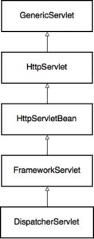

[TOC]

# Spring Web MVC如何工作

参考自https://stackify.com/spring-mvc/

## 1. 介绍

本文深入介绍了Spring MVC的强大特性和内部工作。

相关代码可以在[Github](https://github.com/Baeldung/stackify/tree/master/spring-mvc)上下载。

## 2. 项目设置

1. pom文件添加依赖

```xml
<parent>
    <groupId>org.springframework.boot</groupId>
    <artifactId>spring-boot-starter-parent</artifactId>
    <version>2.0.0.M5</version>
    <relativePath/>
</parent>

<dependencies>
    <dependency>
        <groupId>org.springframework.boot</groupId>
        <artifactId>spring-boot-starter-web</artifactId>
    </dependency>
    <dependency>
        <groupId>org.springframework.boot</groupId>
        <artifactId>spring-boot-starter-thymeleaf</artifactId>
    </dependency>
</dependencies>
```

2. 创建简单的MVC代码

创建一个hello()方法，它返回一个String，这个String会被Spring MVC解释为一个view name，在这个例子中，对应于login.html模板。

```java
import org.springframework.web.bind.annotation.GetMapping;

@GetMapping("/")
public String hello() {
    return "login";
}
```

为了处理用户登录，需要创建另一个处理post请求的方法。它会将用户重定向到成功或者失败的页面。

```java
import org.springframework.web.bind.annotation.PostMapping;
import org.springframework.web.servlet.ModelAndView;

@PostMapping("/login")
public ModelAndView login(LoginData loginData) {
    if (LOGIN.equals(loginData.getLogin())
      && PASSWORD.equals(loginData.getPassword())) {
        return new ModelAndView("success",
          Collections.singletonMap("login", loginData.getLogin()));
    } else {
        return new ModelAndView("failure",
          Collections.singletonMap("login", loginData.getLogin()));
    }
}
```

ModelAndView同时包含两个对象：

- Model，一个key-value map，用于渲染页面的数据。
- View，一个page模板，会填充这些Model中的数据。

为了渲染这个HTML页面，使用Thymeleaf作为view template引擎。

## 3. Servlet是一个Java Web应用的基础

在浏览器中输入“http://localhost:8080/”，请求如何到达Web服务器的？

Spring Boot默认使用Tomcat，因此在运行上面的应用时，可以看到如下信息：

```java
2017-10-16 20:36:11.626  INFO 57414 --- [main]
  o.s.b.w.embedded.tomcat.TomcatWebServer  :
  Tomcat initialized with port(s): 8080 (http)

2017-10-16 20:36:11.634  INFO 57414 --- [main]
  o.apache.catalina.core.StandardService   :
  Starting service [Tomcat]

2017-10-16 20:36:11.635  INFO 57414 --- [main]
  org.apache.catalina.core.StandardEngine  :
  Starting Servlet Engine: Apache Tomcat/8.5.23
```

Tomcat是一个Servlet容器，所以所有发送到Tomcat的HTTP请求都会被一个Java Servlet处理。所以，Spring Web应用的入口就是一个Servlet。

servlet是一个很底层规范，所以不会对上层的编程模式有什么约束，比如MVC。

一个HTTP servlet只能接受一个HTTP request，处理它，然后发送一个response。

## 4. DispatcherServlet是Spring MVC的核心

作为一个Web开发者，我们希望能**抽离下面冗余的工作**，而集中于核心的业务逻辑：

- 将一个HTTP请求映射到一个处理方法上。

- 解析HTTP请求数据和header到一个data transfer object(DTO)中或者一个domain object中。

- model-view-controller交互。

- 从DTO或者domain objects生成Response。

Spring 的DispatcherServlet就是用来解决上面冗余工作的。它是Spring Web MVC框架的核心，它接收所有的给应用的请求。

DispatcherServlet具有可扩展性，它允许你插入不同的已经存在的或者新的adapter：

- 通过实现HandlerMapping接口，可以将一个请求映射到一个处理它的类或者方法。

- 通过实现HandlerAdapter接口，可以自定义一种方式来处理一个请求，可以是常规的servlet，或者复杂的MVC workflow，或者只是一个POJO bean的一个方法。

- 通过实现ViewResolver接口，可以根据name解析view，允许使用不同的templating engines，XML，XSLT或者任何其他的view技术。

- 使用默认的Apache Commons file uploading实现来处理复合请求，或者创建自己的MultipartResolver。

- 通过LocalReolver实现来解决本体化问题。包含cookie,session,Accept HTTP header。

## 5. HTTP请求处理过程

DispatcherServlet有一个很长的继承层级，从上到下理解它们是很有必须要。请求的处理方法是我们最感兴趣的。



### 5.1 GenericServlet

GenericServlet是Servlet规范的一部分，它定义了service方法，这个方法接受请求，产生response。

```java
public abstract void service(ServletRequest req, ServletResponse res)
  throws ServletException, IOException;
```

### 5.2 HTTPServlet

专注于HTTP的Servlet实现，实现按照HTTP方法分割请求。代码大致结构如下：

```java
protected void service(HttpServletRequest req, HttpServletResponse resp)
    throws ServletException, IOException {

    String method = req.getMethod();
    if (method.equals(METHOD_GET)) {
        // ...
        doGet(req, resp);
    } else if (method.equals(METHOD_HEAD)) {
        // ...
        doHead(req, resp);
    } else if (method.equals(METHOD_POST)) {
        doPost(req, resp);
        // ...
    }
```

### 5.3 HttpServletBean

HttpServletBean是层级中第一个Spring管理的类。它通过来自于web.xml或者WebApplicationInitializer的初始参数值注入bean的属性。

对于您的应用程序的请求，doGet()、doPost()等方法会被调用来处理这些特定的HTTP请求。

### 5.4 FrameworkServlet

它通过实现ApplicationContextAware接口集成了web应用的上下文到一个Servlet中。

### 5.5 DispatcherServlet

1. 统一请求的处理

HttpServlet.service() 实现根据不同的HTTP方法来路由请求，在低级servlet上下文中非常有意义。然而，在Spring MVC抽象级别上，方法类型只是可用于将请求映射到其处理程序的参数之一。因此，FrameworkServlet类的另一个主要功能是将处理逻辑加入到单个processRequest()方法中，该方法反过来调用doService()方法

```java
@Override
protected final void doGet(HttpServletRequest request,
  HttpServletResponse response) throws ServletException, IOException {
    processRequest(request, response);
}

@Override
protected final void doPost(HttpServletRequest request,
  HttpServletResponse response) throws ServletException, IOException {
    processRequest(request, response);
}

// …
```

2. 丰富请求

最后，DispatcherServlet实现了doService()方法。这里，它向请求添加了一些有用的对象，这些对象在处理管道中可能会派上用场: web应用程序上下文、语言环境解析器、主题解析器、主题源等等。

```java
request.setAttribute(WEB_APPLICATION_CONTEXT_ATTRIBUTE,
  getWebApplicationContext());
request.setAttribute(LOCALE_RESOLVER_ATTRIBUTE, this.localeResolver);
request.setAttribute(THEME_RESOLVER_ATTRIBUTE, this.themeResolver);
request.setAttribute(THEME_SOURCE_ATTRIBUTE, getThemeSource());
```

另外，doService()方法准备输入和输出flash映射。Flash map基本上是一种将参数从一个请求传递到紧接其后的另一个请求的模式。这在重定向期间可能非常有用(比如在重定向之后向用户显示一次性信息消息)

```java
FlashMap inputFlashMap = this.flashMapManager
  .retrieveAndUpdate(request, response);
if (inputFlashMap != null) {
    request.setAttribute(INPUT_FLASH_MAP_ATTRIBUTE,
      Collections.unmodifiableMap(inputFlashMap));
}
request.setAttribute(OUTPUT_FLASH_MAP_ATTRIBUTE, new FlashMap());
```

然后，doService()方法调用负责请求分派的doDispatch()方法。

3. 分发请求

dispatch()方法的主要目的是为请求找到合适的处理程序，并为其提供请求/响应参数。处理程序基本上是任何类型的对象，而不限于特定的接口。这也意味着Spring需要为该处理程序找到一个适配器，该适配器知道如何与该处理程序“对话”。

为了找到匹配请求的处理程序，Spring遍历已注册的HandlerMapping接口实现。有许多不同的实现可以满足您的需要。

SimpleUrlHandlerMapping允许通过URL将请求映射到特定的处理bean。例如，可以通过使用java.util注入映射属性来配置它。属性实例类似于此：

```java
/welcome.html=ticketController
/show.html=ticketController
```

处理程序映射最广泛使用的类可能是RequestMappingHandlerMapping，它将请求映射到@Controller类的一个带有@ requestmappin注释的方法。这正是将调度程序与控制器的hello()和login()方法连接起来的映射。

注意，您的支持spring的方法相应地用@GetMapping和@PostMapping进行了注释。这些注释依次使用@RequestMapping元注释进行标记。

dispatch()方法还负责其他一些特定于http的任务:

- 在资源未被修改的情况下，短路GET请求的处理

- 对相应的请求应用多部分解析器

- 如果处理程序选择异步处理请求，则短路处理

### 5.6 处理请求

现在，Spring确定了请求的处理程序和处理程序的适配器，是时候最终处理请求了。 这是HandlerAdapter.handle（）方法的签名。 请务必注意，处理程序可以选择处理请求的方式：

- 自行将数据写入响应对象并返回null

返回一个要由DispatcherServlet呈现的ModelAndView对象

```java
@Nullable
ModelAndView handle(HttpServletRequest request,
                    HttpServletResponse response,
                    Object handler) throws Exception;
```

有几种类型的handlers。下面是**SimpleControllerHandlerAdapter**如何处理Spring MVC控制器实例(不要将其与带有@ controller注释的POJO混淆)。

注意控制器处理程序是如何返回ModelAndView对象的，而不是自己呈现视图的。

```java
public ModelAndView handle(HttpServletRequest request,
  HttpServletResponse response, Object handler) throws Exception {
    return ((Controller) handler).handleRequest(request, response);
}
```

第二个是**SimpleServletHandlerAdapter**，它将常规Servlet调整为请求handler。

Servlet对ModelAndView一无所知，它只是自己处理请求，将结果呈现到响应对象中。所以这个适配器只返回null而不是ModelAndView：

```java
public ModelAndView handle(HttpServletRequest request,
  HttpServletResponse response, Object handler) throws Exception {
    ((Servlet) handler).service(request, response);
    return null;
}
```

在您的例子中，控制器是一个带有几个@RequestMapping注释的POJO，因此任何处理程序基本上都是这个类的一个方法，包装在一个HandlerMethod实例中。为了适应这个处理程序类型，Spring使用了RequestMappingHandlerAdapter类。

### 5.7 处理handler方法的参数和返回值

controller方法通常不将HttpServletRequest和HttpServletResponse作为参数，而是接受和返回很多不同类型的数据，比如domain object，path参数等。

不仅如此，也不需要controller返回一个ModelAndView实例。可能返回的是一个view的name，或者是一个ResponseEntity或者一个POJO，它们将被转换为JSON Response。

RequestMappingHandlerAdapter 从HttpServletRequest中解析参数，同时从函数返回值中创建一个ModelAndView对象。

在RequestMappingHandlerAdapter中有一段重要的代码，它确保所有这些转换魔术都发生：

```java
ServletInvocableHandlerMethod invocableMethod
  = createInvocableHandlerMethod(handlerMethod);
if (this.argumentResolvers != null) {
    invocableMethod.setHandlerMethodArgumentResolvers(
      this.argumentResolvers);
}
if (this.returnValueHandlers != null) {
    invocableMethod.setHandlerMethodReturnValueHandlers(
      this.returnValueHandlers);
}
```

argumentResolvers对象是不同HandlerMethodArgumentResolver实例的组合。

有超过30种不同的参数解析器实现。它们允许从请求中提取任何类型的信息，并将其作为方法参数提供。这包括URL路径变量、请求体参数、请求头、cookie、会话数据等。

returnValueHandlers对象是HandlerMethodReturnValueHandler对象的组合。还有许多不同的值处理程序可以处理方法的结果，以创建适配器所期望的ModelAndView对象。

例如，当您从hello()方法返回一个字符串时，ViewNameMethodReturnValueHandler会处理该值。但是当您从login()方法返回一个就绪的ModelAndView时，Spring会使用ModelAndViewMethodReturnValueHandler。

### 5.8 View渲染

到目前为止，Spring已经处理了HTTP请求并接收了ModelAndView对象，因此它必须呈现用户将在浏览器中看到的HTML页面。它是基于模型和封装在ModelAndView对象中的选定视图来完成的。

还要注意，您可以呈现JSON对象、XML或任何其他可以通过HTTP协议传输的数据格式。我们将在接下来的以rest为重点的部分中进一步讨论它。

让我们回到DispatcherServlet。render()方法首先使用提供的LocaleResolver实例设置响应区域设置。让我们假设你的现代浏览器正确地设置了Accept头，并且默认使用了AcceptHeaderLocaleResolver。

在渲染过程中，ModelAndView对象可能已经包含了一个对选定视图的引用，或者仅仅包含一个视图名，或者如果控制器依赖于一个默认视图，则什么都不包含。

由于hello()和login()方法都将所需的视图指定为字符串名称，因此必须按此名称查找。这就是viewResolvers列表发挥作用的地方。

```java
for (ViewResolver viewResolver : this.viewResolvers) {
    View view = viewResolver.resolveViewName(viewName, locale);
    if (view != null) {
        return view;
    }
}
```

这是一个ViewResolver实例列表，包括我们的thymeleaf-spring5集成库提供的ThymeleafViewResolver。这个解析器知道在哪里搜索视图，并提供相应的视图实例。

在调用view的render()方法之后，Spring最终通过将HTML页面发送到用户的浏览器来完成请求处理。

## 6. REST支持

除了典型的MVC场景之外，我们还可以使用框架来创建REST web服务。

简单地说，您可以接受资源作为输入，指定POJO作为方法参数，并使用@RequestBody对其进行注释。您还可以使用@ResponseBody注释方法本身，以指定其结果必须直接转换为HTTP响应。

```java
import org.springframework.web.bind.annotation.RequestBody;
import org.springframework.web.bind.annotation.ResponseBody;

@ResponseBody
@PostMapping("/message")
public MyOutputResource sendMessage(
  @RequestBody MyInputResource inputResource) {

    return new MyOutputResource("Received: "
      + inputResource.getRequestMessage());
}
```

这也得益于Spring MVC的可扩展性。

为了将内部dto编组为REST表示，框架使用了HttpMessageConverter基础结构。例如，其中一个实现是MappingJackson2HttpMessageConverter，它能够使用Jackson库将模型对象与JSON进行转换。

为了进一步简化REST API的创建，Spring引入了@RestController注释。在默认情况下假定@ResponseBody语义并避免在每个REST控制器上显式地设置该语义，这样做很方便.

```java
import org.springframework.web.bind.annotation.RestController;

@RestController
public class RestfulWebServiceController {

    @GetMapping("/message")
    public MyOutputResource getMessage() {
        return new MyOutputResource("Hello!");
    }
}
```


