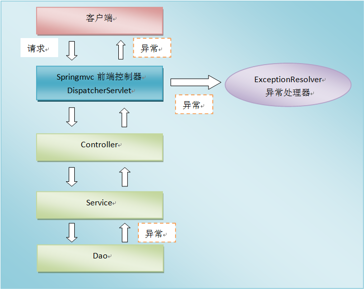

[TOC]

# SpringMVC中的异常处理

在开发中，不管是dao层、service层还是controller层，都有可能抛出异常，在springmvc中，能将所有类型的异常处理**从各处理过程解耦出来**，既保证了相关处理过程的功能较单一，也实现了异常信息的统一处理和维护。

SpringMVC处理异常的流程如下图：


如上图所示，系统的dao、service、controller出现异常都通过throws Exception向上抛出，最后由springmvc前端控制器交由异常处理器进行异常处理。springmvc提供全局异常处理器（一个系统只有一个异常处理器）进行统一异常处理。

## 1. SpringMVC处理异常的四种方式

Spring MVC处理异常有4种方式：

1. 使用Spring MVC提供的简单异常处理器SimpleMappingExceptionResolver；
2. 实现Spring的异常处理接口HandlerExceptionResolver 自定义自己的异常处理器；
3. 使用@ExceptionHandler注解实现异常处理；
4. 使用@ControllerAdvise + @ExceptionHandler

### 1.1 SimpleMappingExceptionResolver方式

```java
@Configuration
public class GlobalException {
    /**
     * 改方法必须要有返回值，返回值类型必须是SimpleMappingExceptionResolver
     * 无法传递异常信息到页面中
     */
    @Bean
    public SimpleMappingExceptionResolver getSimpleMappingExceptionResolver() {
        SimpleMappingExceptionResolver resolver = new SimpleMappingExceptionResolver();

        Properties mappers = new Properties();

        /**
         * 参数一：异常的类型，注意必须是异常类型的全名
         * 参数二：视图名称
         */
        mappers.put("java.lang.ArithmeticException", "error1");
        mappers.put("java.lang.NullPointerException", "error2");

        // 设置异常与视图的映射信息
        resolver.setExceptionMappings(mappers);
        return resolver;
    }
}
```

### 1.2 实现HandlerExceptionResolver接口

```java
@Component //注册为组件
public class MyExceptionHandler implements HandlerExceptionResolver {
  
  @Override
  public ModelAndView resolveException(HttpServletRequest request, HttpServletResponse response, Object handler,
      Exception ex) {
    Map<String, Object> model = new HashMap<String, Object>();
    model.put("ex", ex);

    // 根据不同错误转向不同页面
    if(ex instanceof BusinessException) {
      return new ModelAndView("error-business", model);
    }else if(ex instanceof ParameterException) {
      return new ModelAndView("error-parameter", model);
    } else {
      return new ModelAndView("error", model);
    }
  }
}
```

### 1.3 @ExceptionHandler注解实现异常处理

1. 首先实现一个异常处理的类

```java
public class BaseController {
  /** 基于@ExceptionHandler异常处理 */
  @ExceptionHandler
  public String exp(HttpServletRequest request, Exception ex) {

    request.setAttribute("ex", ex);

    // 根据不同错误转向不同页面
    if(ex instanceof BusinessException) {
      return "error-business";
    }else if(ex instanceof ParameterException) {
      return "error-parameter";
    } else {
      return "error";
    }
  }
}
```

2. 在需要处理异常的的所有Controller中都继承上面的类

```java
public class TestController extends BaseController
```

### 1.4 @ControllerAdvise & @ExceptonHandler

1. 在application.properties文件中， 增加下面两项设置禁用默认异常处理

spring.mvc.throw-exception-if-no-handler-found=true
spring.resources.add-mappings=false
第一句配置SpringBoot当出现404错误时, 直接抛出异常。
第二句配置SpringBoot不要为我们工程中的资源文件建立映射。

2. @ControllerAdvice , @ExceptionHandler

```java
@ControllerAdvice
@ResponseBody
public class ErrorController  {
    protected final ResultUtil result = new ResultUtil();

    private static final Logger log = LogManager.getLogger(ErrorController.class);

    @ExceptionHandler(Exception.class)
    @ResponseStatus(HttpStatus.INTERNAL_SERVER_ERROR)
    public ResponseModel systemException(Exception e) {
        log.error("System error");
        return result.error(HttpStatus.INTERNAL_SERVER_ERROR.value(), e.getMessage());
    }

    @ExceptionHandler(NoHandlerFoundException.class)
    @ResponseStatus(HttpStatus.NOT_FOUND)
    public ResponseModel methodNotSupported(NoHandlerFoundException e) {
        log.error("method not found : 404");
        return result.error(HttpStatus.NOT_FOUND.value(), e.getMessage());
    }

    @ExceptionHandler(HttpRequestMethodNotSupportedException.class)
    @ResponseStatus(HttpStatus.METHOD_NOT_ALLOWED)
    public ResponseModel methodNotSupported(HttpRequestMethodNotSupportedException e) {
        log.error("method not support : 405");
        return result.error(HttpStatus.METHOD_NOT_ALLOWED.value(), e.getMessage());
    }

    @ExceptionHandler(HttpMediaTypeNotSupportedException.class)
    @ResponseStatus(HttpStatus.UNSUPPORTED_MEDIA_TYPE)
    public ResponseModel mediaTypeNotSupported(HttpMediaTypeNotSupportedException e) {
        log.error("media type not support : 415");
        return result.error(HttpStatus.UNSUPPORTED_MEDIA_TYPE.value(), e.getMessage());
    }

    @ExceptionHandler(HttpMediaTypeNotAcceptableException.class)
    @ResponseStatus(HttpStatus.NOT_ACCEPTABLE)
    public ResponseModel mediaTypeNotAcceptable(HttpMediaTypeNotAcceptableException e) {
        log.error("media type not acceptable : 406");
        return result.error(HttpStatus.NOT_ACCEPTABLE.value(), e.getMessage());
    }
}
```

## 参考

1. [Springboot 自定义异常](https://www.jianshu.com/p/e11c8d49eff7)
2. [SpringBoot2 自定义异常](https://blog.csdn.net/feilala/article/details/88225943)
3. [SpringBoot优雅的全局异常处理](https://www.cnblogs.com/xuwujing/p/10933082.html)
4. [SpringMVC全局异常处理](https://www.cnblogs.com/hfultrastrong/p/10488280.html)
