[TOC]

# 拦截器底层源码分析

## 1. 相关重要类和接口介绍

### 1.1 HandlerExcecutionChain类

由HandlerMethod和Interceptor集合组成的类，会被HandlerMapping接口的getHandler方法获取。

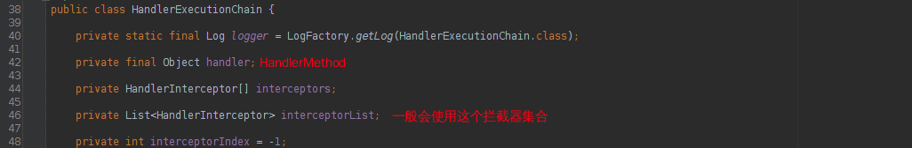

### 1.2 HandlerInterceptor接口

SpringMVC拦截器基础接口。
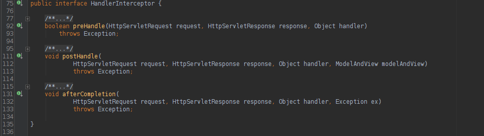

### 1.3 AbstractHandlerMapping

HandlerMapping的基础抽象类。
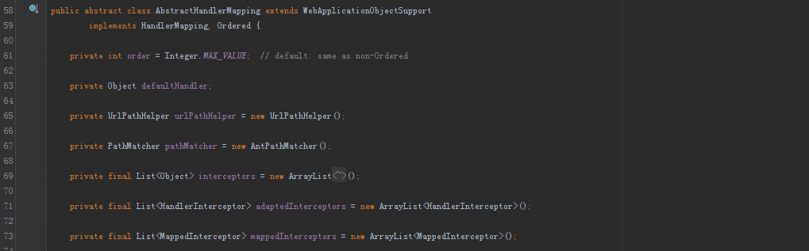

### 1.4 AsyncHandlerInterceptor

继承HandlerInterceptor的接口，额外提供了afterConcurrentHandlingStarted方法，该方法是用来处理异步请求。当Controller中有异步请求方法的时候会触发该方法。 异步请求先执行preHandle、然后执行afterConcurrentHandlingStarted。异步线程完成之后执行preHandle、postHandle、afterCompletion。

### 1.5 HandlerInterceptorAdapter

实现AsyncHandlerInterceptor接口的抽象类，一般我们使用拦截器的话都会继承这个类。然后复写相应的方法。

### 1.6 WebRequestInterceptor

与HandlerInterceptor接口类似，区别是WebRequestInterceptor的preHandle没有返回值。还有WebRequestInterceptor是针对请求的，接口方法参数中没有response。

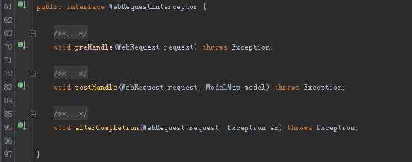

AbstractHandlerMapping内部的interceptors是个Object类型集合。处理的时候判断为MappedInterceptor [加入到mappedInterceptors集合中]；HandlerInterceptor、WebRequestInterceptor(适配成WebRequestHandlerInterceptorAdapter) [加入到adaptedInterceptors中]。

### 1.7 MappedInterceptor

一个包括includePatterns和excludePatterns字符串集合并带有HandlerInterceptor的类。 很明显，就是**对于某些地址做特殊包括和排除的拦截器**。

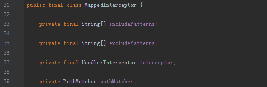

### 1.8 ConversionServiceExposingInterceptor

默认的\<annotation-driven/>标签初始化的时候会初始化ConversionServiceExposingInterceptor这个拦截器，并被当做构造方法的参数来构造MappedInterceptor。之后会被加入到AbstractHandlerMapping的mappedInterceptors集合中。该拦截器会在每个请求之前往request中丢入ConversionService。主要用于spring:eval标签的使用。

## 2. 源码分析

Web请求被DispatcherServlet截获后，会调用DispatcherServlet的doDispatcher方法。
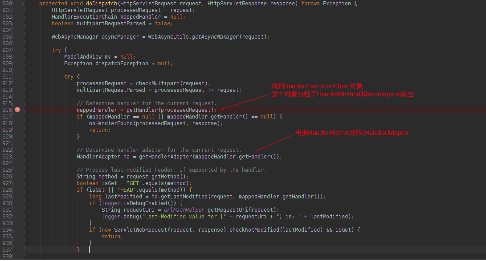
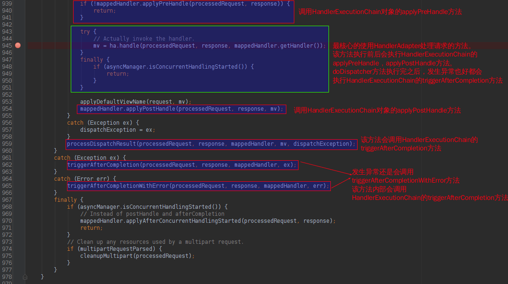

很明显地看到，在HandlerAdapter处理之后，以及处理完成之后会调用HandlerExecutionChain的方法。

HandlerExecutionChain的applyPreHandle、applyPostHandle、triggerAfterCompletion方法如下：
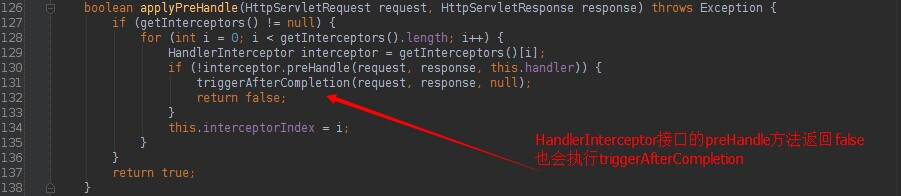
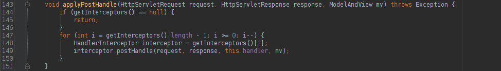
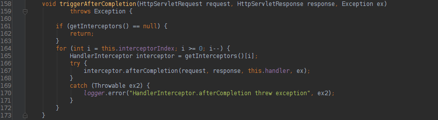

下面我们看下HandlerExecutionChain的构造过程。

 HandlerExecutionChain是从HandlerMapping接口的getHandler方法获取的。

 HandlerMapping的基础抽象类AbstractHandlerMapping中：

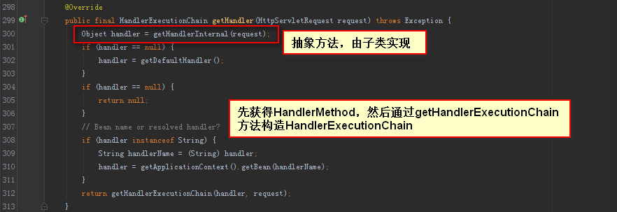
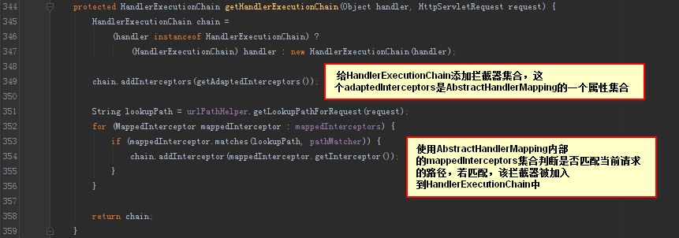

 我们看到，HandlerExecutionChain的拦截器是从AbstractHandlerMapping中的adaptedInterceptors和mappedInterceptors属性中获取的。

## 参考

1. [SpringMVC拦截器详解](https://www.cnblogs.com/winner-0715/p/9749039.html)
