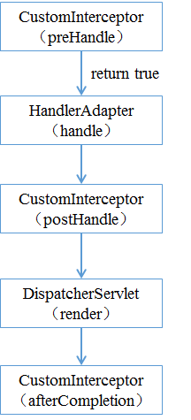
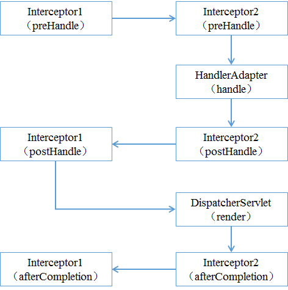

[TOC]

# Spring MVC 拦截器

Spring MVC中的拦截器（Interceptor）类似于Servlet中的过滤器（Filter），它主要用于拦截用户请求并作相应的处理。例如通过拦截器可以进行权限验证、记录请求信息的日志、判断用户是否登录等。

## 1. 拦截器创建方式

要使用Spring MVC中的拦截器，就需要对拦截器类进行定义和配置。通常拦截器类可以通过两种方式来定义。

1. 通过实现HandlerInterceptor接口，或继承HandlerInterceptor接口的实现类（如HandlerInterceptorAdapter）来定义。

2. 通过实现WebRequestInterceptor接口，或继承WebRequestInterceptor接口的实现类来定义。

以实现HandlerInterceptor接口方式为例，自定义拦截器类的代码如下：

```java
public class CustomInterceptor implements HandlerInterceptor{
    public boolean preHandle(HttpServletRequest request, 
                             HttpServletResponse response, Object handler) throws Exception {
        return false;
    }
    public void postHandle(HttpServletRequest request,
                           HttpServletResponse response, Object handler,
                           ModelAndView modelAndView) throws Exception {
    }
    public void afterCompletion(HttpServletRequest request,
                                HttpServletResponse response, Object handler,
                                Exception ex) throws Exception {
    }
}
```

接口中的三个方法：

- preHandle() 方法：该方法会在控制器方法前执行，其返回值表示是否中断后续操作。当其返回值为true时，表示继续向下执行；当其返回值为false时，会中断后续的所有操作（包括调用下一个拦截器和控制器类中的方法执行等）。

- postHandle()方法：该方法会**在控制器方法调用之后，且解析视图之前执行**。可以通过此方法对请求域中的模型和视图做出进一步的修改。

- afterCompletion()方法：该方法会在**整个请求完成，即视图渲染结束之后执行**。可以通过此方法实现一些资源清理、记录日志信息等工作。

## 2. 拦截器执行顺序

在运行程序时，拦截器的执行是有一定顺序的，该顺序与配置文件中所定义的拦截器的顺序相关。

### 2.1 单个拦截器执行顺序



1.程序先执行preHandle()方法，如果该方法的返回值为true，则程序会继续向下执行处理器中的方法，否则将不再向下执行。

2.在业务处理器（即控制器Controller类）处理完请求后，会执行postHandle()方法，然后会通过DispatcherServlet向客户端返回响应。

3.在DispatcherServlet处理完请求后，才会执行afterCompletion()方法。

### 2.2 多个拦截器的执行流程

假设有两个拦截器Interceptor1和Interceptor2，并且在配置文件中， Interceptor1拦截器配置在前。



从图可以看出，当有多个拦截器同时工作时，它们的preHandle()方法会按照配置文件中拦截器的配置顺序执行，而它们的postHandle()方法和afterCompletion()方法则会按照配置顺序的反序执行。
