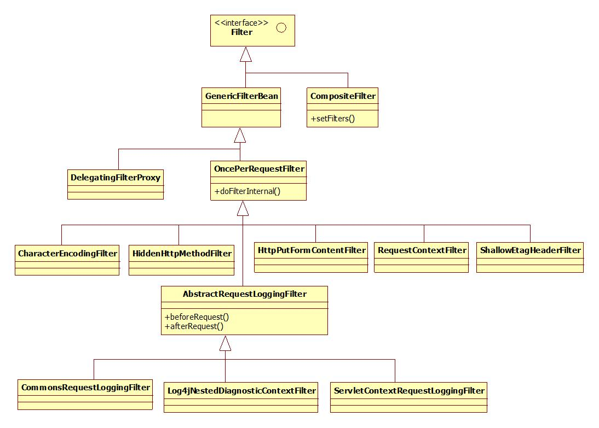

[TOC]

# Spring Web 中的各种Filter



Spring的web包中中有很多过滤器，这些过滤器位于**org.springframework.web.filter**并且理所当然地实现了javax.servlet.Filter，不过实现的方式有以下几类：

(1) 直接实现Filter，这一类过滤器只有CompositeFilter；

(2) 继承抽象类GenericFilterBean，该类实现了javax.servlet.Filter，这一类的过滤器只有一个，即DelegatingFilterProxy；

(3) 继承抽象类OncePerRequestFilter，该类为GenericFilterBean的直接子类，这一类过滤器包括CharacterEncodingFilter、HiddenHttpMethodFilter、HttpPutFormContentFilter、RequestContextFilter和ShallowEtagHeaderFilter；

(4) 继承抽象类AbstractRequestLoggingFilter，该类为OncePerRequestFilter的直接子类，这一类过滤器包括CommonsRequestLoggingFilter、Log4jNestedDiagnosticContextFilter和ServletContextRequestLoggingFilter。

## 1. GenericFilterBean

抽象类GenericFilterBean实现了javax.servlet.Filter、org.springframework.beans.factory.BeanNameAware、org.springframework.context.EnvironmentAware、org.springframework.web.context.ServletContextAware、org.springframework.beans.factory.InitializingBean和org.springframework.beans.factory.DisposableBean五个接口，作用如下：

(1) Filter，实现过滤器；

(2) BeanNameAware，实现该接口的setBeanName方法，便于Bean管理器生成Bean；

(3) EnvironmentAware，实现该接口的setEnvironment方法，指明该Bean运行的环境；

(4) ServletContextAware，实现该接口的setServletContextAware方法，指明上下文；

(5) InitializingBean，实现该接口的afterPropertiesSet方法，指明设置属性生的操作；

(6) DisposableBean，实现该接口的destroy方法，用于回收资源。

GenericFilterBean的工作流程是：init-doFilter-destory，其中的init和destory在该类中实现，doFilter在具体实现类中实现。init的代码如下：

```java
/**
     * Standard way of initializing this filter.
     * Map config parameters onto bean properties of this filter, and
     * invoke subclass initialization.
     * @param filterConfig the configuration for this filter
     * @throws ServletException if bean properties are invalid (or required
     * properties are missing), or if subclass initialization fails.
     * @see #initFilterBean
     */  
    public final void init(FilterConfig filterConfig) throws ServletException {  
        Assert.notNull(filterConfig, "FilterConfig must not be null");  
        if (logger.isDebugEnabled()) {  
            logger.debug("Initializing filter '" + filterConfig.getFilterName() + "'");  
        }  
  
        this.filterConfig = filterConfig;  
  
        // Set bean properties from init parameters.  
        try {
            //从properties文件中获取值，这里是web.xml
            PropertyValues pvs = new FilterConfigPropertyValues(filterConfig, this.requiredProperties);  
            //设置bean适配器
            BeanWrapper bw = PropertyAccessorFactory.forBeanPropertyAccess(this);  
            //设置上下文，这里的servletContext的设定继承自ServletContextAware的setter
            ResourceLoader resourceLoader = new ServletContextResourceLoader(filterConfig.getServletContext());  
            //将上下文信息和环境信息设置到bean适配器中，这里的environment来自于EnvironmentAware的setter
            bw.registerCustomEditor(Resource.class, new ResourceEditor(resourceLoader, this.environment));  
            // 初始化bean适配器
            initBeanWrapper(bw);
            // 将从properties中获取的资源放置到bean适配器
            bw.setPropertyValues(pvs, true);  
        }  
        catch (BeansException ex) {  
            String msg = "Failed to set bean properties on filter '" +  
                filterConfig.getFilterName() + "': " + ex.getMessage();  
            logger.error(msg, ex);  
            throw new NestedServletException(msg, ex);  
        }  
  
        // Let subclasses do whatever initialization they like.  
        initFilterBean();  
  
        if (logger.isDebugEnabled()) {  
            logger.debug("Filter '" + filterConfig.getFilterName() + "' configured successfully");  
        }  
    }  
```

## 2. OncePerRequestFilter

 抽象类oncePerRequestFilter继承自GenericFilterBean，它保留了GenericFilterBean中的所有方法并对之进行了扩展，在oncePerRequestFilter中的主要方法是doFilter，代码如下：

 ```java
/**
     * This <code>doFilter</code> implementation stores a request attribute for
     * "already filtered", proceeding without filtering again if the
     * attribute is already there.
     * @see #getAlreadyFilteredAttributeName
     * @see #shouldNotFilter
     * @see #doFilterInternal
     */  
    public final void doFilter(ServletRequest request, ServletResponse response, FilterChain filterChain)  
            throws ServletException, IOException {  
  
        if (!(request instanceof HttpServletRequest) || !(response instanceof HttpServletResponse)) {  
            throw new ServletException("OncePerRequestFilter just supports HTTP requests");  
        }  
        HttpServletRequest httpRequest = (HttpServletRequest) request;  
        HttpServletResponse httpResponse = (HttpServletResponse) response;  
                // 调用GenericFilterBean的getFilterName方法返回已过滤的属性名  
        String alreadyFilteredAttributeName = getAlreadyFilteredAttributeName();  
        if (request.getAttribute(alreadyFilteredAttributeName) != null || shouldNotFilter(httpRequest)) {  
            // 未调用该过滤器或已过滤  
            filterChain.doFilter(request, response);  
        }  
        else {  
            // 进行过滤  
            request.setAttribute(alreadyFilteredAttributeName, Boolean.TRUE);  
            try {  
                doFilterInternal(httpRequest, httpResponse, filterChain);  
            }  
            finally {  
                // Remove the "already filtered" request attribute for this request.  
                request.removeAttribute(alreadyFilteredAttributeName);  
            }  
        }  
    }  
 ```

在doFilter方法中，doFilterInternal方法由子类实现，主要作用是规定过滤的具体方法。

## 3. AbstractRequestLoggingFilter


