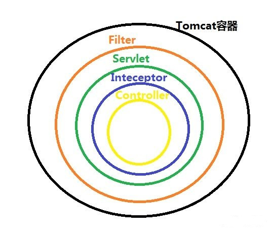

[TOC]

# 拦截器与过滤器

关于拦截器与过滤器的内容，在[过滤器](./过滤器.md)中有简单的描述，这里集中比较二者。

## 1. 二者区别

1. 拦截器基于java的反射机制，而过滤器是基于函数回调

2. 拦截器不依赖于servlet容器，过滤器依赖servlet容器

3. 拦截器只能对action请求起作用，而过滤器则可以对几乎所有的请求起作用

4. 在action的生命周期中，拦截器可以多次被调用，而过滤器只能在容器初始化时被调用一次

5. 拦截器可以获取IOC容器中的各个bean，而过滤器就不行，这点很重要，在拦截器注入一个service，可以调用业务逻辑。

过滤器和拦截器之间的关系如下图，Filter包裹Servlet，Servlet包裹Interceptor：


过滤器的触发时机是容器后，servlet之前，所以过滤器的  doFilter ( ServletRequest request, ServletResponse response, FilterChain chain ) 的入参是ServletRequest，而不是HttpServletRequest，因为过滤器在HttpServlet之前。

Filter的编写逻辑一般如下：

```java
@Override
public void doFilter(ServletRequest request, ServletResponse response, FilterChain chain) throws IOException, ServletException {

    //表示在调用其他Filter之前进行的操作
    System.out.println("before...");

    //表示将请求转发给Filter链上的下一个Filter，如果Filter没有了，那就转发给请求资源。
    chain.doFilter(request, response);

    //在其他Filter执行之后要执行的操作
    System.out.println("after...");
}
```
