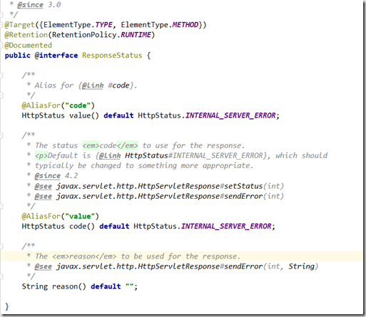

[TOC]

# Spring 完整注解列表

## @Async

 java里使用线程用3种方法：

1. 继承Thread，重写run方法
2. 实现Runnable,重写run方法
3. 使用Callable和Future接口创建线程，并能得到返回值。

而使用@Async可视为第4种方法。基于@Async标注的方法，称之为异步方法,这个注解用于标注某个方法或某个类里面的所有方法都是需要异步处理的。被注解的方法被调用的时候，会在新线程中执行，而调用它的方法会在原来的线程中执行。

## @Autowired

修饰**字段**，**方法**，**构造函数**，**入参**，实现自动注入，由Spring的依赖注入工具（BeanPostProcessor、BeanFactoryPostProcessor）自动注入。

Autowired默认先按byType，如果发现找到多个bean，则，又按照byName方式比对，如果还有多个，则报出异常。

required属性决定依赖注入是否必选，缺省true，意味着没有合适类型bean注入时，会抛出异常。如果要允许null值，可以设置它的required属性为false，如：@Autowired(required=false)。

## @Bean

作用在方法和注解上，作用在方法上标记此处会生成一个beanDefinition。

配合Profile, Scope, Lazy,DependsOn, Primary, Order使用，描述definition行为。

@Bean注解在实现上基于factory-method，因此修饰在方法上。@Bean注解本身带有name，autowire，destroyMethod，initMethod属性，充definition。

- value和name属性均指定bean名称。
- autowire指定bean自动加载模式，缺省不自动加载。
- initMethod指定初始化方法，等同于xml里的init-method属性，存储在definition的initMethodName变量里，缺省空。
- destroyMethod指定销毁方法，同initMethod类似，等同于destroy-method。缺省值"(inferred)"，意味着bean里无参的close和shutdown方法会被作为destoryMethod回调（spring称之为推断）。

被@Bean修饰的方法会作为definition的factory method，用静态或动态工厂创建bean对象。一个@Bean生成一个definition，但definition的很多属性不通过@Bean的属性来标记，而通过其它注解同样修饰在该方法上来定义。

## @Cacheable

用来标记缓存查询。可用用于方法或者类中：

- 当标记在一个方法上时表示该方法是支持缓存的；
- 当标记在一个类上时则表示该类所有的方法都是支持缓存的。

参数列表

参数 | 解释 | 例子
- | - | -
value | 名称 | @Cacheable(value={”c1”,”c2”}
key | key | @Cacheable(value=”c1”,key=”#id”)
condition | 条件 | @Cacheable(value=”c1”,condition=”#id=1”)比如@Cacheable(value="UserCache") 标识的是当调用了标记了这个注解的方法时，逻辑默认加上从缓存中获取结果的逻辑，如果缓存中没有数据，则执行用户编写查询逻辑，查询成功之后，同时将结果放入缓存中。但凡说到缓存，都是key-value的形式的，因此key就是方法中的参数（id），value就是查询的结果，而命名空间UserCache是在spring*.xml中定义.

```java
@Cacheable(value="UserCache")// 使用了一个缓存名叫accountCache
public Account getUserAge(int id) {
    //这里不用写缓存的逻辑，直接按正常业务逻辑走即可，
    //缓存通过切面自动切入
    int age=getUser(id);
    return age;
}
```

## @CacheEvict

用来标记要清空缓存的方法，当这个方法被调用后，即会清空缓存。 @CacheEvict(value=”UserCache”)。

参数列表
参数 | 解释 | 例子
- | - | - |
value | 名称 | @CachEvict(value={”c1”,”c2”}
key | key | @CachEvict(value=”c1”,key=”#id”)
condition | 缓存的条件，可以为空 |
allEntries | 是否清空所有缓存内容 | @CachEvict(value=”c1”，allEntries=true)
beforeInvocation | 是否在方法执行前就清空 | @CachEvict(value=”c1”，beforeInvocation=true)

## @Component

表示一个带注释的类是一个“组件”，成为Spring管理的Bean。当使用基于注解的配置和类路径扫描时，这些类被视为自动检测的候选对象。同时@Component还是一个元注解。

泛指组件，当组件不好归类的时候，我们可以使用这个注解进行标注。

## @ComponentScan

作用在类上，声明需要对包路径下资源进行扫描，效果等同于\<context:component-scan>。

- value(basePackages) 属性指定要扫描的包路径，多个用逗号分割。
- basePackageClasses 属性指定class做扫描。
- nameGenerator 属性指定beanName命名策略。
- scopeResolver 属性指定从definition中解析出scope元信息的方式。
- scopedProxy 指定缺省的scopedProxy，决定不同scope之间的连接方式。
- resourcePattern 模糊匹配scan的文件。
- useDefaultFilters 是否使用默认的探测注解（默认探测注解含@Component和被@Component修饰的注解）
- includeFilters指定includeFilter，内容是Filter对象，Filter有多种类型，且能细化多种行为。

```java
@ComponentScan(basePackages = "com.concretepage",
includeFilters = @Filter(type = FilterType.REGEX, pattern="com.concretepage..Util"),
excludeFilters = @Filter(type = FilterType.ASSIGNABLE_TYPE, classes = IUserService.class))
```

- excludeFilters排除的Filter。
- lazyInit延迟加载。
- 还有ComponentScan中定义的子注解@Filter，这个注解很有意思，@Target({})，@Target里没有任何内容，意味着@Filter不用于修饰任何资源，而只是单纯的作为元信息载体。主要作为@ComponentScan的includeFilters
和excludeFilters的内容，用于决定scan时过滤搜索资源的策略。

**@Filter有以下属性：**

- type(value)决定过滤器类型：
- ANNOTATION：注解类型，配合AnnotationTypeFilter使用，筛选出被指定注解修饰的资源。
- ASSIGNABLE_TYPE：枚举出扫描类型，配合AssignableTypeFilter使用，加载指定类型的资源（含子类)
- ASPECTJ：用AspectJ正则方式搜索名称符合要求的资源。
- REGEX：Java正则匹配资源。REGEX：Java正则匹配资源。
- CUSTOM：自定义的FIlter.
- classes属性配合type使用，当type是：
- ANNOTATION：待扫描注解
- ASSIGNABLE_TYPE：用户枚举的类
- CUSTOM：自定义Filter
- pattern属性配合type使用，当type是：
  - ASPECTJ：ASPECTJ规范的正则内容
  - REGEX：Java规范的正则内容

## @Conditional

作用在类和方法上，决定@Component（含子注解）和@Bean是否需要被加载。@Confitional的value属性是一组实现Condition接口的类，例如：
@Conditional({ ConditionTrueTest.class, ConditionTrueTest.class })

Condition接口唯一的方法是matches：

```java
boolean matches(ConditionContext context, AnnotatedTypeMetadata metadata);
```

- 入参ConditionContext是回调matcher方法时的上下文，其中包含beanFactory，environment，resourceLoader等，几乎包含了容器各方面的资源。

- 入参AnnotatedTypeMetadata是被该@Conditional注解修饰资源的元信息（元信息有类和方法两种，其中AnnotatedTypeMetadata是类元信息，MethodMetadata（AnnotatedTypeMetadata的子类）是方法元信
息）。

当@Conditional注解有多个Condition判断条件时，多个条件之间是与的关系，也即只有所有Condition均满足条
件时，才会被加载。

## @Configuration

作用在类上，声明一个class需要被spring解析以扩充beanDefinition。

这个注解对应的类等价于XML中的**beans**，相当于IOC容器。它的某个方法头上如果注册了@Bean，就会作为这个Spring容器中的Bean，与xml中配置的bean意思一样。

- @Configration注解同时被
- @Component注解修饰，因此具有被自动加载的特点，被@Configuration修饰的类本身也会作为definition注册。
- value属性是Configuration bean名称。

@Configuration注解的类必需使用\<context:component-scanbase-package=”XXX”/>扫描.

```java
@Configuration
public class MainConfig {

    //在properties文件里配置
    @Value("${wx_appid}")
    public String appid;

     protected MainConfig(){}

    @Bean
    public WxMpService wxMpService() {
        WxMpService wxMpService = new WxMpServiceImpl();
        wxMpService.setWxMpConfigStorage(wxMpConfigStorage());
        return wxMpService;
    }
}
```

## @ConfigurationProperties

这个注解的作用就是方便Spring Boot程序读取在配置文件中自定义的配置。

### 1. 一个简单的例子

假设application.yml配置文件中有如下我们需要的配置：

```yaml
environment:
  production:
    url: http://production.example.com
    name: production mode
  dev:
    url: http://dev.example.com
    name: developer mode
```

接下来定义一个与配置内容对应的类：

```java
@Configuration   //配置类注解，被自动扫描发现
@PropertySource("classpath:application.yml") //指明配置源文件位置，由于application.yml在spring boot程序中是默认加载的，所以，这个可以不用写。
@ConfigurationProperties("environment") //指明前缀
public class EnvConfig {
    private final Dev dev=new Dev();
    private final Production production=new Production();


    public Dev getDev() {
        return dev;
    }

   //getXXX必须中xxx和字段名production严格一致，否则出异常，即使松弛绑定，也要这样
    public Production getProduction() {
        return production;
    }

    public static class Dev{
        private String url;
        private String name;

        public String getUrl() {
            return url;
        }

        public void setUrl(String url) {
            this.url = url;
        }

        public String getName() {
            return name;
        }

        public void setName(String name) {
            this.name = name;
        }
        //toString
    }

    public static class Production{
        private String url;
        private String name;
        //setter and getter省略
       //toString 省略
    }
   //toString()省略
}
```

测试代码如下：

```java
@Controller
public class TestStaticController {
    Logger log= LoggerFactory.getLogger(TestStaticController.class);

    @Autowired
    public EnvConfig env;

    @GetMapping("/envtest")
    public String getEnv(){
        log.info(this.env.toString());
        return "test";
    }
}
```

### 2. @ConfigurationProperties用在类上

如果注解在类上，那么要求指定prefix后面的名称必须是和类的属性一致，这里的一致指的是复合Spring的宽松绑定规则。

下面给出宽松绑定的一个例子，下面的配置，都会将属性值绑定到hostName上。

```txt
mail.hostName = localhost
mail.hostname = localhost
mail.host_name = localhost
mail.host-name = localhost
mail.HOST_NAME = localhost
```

注解用到类上，同时要保证这个类要作为一个bean被容器管理。有两种做法：在加有这个注解的类上添加@Configuration或者@Component。或者通过添加@EnableConfigurationProperties注解。

```java
@RestController
@EnableConfigurationProperties({AccountProperties.class})
public class DemoController {

    @Autowired
    private AccountProperties accountProperties;
}
```

### 3. @ConfigurationProperties用在方法上

被注解的方法上需要同时使用@Bean注解。

要求方法返回的Bean有配置文件对应的属性。

```java
@Configuration
public class DemoConfig {

    @Bean
    @ConfigurationProperties(prefix = "account")
    public AccountProperties accountProperties() {
        return new AccountProperties();
    }
}
```

### 4. 复杂属性类型：List、Map

List类型的属性：

```java
@ConfigurationProperties("mail") //指明前缀
public class MailInfo {
    private List<String> addr;
}
```

Properties文件配置：

```txt
mail.addr[0] = abc@test.com.cn
mail.addr[1] = efg@test.com.cn
```

Yaml格式的文件，本身支持数组类型的数据。

```yaml
mail:
    addr:
        - abc@test.com.cn
        - efg@test.com.cn
```

## @Controller

标识一个该类是Spring MVC controller处理器，用来创建处理http请求的对象。

## @ControllerAdvice

把@ControllerAdvice注解内部使用@ExceptionHandler、@InitBinder、@ModelAttribute注解的方法应用到所有的 @RequestMapping注解的方法。非常简单，不过只有当使用@ExceptionHandler最有用，另外两个用处不大。

```java
@ControllerAdvice  
public class GlobalExceptionHandler {  
    @ExceptionHandler(SQLException.class)  
    @ResponseStatus(value=HttpStatus.INTERNAL_SERVER_ERROR,reason=”sql查询错误”)  
    @ResponseBody  
    public ExceptionResponse handleSQLException(HttpServletRequest request, Exception ex) {  
        String message = ex.getMessage();  
        return ExceptionResponse.create(HttpStatus.INTERNAL_SERVER_ERROR.value(), message);  
    }
}
```

即表示让Spring捕获到所有抛出的SQLException异常，并交由这个被注解的handleSQLException方法处理，同时使用@ResponseStatus指定了code和reason写到response上，返回给前端。

## @DependsOn

标记是否依赖加载。

属性value的内容是字符串数据，因此一个bean能依赖多个其它bean做实例化，效果等同于xml里的dependson。在spring做bean实例化时，如果definition中有dependsOn，则会先实例化依赖的bean。

## @Import

加载一个被@Configuration修饰的class。

属性value是Class数组，因此可以注入多个值。Import注解的处理逻辑会依照Import注入class类型不同而执行不
同行为：

- 如果被import的类是ImportSelector接口的实现类，则会回调该类实现的selectImports方法，通过返回值决定实际要import的class（实现ImportSelector接口的类未必会被import，取决于返回值）。

- 如果import的类是DeferredImportSelector接口的实现类，则会延迟直到所有Configuration都被解析完成后，再判断具体加载哪些class，这在使用某些Conditional条件判断里是需要的。

- 如果import的类是ImportBeanDefinitionRegistrar接口的实现类，则该类会被声明为一个registrar，最终在从configClass中加载definition时，向BeanFactory中注入更多
definition（ConfigurationClassBeanDefinitionReader.loadBeanDefinitionsFromRegistrars(...)）。

- 如果以上都不满足，才会作为被@Component修饰的类来解析。
源码见org.springframework.context.annotation.ConfigurationClassParser.processImports(...)

## @ImportResource

加载一个xml资源，和spring xml配置里import语义相同。

- value和locations属性指定需要import的多个资源。
- reader属性决定资源文件解析器，默认会依照文件后缀自动适配xml或groovy。

## @Inject

使用@Inject需要引用javax.inject.jar，它与Spring没有关系，是jsr330规范。

与@Autowired有互换性。

## @Lazy(true)

用于指定该Bean是否取消预初始化，用于注解类，延迟初始化。

## @Lookup

## @ModelAttribute

有三种地方可以使用：

**1. 标记在方法上**
标记在方法上，会在每一个@RequestMapping标注的方法前执行，如果有返回值，则自动将该返回值加入到ModelMap中。

**1.1 在有返回的方法上**
当ModelAttribute设置了value，方法返回的值会以这个value为key，以参数接受到的值作为value，存入到Model中，如下面的方法执行之后，最终相当于 model.addAttribute("user_name", name);假如 @ModelAttribute没有自定义value，则相当于model.addAttribute("name", name);

```java
@ModelAttribute(value="user_name")
public String before2(@RequestParam(required=false) String name, Model model) {
    System.out.println("进入了2：" + name);
    return name;
}
```

**1.2 在没有返回的方法上**
需要手动model.add方法。

```java
@ModelAttribute
public void before(@RequestParam(required=false) Integer age, Model model){
    model.addAttribute("age", age);
    System.out.println("进入了1：" + age);
}
```

接下来我们在**当前类**下建立一个请求方法：

```java
@RequestMapping(value="/mod")
public Resp mod(
    @RequestParam(required=false) String name,
    @RequestParam(required=false) Integer age,
    Model model){
        System.out.println("进入mod方法")；
        System.out.println("参数接收的数值{name=" + name + ";age="+age+"}");
        System.out.println("model传过来的值："+model);
        return Resp.success("1");
}
```

在浏览器中输入如下地址加参数：
http://localhost:8081/api/test/mod?name=我是小菜&age=12

输出内容如下：

```txt
进入了1：40
进入了2：我是小菜
进入mod方法
参数接收的数值{name=我是小菜;age=12}
model传过来的值：{age=40,user_name=我是小菜}
```

**2. 标记在方法的参数上**
标记在方法的参数上，会将客户端传递过来的参数按名称注入到指定对象中，并且会将这个对象自动加入Model Map中，便于View层使用.我们在上面的类中加入一个方法如下：

```java
@RequestMapping(value="/mod2")
public Resp mod2(
    @ModelAttribute("user_name") String user_name,
    @ModelAttribute("name") String name,
    @ModelAttribute("age") Integer age,
    Model model){
        System.out.println("进入mod2")；
        System.out.println("user_name:" + user_name);
        System.out.println("name:" + name);
        System.out.println("age:" + age);
        System.out.println("model:"+model);
        return Resp.success("1");
}
```

在浏览器中输入访问地址并且加上参数：

http://localhost:8081/api/test/mod2?name=我是小菜&age=12

得到的输出：

```txt
进入了1：40
进入了2：我是小菜
进入mod2
user_name:我是小菜
name:我是小菜
age:40
model:{user_name=我是小菜,
org.springframework.validation.BindingResult.user_name=org.springframework.validation.BeanPropertyBindingResult: 0 errors, name=我是小菜, org.springframework.validation.BindingResult.name=org.springframework.validation.BeanPropertyBindingResult: 0 errors, age=40, org.springframework.validation.BindingResult.age=org.springframework.validation.BeanPropertyBindingResult: 0 errors}
```

从结果就能看出，用在方法参数中的@ModelAttribute注解，实际上是一种接受参数并且自动放入Model对象中，便于使用。

## @Named

@Named和Spring的@Component功能相同。@Named可以有值，如果没有值生成的Bean名称默认和类名相同。比如

@Named
public class Person

或

@Named("cc")
public class Person

## @Order

定义顺序，值越小优先级越高，支持负数。

属性value值决定优先级，缺省是最低优先级。

## @PostConstruct

用来标记是在项目启动的时候执行这个方法。用来修饰一个非静态的void()方法
也就是spring容器启动时就执行，多用于一些全局配置、数据字典之类的加载

被@PostConstruct修饰的方法会在服务器加载Servlet的时候运行，并且只会被服务器执行一次。PostConstruct在构造函数之后执行,init()方法之前执行。

## @PreDestroy

被@PreDestroy修饰的方法会在服务器卸载Servlet的时候运行，并且只会被服务器调用一次，类似于Servlet的destroy()方法。被@PreDestroy修饰的方法会在destroy()方法之后运行，在Servlet被彻底卸载之前。

**扩展阅读：**
Spring 容器中的 Bean 是有生命周期的，Spring 允许在 Bean 在初始化完成后以及 Bean 销毁前执行特定的操作，常用的设定方式有以下三种：

1.通过实现 InitializingBean/DisposableBean 接口来定制初始化之后/销毁之前的操作方法；
2.通过 \<bean> 元素的 init-method/destroy-method属性指定初始化之后 /销毁之前调用的操作方法；
3.在指定方法上加上@PostConstruct 或@PreDestroy注解来制定该方法是在初始化之后还是销毁之前调用

但他们之前并不等价。即使3个方法都用上了，也有先后顺序.

Constructor > @PostConstruct >InitializingBean > init-method

## @Primary

自动装配时当出现多个Bean候选者时，被注解为@Primary的Bean将作为首选者，否则将抛出异常。

```java
@Component  
public class Apple implements Fruit{
  
    @Override
    public String hello() {
        return "我是苹果";
    }  
}

@Component  
@Primary
public class Pear implements Fruit{
  
    @Override  
    public String hello(String lyrics) {
        return "梨子";
    }  
}

public class FruitService {
  
  //Fruit有2个实例子类，因为梨子用@Primary，那么会使用Pear注入
    @Autowired  
    private Fruit fruit;
  
    public String hello(){
        return fruit.hello();
    }  
}
```

## @Profile

修饰类或方法，用于分类偏好（如区分环境），应用启动时决定启用哪些profile。

例如：

```java
@Profile("production")
@Configuration
public class ABC {}
```

这里用的@Profile注解要求运行时激活production Profile，这样才能应用该配置。如果 production Profile没有激活，就会忽略该配置。设置spring.profiles.active属性就能激活Profile。

向application.yml里添加spring.profiles.active属性：

```yaml
spring:
    profiles:
        active: production
```

xml也可以指定profile，此时profile作为beans标签的一个属性，效果同@Profile。

value属性的值是字符串数组，用于存储多个profile，容器指定任意一个均可。

@Profile注解被@Conditional(ProfileCondition.class)注解修饰，因此在使用方面走的是@Conditional的判断逻辑，判断实现就是org.springframework.context.annotation.ProfileCondition，该实现在match方法里获取注解@Profile的value值，并通过Environment对象判断该profile是否被当前容器接纳，如果不被接纳，解析就终止了。

@Conditional解析在很多地方都有，例如：
org.springframework.context.annotation.ConfigurationClassParser.processConfigurationClass()

指定应用启动偏好有多种方式：
a. @ActiveProfiles注解（spring.test）
b. JVM启动参数，-Dspring.profiles.active=xxx
c. ConfigurableEnvironment.setActiveProfiles(xx)，显式指定profile
d. web启动参数

```xml
<context-param>
<param-name>spring.profiles.active</param-name>
<param-value>xxx</param-value>
</context-param>
```

e. System.setProperty(AbstractEnvironment.ACTIVE_PROFILES_PROPERTY_NAME, xx);

## @PropertySource

作用在类上，加载指定路径资源到Environment，从而实现注入。

- name属性指定propertySource资源名称，缺省是空，会自动生成。

- value属性指定资源路径，必填，可以是"classpath:/com/myco/app.properties" or "file:/path/to/file"，也可以是${...}，作为变量时可以用当前所有加载到Environment里的属性做渲染。value必须指向唯一资源，不能模糊匹配到多个。

- ignoreResourceNotFound，声明是否必须要找到value指定的资源，缺省false表示没有该资源时会抛错。

- encoding编码。

- factory属性指定封装propertySource的PropertySourceFactory，PropertySourceFactory用于将一个EncodedResource资源封装成PropertySource资源，在factory这一步可以干预PropertySource的生成。缺省用spring默认的factory。

## @Qualifier

当你创建多个具有相同类型的 bean 时，并且想要用一个属性只为它们其中的一个进行装配，在这种情况下，你可以使用 @Qualifier 注释和 @Autowired 注释通过指定哪一个真正的 bean 将会被装配来消除混乱。

举例说明：

```java
/*
定义一个ICar接口
*/
package com.spring.service;

public interface ICar {

    public String getCarName();
}

/*
有两个实现
*/
package com.spring.service.impl;

import com.spring.service.ICar;

@Component
public class BMWCar implements ICar{

    public String getCarName(){
        return "BMW car";
    }
}

@Component
public class BenzCar implements ICar{

    public String getCarName(){
        return "Benz car";
    }
}

/*
Car Factory
*/
package com.spring.model;

import org.springframework.beans.factory.annotation.Autowired;

import com.spring.service.ICar;

public class CarFactory {

    @Autowired
    private ICar car; //这里不确定注入BMWCar还是BenzCar

    public String toString(){
        return car.getCarName();
    }
}
```

解决方法就是使用@Qualifier

```java
package com.spring.model;

import org.springframework.beans.factory.annotation.Autowired;
import org.springframework.beans.factory.annotation.Qualifier;

import com.spring.service.ICar;

public class CarFactory {

    @Autowired
    @Qualifier("bmwCar")
    private ICar car;

    public String toString(){
        return car.getCarName();
    }
}
```

## @Repository

用于标注数据访问组件，即DAO组件。

支持一个value属性，用于说明组件的bean ID。比如：@Repository("userDao")。

## @RequestBody

@RequestBody主要用来接收前端传递给后端的json字符串中的数据的(请求体中的数据的);GET方式无请求体，所以使用@RequestBody接收数据时，前端不能使用GET方式提交数据，而是**用POST方式**进行提交.

在后端的同一个接收方法里，@RequestBody 与@RequestParam()可以同时使用，**@RequestBody最多只能有一个，而@RequestParam()可以有多个**。

当同时使用@RequestParam()和@RequestBody时，@RequestParam()指定的参数可以是普通元素、数组、集合、对象等等(即:当，@RequestBody 与@RequestParam()可以同时使用时，原SpringMVC接收参数的机制不变，只不过RequestBody 接收的是请求体里面的数据；而RequestParam接收的是key-value里面的参数，所以它会被切面进行处理从而可以用普通元素、数组、集合、对象等接收)。

@requestBody注解常用来处理content-type不是默认的application/x-www-form-urlcoded编码的内容，比如说：application/json或者是application/xml等。一般情况下来说常用其来处理application/json类型。

## @RequestMapping

- 类定义处: 提供初步的请求映射信息，相对于 WEB 应用的根目录。
- 方法处: 提供进一步的细分映射信息，相对于类定义处的 URL。

同时支持Serlvet的request和response作为参数，也支持对request和response的媒体类型进行配置。其中有value(路径)，produces(定义返回的媒体类型和字符集)，method(指定请求方式)等属性。

下面是一个同时在类和方法上应用了 @RequestMapping 注解的示例代码:

```java
@RestController  
@RequestMapping("/home")  
public class IndexController {  
    @RequestMapping("/")  
    String get() {  
        //mapped to hostname:port/home/  
        return "Hello from get";  
    }  
    @RequestMapping("/index")  
    String index() {  
        //mapped to hostname:port/home/index/  
        return "Hello from index";  
    }  
}  
```

如上述代码所示，到 /home 的请求会由 get() 方法来处理，而到 /home/index 的请求会由 index() 来处理。

### @RequestMapping来处理多个URI

你可以将多个请求映射到一个方法上去，只需要添加一个带有请求路径值列表的 @RequestMapping 注解就行了。

```java
@RestController  
@RequestMapping("/home")  
public class IndexController {  
  
    @RequestMapping(value = {  
        "",  
        "/page",  
        "page*",  
        "view/*,**/msg"  
    })  
    String indexMultipleMapping() {  
        return "Hello from index multiple mapping.";  
    }  
}
```

如你在这段代码中所看到的，@RequestMapping 支持统配符以及ANT风格的路径。前面这段代码中，如下的这些 URL 都会由 indexMultipleMapping() 来处理：

- localhost:8080/home
- localhost:8080/home/
- localhost:8080/home/page
- localhost:8080/home/pageabc
- localhost:8080/home/view/
- localhost:8080/home/view/view

### 带有@RequestParam的@RequestMapping

```java
@RestController  
@RequestMapping("/home")  
public class IndexController {  
  
    @RequestMapping(value = "/id")  
    String getIdByValue(@RequestParam("id") String personId)    {  
        System.out.println("ID is " + personId);  
        return "Get ID from query string of URL with value element";  
    }  

    @RequestMapping(value = "/personId")  
    String getId(@RequestParam String personId) {  
        System.out.println("ID is " + personId);  
        return "Get ID from query string of URL without value element";  
    }  
}
```

如果请求参数和处理方法参数的名称一样的话，@RequestParam 注解的 value 这个参数就可省掉了。

@RequestParam 注解的 required 这个参数定义了参数值是否是必须要传的。

```java
@RestController  
@RequestMapping("/home")  
public class IndexController {  

    @RequestMapping(value = "/name")  
    String getName(@RequestParam(value = "person", required = false) String personName) {  
        return "Required element of request param";  
    }  
}
```

在这段代码中，因为 required 被指定为 false，所以 getName() 处理方法对于如下两个 URL 都会进行处理：

- /home/name?person=xyz
- /home/name

@RequestParam 的 defaultValue 取值就是用来给取值为空的请求参数提供一个默认值的。

```java
@RestController  
@RequestMapping("/home")  
public class IndexController {

    @RequestMapping(value = "/name")  
    String getName(@RequestParam(value = "person", defaultValue = "John") String personName) {  
        return "Required element of request param";  
    }  
}
```

在这段代码中，如果 person 这个请求参数为空，那么 getName() 处理方法就会接收 John 这个默认值作为其参数。

### 用@RequestMapping处理HTTP的各种方法

Spring MVC 的 @RequestMapping 注解能够处理 HTTP 请求的方法, 比如 GET, PUT, POST, DELETE 以及 PATCH。

所有的请求**默认都会是HTTP GET类型的**。

为了能降一个请求映射到一个特定的 HTTP 方法，你需要在 @RequestMapping 中使用 method 来声明 HTTP 请求所使用的方法类型，如下所示：

```java
@RestController  
@RequestMapping("/home")  
public class IndexController {  
    @RequestMapping(method = RequestMethod.GET)  
    String get() {  
        return "Hello from get";  
    }  
    @RequestMapping(method = RequestMethod.DELETE)  
    String delete() {  
        return "Hello from delete";  
    }  
    @RequestMapping(method = RequestMethod.POST)  
    String post() {  
        return "Hello from post";  
    }  
    @RequestMapping(method = RequestMethod.PUT)  
    String put() {  
        return "Hello from put";  
    }  
    @RequestMapping(method = RequestMethod.PATCH)  
    String patch() {  
        return "Hello from patch";  
    }  
}
```

所有的处理处理方法会处理从这同一个 URL( /home)进来的请求, 但要看指定的 HTTP 方法是什么来决定用哪个方法来处理。

例如，一个 POST 类型的请求 /home 会交给 post() 方法来处理，而一个 DELETE 类型的请求 /home 则会由 delete() 方法来处理。

也可以限制**允许多个方法**，比如：method={RequestMethod.POST,RequestMethod.GET}，这种写法就同时允许两种方法。

### 用@RequestMapping来处理生产和消费对象

可以使用 @RequestMapping 注解的 produces 和 consumes 这两个元素来缩小请求映射类型的范围。

为了能用请求的媒体类型来产生对象, 你要用到 @RequestMapping 的 produces 元素再结合着 @ResponseBody 注解。

你也可以利用 @RequestMapping 的 comsumes 元素再结合着 @RequestBody 注解用请求的媒体类型来消费对象。

```java
@RestController  
@RequestMapping("/home")  
public class IndexController {

    @RequestMapping(value = "/prod", produces = {  
        "application/JSON"  
    })  
    @ResponseBody  
    String getProduces() {  
        return "Produces attribute";  
    }  
  
    @RequestMapping(value = "/cons", consumes = {  
        "application/JSON",  
        "application/XML"  
    })  
    String getConsumes() {  
        return "Consumes attribute";  
    }  
}
```

在这段代码中， getProduces() 处理方法会产生一个 JSON 响应， getConsumes() 处理方法可以同时处理请求中的 JSON 和 XML 内容。

### 使用 @RequestMapping 来处理消息头

@RequestMapping 注解提供了一个 header 元素来根据请求中的消息头内容缩小请求映射的范围。

在可以指定 header 元素的值，用 myHeader = myValue 这样的格式：

```java
@RestController  
@RequestMapping("/home")  
public class IndexController {

    @RequestMapping(value = "/head", headers = {  
        "content-type=text/plain"  
    })  
    String post() {  
        return "Mapping applied along with headers";  
    }  
}
```

在上面这段代码中， @RequestMapping 注解的 headers 属性将映射范围缩小到了 post() 方法。有了这个，post() 方法就只会处理到 /home/head 并且 content-typeheader 被指定为 text/plain 这个值的请求。

你也可以像下面这样指定多个消息头：

```java
@RestController  
@RequestMapping("/home")  
public class IndexController {

    @RequestMapping(value = "/head", headers = {  
        "content-type=text/plain",  
        "content-type=text/html"  
    }) String post() {  
        return "Mapping applied along with headers";  
    }  
}
```

这样， post() 方法就能同时接受 text/plain 还有 text/html 的请求了。

### 使用 @RequestMapping 来处理请求参数

@RequestMapping 直接的 params 元素可以进一步帮助我们缩小请求映射的定位范围。使用 params 元素，你可以让多个处理方法处理到同一个URL 的请求, 而这些请求的参数是不一样的。

你可以用 myParams = myValue 这种格式来定义参数，也可以使用通配符来指定特定的参数值在请求中是不受支持的。

```java
@RestController  
@RequestMapping("/home")  
public class IndexController {

    @RequestMapping(value = "/fetch", params = {  
        "personId=10"  
    })  
    String getParams(@RequestParam("personId") String id) {  
        return "Fetched parameter using params attribute = " + id;  
    }

    @RequestMapping(value = "/fetch", params = {  
        "personId=20"  
    })  
    String getParamsDifferent(@RequestParam("personId") String id) {  
        return "Fetched parameter using params attribute = " + id;  
    }  
}
```

在这段代码中，getParams() 和 getParamsDifferent() 两个方法都能处理相同的一个 URL (/home/fetch) ，但是会根据 params 元素的配置不同而决定具体来执行哪一个方法。

### 使用 @RequestMapping 处理动态 URI

@RequestMapping 注解可以同 @PathVaraible 注解一起使用，用来处理动态的 URI，URI 的值可以作为控制器中处理方法的参数。你也可以使用正则表达式来只处理可以匹配到正则表达式的动态 URI。

```java
@RestController  
@RequestMapping("/home")  
public class IndexController {

    @RequestMapping(value = "/fetch/{id}", method = RequestMethod.GET)  
    String getDynamicUriValue(@PathVariable String id) {  
        System.out.println("ID is " + id);  
        return "Dynamic URI parameter fetched";  
    }

    @RequestMapping(value = "/fetch/{id:[a-z]+}/{name}", method = RequestMethod.GET)  
    String getDynamicUriValueRegex(@PathVariable("name") String name) {  
        System.out.println("Name is " + name);  
        return "Dynamic URI parameter fetched using regex";  
    }  
}
```

在这段代码中，方法 getDynamicUriValue() 会在发起到 localhost:8080/home/fetch/10 的请求时执行。这里 getDynamicUriValue() 方法 id 参数也会动态地被填充为 10 这个值。 

方法 getDynamicUriValueRegex() 会在发起到 localhost:8080/home/fetch/category/shirt 的请求时执行。不过，如果发起的请求是 /home/fetch/10/shirt 的话，会抛出异常，因为这个URI并不能匹配正则表达式。

@PathVariable 同 @RequestParam的运行方式不同。你使用 @PathVariable 是为了从 URI 里取到查询参数值。换言之，你使用 @RequestParam 是为了从 URI 模板中获取参数值。

### @RequestMapping 默认的处理方法

在控制器类中，你可以有一个默认的处理方法，它可以在有一个向默认 URI 发起的请求时被执行。

```java
@RestController  
@RequestMapping("/home")  
public class IndexController {  
    @RequestMapping()  
    String  
    default () {  
        return "This is a default method for the class";  
    }  
}
```

在这段代码中，向 /home 发起的一个请求将会由 default() 来处理，因为注解并没有指定任何值。

### @RequestMapping 快捷方式

Spring 4.3 引入了方法级注解的变体，也被叫做 @RequestMapping 的组合注解。组合注解可以更好的表达被注解方法的语义。它们所扮演的角色就是针对 @RequestMapping 的封装，而且成了定义端点的标准方法。

例如，@GetMapping 是一个组合注解，它所扮演的是 @RequestMapping(method =RequestMethod.GET) 的一个快捷方式。
方法级别的注解变体有如下几个：

- @GetMapping
- @PostMapping
- @PutMapping
- @DeleteMapping
- @PatchMapping

如下代码展示了如何使用组合注解：

```java
@RestController  
@RequestMapping("/home")  
public class IndexController {  
    @GetMapping("/person")  
    public @ResponseBody ResponseEntity < String > getPerson() {  
        return new ResponseEntity < String > ("Response from GET", HttpStatus.OK);  
    }  

    @GetMapping("/person/{id}")  
    public @ResponseBody ResponseEntity < String > getPersonById(@PathVariable String id) {  
        return new ResponseEntity < String > ("Response from GET with id " + id, HttpStatus.OK);  
    }  

    @PostMapping("/person")  
    public @ResponseBody ResponseEntity < String > postPerson() {  
        return new ResponseEntity < String > ("Response from POST method", HttpStatus.OK);  
    }  

    @PutMapping("/person")  
    public @ResponseBody ResponseEntity < String > putPerson() {  
        return new ResponseEntity < String > ("Response from PUT method", HttpStatus.OK);  
    }  

    @DeleteMapping("/person")  
    public @ResponseBody ResponseEntity < String > deletePerson() {  
        return new ResponseEntity < String > ("Response from DELETE method", HttpStatus.OK);  
    }

    @PatchMapping("/person")  
    public @ResponseBody ResponseEntity < String > patchPerson() {  
        return new ResponseEntity < String > ("Response from PATCH method", HttpStatus.OK);  
    }  
}
```

在这段代码中，每一个处理方法都使用 @RequestMapping 的组合变体进行了注解。尽管每个变体都可以使用带有方法属性的 @RequestMapping 注解来互换实现, 但组合变体仍然是一种最佳的实践 — 这主要是因为组合注解减少了在应用程序上要配置的元数据，并且代码也更易读。

## @RequestParam

用于将请求参数区数据映射到功能处理方法的参数上。

```java
public Resp test(@RequestParam Integer id){
    return Resp.success(customerInfoService.fetch(id));
}
```

这个id就是要接收从接口传递过来的参数id的值的，如果接口传递过来的参数名和你接收的不一致，也可以如下:

```java
public Resp test(@RequestParam(value="course_id") Integer id){
    return Resp.success(customerInfoService.fetch(id));
}
```

其中course_id就是接口传递的参数，id就是映射course_id的参数名。

其还有一个属性required，比如：@RequestParam(required=true)，为true表示这个参数必须存在，为false则表示可以不传入。

## @Require

适用于bean属性setter方法，并表示受影响的bean属性必须在XML配置文件在配置时进行填充。否则，容器会抛出一个BeanInitializationException异常。

```java
public class SimpleMovieLister {

    private MovieFinder movieFinder;

    @Required
    public void setMovieFinder(MovieFinder movieFinder) {
        this.movieFinder = movieFinder;
    }
}
```

## @Resource

JSR-250提供的注解。

@Resource的作用相当于@Autowired
只不过@Autowired按byType自动注入，
而@Resource默认按 byName自动注入。

@Resource有两个属性是比较重要的，分是name和type，Spring将@Resource注解的name属性解析为bean的名字，而type属性则解析为bean的类型。所以如果使用name属性，则使用byName的自动注入策略，而使用type属性时则使用byType自动注入策略。如果既不指定name也不指定type属性，这时将通过反射机制使用byName自动注入策略。

```java
package com.spring.model;

import javax.annotation.Resource;

public class Zoo1 {

    @Resource(name="tiger")
    private Tiger tiger;

    @Resource(type=Monkey.class)
    private Monkey monkey;

    public String toString(){
        return tiger + "\n" + monkey;
    }
}
```

**@Resource装配顺序:**

如果同时指定了name和type，则从Spring上下文中找到唯一匹配的bean进行装配，找不到则抛出异常
如果指定了name，则从上下文中查找名称（id）匹配的bean进行装配，找不到则抛出异常

如果指定了type，则从上下文中找到类型匹配的唯一bean进行装配，找不到或者找到多个，都会抛出异常

如果既没有指定name，又没有指定type，则自动按照byName方式进行装配；如果没有匹配，则回退为一个原始类型进行匹配，如果匹配则自动装配；

**@Autowired和@Resource两个注解的区别：**

(1)、@Autowired默认按照byType方式进行bean匹配，@Resource默认按照byName方式进行bean匹配
(2)、@Autowired是Spring的注解，@Resource是J2EE的注解，这个看一下导入注解的时候这两个注解的包名就一清二楚了
Spring属于第三方的，J2EE是Java自己的东西，因此，建议使用@Resource注解，以减少代码和Spring之间的耦合。

## @ResponseBody

这个注解可以放在方法上用来指示这个方法，返回的值直接写到Http的响应Body中，不需要替换为Spring的Model或者解析为视图。

该注解用于将Controller的方法返回的对象，根据HTTP Request Header的Accept的内容,通过适当的HttpMessageConverter转换为指定格式后，写入到Response对象的body数据区。

## @ResponseStatus

@ResponseStatus声明在方法、类上, Spring3.0开始才有的, 三个属性其中 HttpStatus类型的value和code是一个含义, 默认值就是服务器500错误的HttpStatus。



**三个应用场景**:

1. 标注在@RequestMapping方法上

```java
@Controller
@RequestMapping("/simple")
public class SimpleController {

    @RequestMapping("/demo2")
    @ResponseBody
    @ResponseStatus(code = HttpStatus.OK)
    public String demo2(){
        return "hello world";
    }
}
```

2. 标注在@ControllerAdvice中

```java
@ControllerAdvice
@ResponseStatus
public class MyControllerAdvice {

    @ExceptionHandler({ArithmeticException.class})
    public ModelAndView fix1(Exception e){
        Map map=new HashMap();
        map.put("ex",e.getMessage());
        return new ModelAndView("error",map);
    }

    @ExceptionHandler({ArithmeticException.class})
    @ResponseStatus(HttpStatus.NOT_FOUND)
    public ModelAndView fix2(Exception e){
        Map map=new HashMap();
        map.put("ex",e.getMessage());
        return new ModelAndView("error",map);
    }
}
```

3. 自定义类型的异常添加注解@ResponseStatus

```java
@ResponseStatus(code = HttpStatus.INTERNAL_SERVER_ERROR,reason = "not  an error , just info")
public class MyException extends RuntimeException {
    public MyException() {
    }

    public MyException(String message) {
        super(message);
    }
}
```

## @RestController

Spring4之后加入的注解，原来在@Controller中返回json需要@ResponseBody来配合，如果直接用@RestController替代@Controller就不需要再配置@ResponseBody，默认返回json格式。

@RestController = @Controller + @ResponseBody。

```java
@RestController
public class TestController {

    @RequestMapping("/test")
    public String test(Map<String,Object> map){
        return "hello";
    }
}
```

## @Scope

用来配置 spring bean 的作用域，它标识 bean 的作用域。

默认值是单例

1、singleton:单例模式,全局有且仅有一个实例

2、prototype:原型模式,每次获取Bean的时候会有一个新的实例

3、request:request表示该针对每一次HTTP请求都会产生一个新的bean，同时该bean仅在当前HTTP request内有效

4、session:session作用域表示该针对每一次HTTP请求都会产生一个新的bean，同时该bean仅在当前HTTP session内有效

5、global session:只在portal应用中有用，给每一个 global http session 新建一个Bean实例。

## @Service

用于标注业务层组件，说白了就是加入你有一个用注解的方式把这个类注入到spring配置中。

## @SessionAttributes

默认情况下Spring MVC将模型中的数据存储到request域中。当一个请求结束后，数据就失效了。如果要跨页面使用。那么需要使用到session。而@SessionAttributes注解就可以使得模型中的数据存储一份到session域中。

参数：

- names：这是一个字符串数组。里面应写需要存储到session中数据的名称。
- types：根据指定参数的类型，将模型中对应类型的参数存储到session中
- value：和names是一样的。

```java
@Controller
@SessionAttributes(value={"names"},types={Integer.class})
public class ScopeService {

    @RequestMapping("/testSession")
    public String test(Map<String,Object> map){
         map.put("names", Arrays.asList("a","b","c"));
         map.put("age", 12);
         return "hello";
    }
}
```

## @Singleton

只要在类上加上这个注解，就可以实现一个单例类，不需要自己手动编写单例实现类。

## @Value

为了简化从properties里取配置，可以使用@Value, 可以properties文件中的配置值。

在dispatcher-servlet.xml里引入properties文件。

\<context:property-placeholder location="classpath:test.properties" />

在程序里使用@Value:

```java
@Value("${wx_appid}")
public String appid;
```

即使给变量赋了初值也会以配置文件的值为准。
