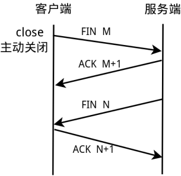

[TOC]

# TCP

## 1. 连接

### 1.1 建立连接

TCP连接的建立
需要经过三路握手：
要求服务端必须准备好外来的连接。这是通过socket、bind和listen三个函数完成。称为被动打开。

1. 客户端通过connect发起主动发起连接，发送SYN同步报文，它告诉服务器客户端将在要建立的连接中发送的数据的初始序列号。通常SYN不携带数据，其所在的IP数据包只含有一个IP首部、一个TCP首部和可能有的TCP选项。
2. 服务器发送ACK确认客户端的SYN，同时自己也发送一个SYN报文，它含有服务器将在此连接中发送的数据的初始序列号。
3. 客户端确认服务器的SYN。

TCP选项：
每个SYN可以有多个TCP选项，常用的有：

MSS选项
多大segment大小，也就是在这个连接中每个TCP报文的最大数据量。tcp套接字中使用TCP_MAXSEG选项来设置。

MSS与MTU
**MTU**
由硬件规定的，是链路层的概念。它是除去帧头的数据包大小。以太网的帧报头有：目的地址6字节、源地址6字节、协议类型2字节和CRC校验4字节。

**MSS**
它是TCP数据包每次能够传输的最大数据分段。它的值一般是由MTU减去IP头20字节和TCP头20字节得到。

窗口规模选项

时间戳选项

### 1.2 终止连接

建立TCP连接需要三个报文，终止则需要四个报文。之所以需要四次，是因为TCP是全双工的，一方发送FIN只表示关闭了一个方向的管道，另一个方向的数据流动则有另一端关闭。

1. 某个应用调用close，主动关闭。这一端发送FIN报文，表示此端已没有数据发送。
2. 另一端接收到FIN报文后，执行被动关闭。这个FIN由TCP确认，作为文件结束符传递给应用程序。
3. 一段时间后，接收了这个文件结束符的应用程序调用close关闭套接字，这导致TCP发送一个FIN。
4. 发起主动close的这一端发送ACK确认另一端的FIN。
