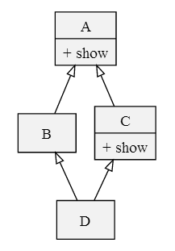
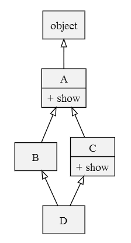
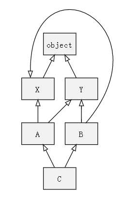
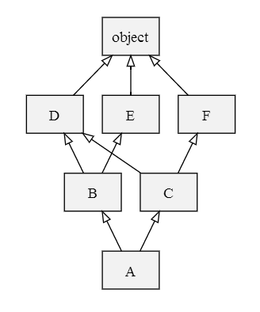

[TOC]

# Python类继承

在面向对象的语言中，类继承是一种基本特性。通过继承一方面可以可以复用已有的代码，另一方面也能反映概念上的包含与被包含关系。所以有实际的工程意义，也有模型设计时的概念意义。

Python作为一种面向对象的语言，毫无疑问，它也是支持类之间的继承的。

## 1. 一个简单的例子

Apple是一种Fruit，接下来我们通过类的继承来表示这种关系。

```python
class Fruit:
    def color(self):
        print("fruit color")

class Apple(Fruit):
    pass
```

## 2. __init__函数继承

正常情况下，子类继承父类，创建子类的实例时，父类的__init__函数也是会被调用的。但是如果父类的__init__函数需要参数，那么继承这种类型的父类，子类需要在__init__方法中调用父类的__init__方法。

例如：

```python
class Fruit:
    def __init__(self, color, shape):
        self.color = color
        self.shape = shape

class Apple(Fruit):
    def __init__(self, color, shape, taste):
        # 方式一，经典写法
        Fruit.__init__(self, color, shape)
        self.taste = taste

class Orange(Fruit):
    def __init__(self, color, shape, taste):
        # 另一种方式，这个是python3的写法
        # Python2的写法是super(Orange,self).__init__(color,shape)
        super().__init__(color, shape)
        self.taste = taste
```

## 3. Python多类继承

继承单类不会存在方法查找顺序的问题，super()函数会指向单个父类。但是如果一个类同时继承多个类，那么就会涉及到方法解析顺序(MRO, method resolution order)的问题、钻石继承等问题。

先说说什么是钻石继承？顾名思义，继承的层次关系形状像钻石。比如：

```text
    A
   / \
  B   C
   \ /
    D
```

class B和C都继承A，D继承B和C，这种继承关系就是钻石继承。

多类继承举例：

```python
class Plant:
    def __init__(self):
        print("Enter plant")
        print("Enter plant")

class Fruit(Plant):
    def __init__(self):
        print("Enter Fruit")
        super().__init__()
        print("Leave Fruit")

class Vegetable(Plant):
    def __init__(self):
        print("Enter vegetable")
        super().__init__()
        print("Leave vegetable")

class Tomato(Fruit, Vegetable):
    def __init__(self):
        print("Enter Tomato")
        super().__init__()
        print("Leave Tomato")

tomato = Tomato()

# 执行顺序如下：
# Enter Tomato
# Enter Fruit
# Enter vegetable
# Enter plant
# Leave plant
# Leave vegetable
# Leave Fruit
# Leave Tomato

```

为什么会是如此看似奇怪的执行顺序？这就需要我们了解Python的MRO了。

## 4. MRO

多重继承会出现二义性，比如Python语言中，多个父类可能出现相同的方法，这个时候以何种顺序调用呢？这是MRO解决的问题。



假设存在上面图中所示的一个钻石继承关系，x是D的一个实例，那么x.show()会调用哪个show方法呢？这需要通过MRO处理逻辑来确定。

Python至少有三种MRO算法：

1. Python2.1及以前版本的经典类，MRO算法是**从左到右，深度优先遍历**。
2. Python2.2新式类，加载类时的预计算。处理逻辑是**从左到右，深度优先遍历**，但是后面出现重复类时，会覆盖前面的重复类。
3. Python2.3新式类的C3算法。它是Python3唯一支持的方式。

### 4.1 经典类MRO

经典类和新式类的区别就是新式类都是继承了object，但是经典类则需要显示指定继承object。

根据上面多重继承的关系构建如下代码：

```python
class A:
    def show(self):
        print("from A")

class B(A):
    pass

class C(A):
    def show(self):
        print("from C")

class D(B,C):
    pass

d = D()
d.show()
```

按照上面说的经典类的MRO算法是：“从左到右，深度优先”，那么A,B,C,D四个类的遍历顺序是：D->B->A->C->A，路径去重后的遍历顺序：D->B->A->C。由此我们发现，d.show()调用的show方法不是C的，确实A的。但是，C.show方法是A.show方法的更新实现。所以，经典类的MRO逻辑是不合理的。而且，在新式类中，钻石继承更为普遍。

### 4.2 Python2.2新式类MRO

上面继承关系对应的新式类继承关系如下图：



这里新式类的MRO算法是在经典类MRO的基础上稍做了修改：遍历方法仍旧是“从左到右，深度优先”，但是是在类的定义时就完成这种遍历顺序的构建，把mro类遍历顺序存放到类的__mro___属性中，这是第一个改变；另外一个改变是如果遍历过程中遇到重复类，那么就保留后面的一个，而不是前面的。

按照上面说的遍历方法遍历上面的多重继承：D->B->A->object->C->A->object，由于去重逻辑是保留后面的，所以得到的最终遍历顺序是：D->B->C->A->object。

刚才的问题用这里的MRO逻辑解决了。

接下来我们举一个复杂的例子：



```python
class X(object):
    pass

class Y(object):
    pass

class A(X,Y):
    pass

class B(Y,X):
    pass

class C(A,B):
    pass

c = C()

```

按照前面介绍的Python2.2的MRO处理逻辑，调用C中继承的方法的类遍历顺序如下：C->A->X->object->Y->object->B->Y->object->X->object，经过去重的遍历顺序如下：C->A->B->Y->X->object。**注意**：Python2.2实现时做了一个细节调整，使其更尊重基类中类的出现顺序，也就是说在去重前，X是在Y之前出现的，所以最终结果X也需要在Y之前。实际结果是：C->A->B->X->Y->object。

我们接下来分析上面的解析顺序是否合理。

类C的遍历顺序是：C->A->B->X->Y->object，类B的的遍历顺序：B->Y->X->object。对比C和B的遍历顺序，会发现其中存在不一致性，X->Y和Y->X不一致，也就是C继承B之后，遍历顺序出现了不一致问题。这种继承关系违反了单调性原则。

PS. **单调性原则**：子类不能和基类的遍历顺序不一致。

Python2.2的MRO算法不会避免这种不一致性的存在。另外，它们也可能违反局部优先级原则。

### 4.3 C3 MRO算法

**概念定义**：

类C的mro用如下函数表示：L(C) = [C1,C2,C3,...]，表示C的遍历顺序为C1,C2,...。C1称为**L(C)的头**，[C2,C3,...]称为**L(C)的尾部**。如果list中只有一个，那么就是头，而不是尾。

下面说明C3求解MRO的过程：

假设类C顺序继承了B1,B2,B3,...,Bn，求解C的MRO，也即求L(C)的过程如下：

1. L(object) = object
2. L(C) = [C] + merge(L(B1),L(B2),...,L(Bn),[B1],[B2],...,[Bn])
3. L(C)的求解是一个递归过程：
   a. 检查L(B1)列表的头部，记作H；(只是检查判断，并未取出)
   b. 若H未出现在其他列表的**尾部**，则将其输出，并从其他列表中删除H，然后回到步骤a；否则，取出下一个列表的头部作为H，继续此步骤。
   c. 重复上面的步骤，直到所有列表为空或者不能再取出任何元素。如果是前一种情况，表示正常解析MRO，如果是后一种情况，则表示无法构建继承关系，Python抛出异常。

我们现在用C3算法分析上一节中出现的有问题的复杂继承：

```python
# 我们先计算L(X),L(Y),L(A),L(B)

L(X) = [X, object]
L(Y) = [Y, object]

L(A) = [A] + merge([X,object],[Y,object],X,Y)
    = [A,X] + merge([object],[Y,object],Y)
    = [A,X,Y] + merget([object],[object])
    = [A,X,Y,object]

L(B) = [B] + merge([Y,object],[X,object],[Y],[X])
    = [B,Y,X,object]

L(C) = [C] + merge(L(A),L(B),A,B)
    = [C] + merge([A,X,Y,object], [B,Y,X,object],A,B)
    # 由于X出现在了第二个list的尾部，所以取H=B
    = [C,A] + merge([X,Y,object],[B,Y,X,object],B)
    = [C,A,B] + merge([X,Y,object],[Y,X,object])

# 由于X是第二个list的尾部，Y是第一个list的尾部，所以无法继续输出元素。
```

下面给出一个复杂的，但能够成功构建继承关系的例子：


## 5. 深入super

在最开始举例展示如何在python中继承类时，举了一个继承类的经典写法：

```python
class A:
    pass

class B(A):
    def __init__(self):
        A.__init__(self)
```

相比super()函数的调用方法，这种显示地调用父类构造函数的方式其实是有问题的，比如下面的例子：

```python
class Base(object):
    def __init__(self):
        print “Base init”
class Medium1(Base):
    def __init__(self):
        Base.__init__(self)
        print “Medium1 init”
class Medium2(Base):
    def __init__(self):
        Base.__init__(self)
        print “Medium2 init”
class Leaf(Medium1, Medium2):
    def __init__(self):
        Medium1.__init__(self)
        Medium2.__init__(self)
        print “Leaf init”

l = Leaf()

"""输出
Base init
Medium1 init
Base init
Medium2 init
Leaf init
"""
```

我们发现Base的构造函数被调用了两次，这就是钻石继承中会存在的问题，父类构造函数多次执行。Python中解决这个问题的方式就是通过super方法。

我们现在把上面的代码改成用super函数，就不会出现这个问题。

```python
class Base(object):
    def __init__(self):
        print ("Base init")
class Medium1(Base):
    def __init__(self):
        super().__init__()
        print ("Medium1 init")
class Medium2(Base):
    def __init__(self):
        super().__init__()
        print ("Medium2 init")
class Leaf(Medium1, Medium2):
    def __init__(self):
        super().__init__()
        print ("Leaf init")

l = Leaf()
```

super函数的作用就是从MRO中获取上一个对象，然后调用其中的构造函数。

## 参考

1. [Python的方法解析顺序(MRO)](https://hanjianwei.com/2013/07/25/python-mro/)
