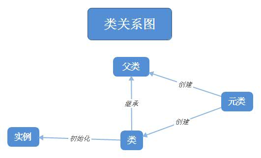

[TOC]

# Python元类

什么是元类？先看一个简单的关系图：

元类是用于创建自定义类型class的类。当解释器读取python文件，读到class ABC这种类的定义位置时，会调用元类来创建这个自定义类对象。（注意：类本身也是对象，当遇到关键字class，解释器就会创建一个类对象）。当调用这个自定义类对象时，可以创建自定义类的实例。

举例：
假设ABCMetaClass是一个元类，那么我们调用
ClassA = ABCMetaClass()
这里得到的ClassA就是累ClassA，然后我们在调用
class_a_instance = ClassA()
这时得到的是类ClassA的一个实例。

## type()函数

通过调用type()函数可以动态的创建类。

声明：
type(类名, 父类的元组（针对继承的情况，可以为空），包含属性的字典（名称和值）)
