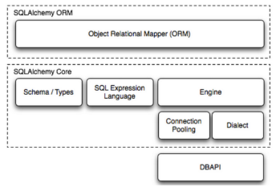

[TOC]

# SQLAIchemy使用教程

## SQLAIchemy

组成部分：

- Engine，框架的引擎
- Connection Pooling ，数据库连接池
- Dialect，选择连接数据库的DB API种类
- Schema/Types，架构和类型
- SQL Exprression Language，SQL表达式语言

## 参考

1. [官方教程](https://docs.sqlalchemy.org/)
