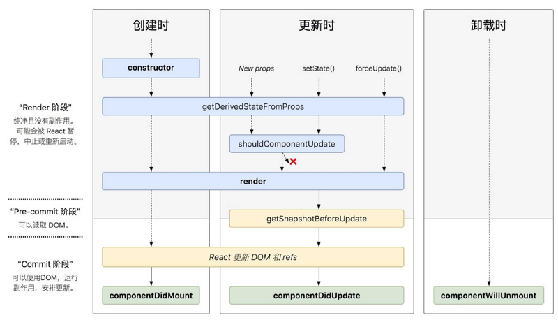
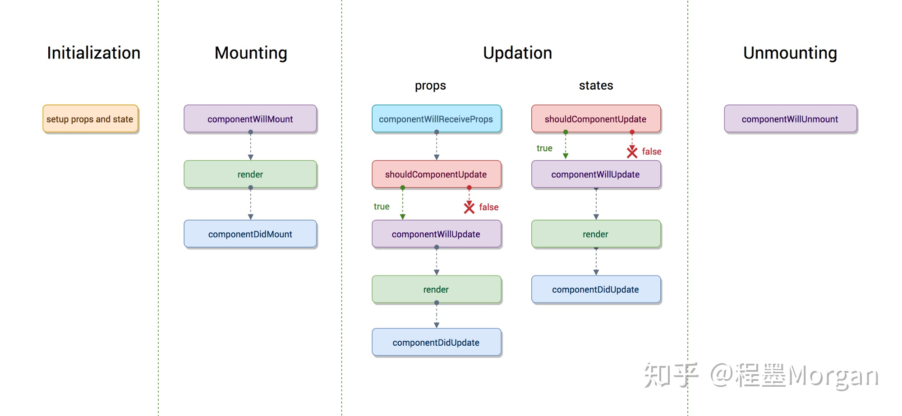
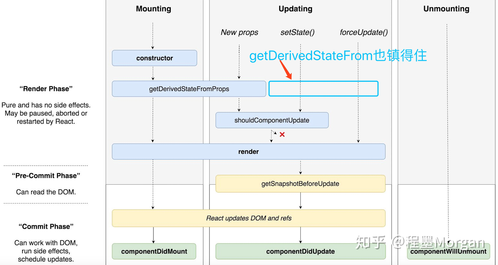
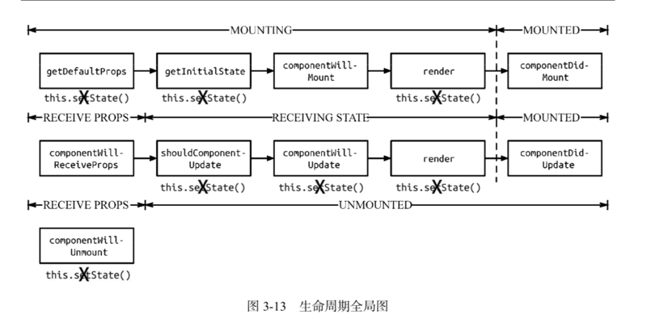

[TOC]

# React 组件生命周期

**生命周期**：每个组件实例，从创建到运行，直到销毁的完整过程。在这个过程中，会发生一系列事件，这些事件就叫做组件的**生命周期函数**。

React 组件的生命周期分三个部分：

1. 组件创建阶段

特点：只执行一次

- componentWillMount
- render
- componentDidMount

2. 组件运行阶段

按需，根据 props 属性或 state 状态的改变，有选择性的执行 0 次到多次

- componentWillReceiveProps
- shouldComponentUpdate
- componentWillUpdate
- render
- componentDidUpdate

3. 组件销毁阶段

只执行一次。

- componentWillUnmount


## 1. 组件创建阶段

### 1.1 constructor()

constructor()中完成了 React 数据的初始化，**它接受两个参数：props 和 context**，当想在函数内部使用这两个参数时，需使用 super()传入这两个参数。

**注意**：只要使用了 constructor()就必须写 super(),否则会导致 this 指向错误。

### 1.2 componentWillMount()

componentWillMount()一般用的比较少，它更多的是在服务端渲染时使用。它代表的过程是组件已经经历了 constructor()初始化数据后，但是还未渲染 DOM 时。

### 1.3 render

**渲染函数**，唯一的一定不能省略的函数，必须有返回值，返回 null 或 false 表示不渲染任何 DOM 元素。它是一个仅仅用于渲染的纯函数，返回值完全取决于 this.state 和 this.props，不能在函数中任何修改 props、state、拉取数据等具有副作用的操作。render 函数返回的是 JSX 的对象，该函数并不因为这渲染到 DOM 树，何时进行真正的渲染是有 React 库决定的。（setState 是一个异步函数）

PS.
**纯函数**：如果函数的调用参数相同，则永远返回相同的结果。它不依赖于程序执行期间函数外部任何状态或数据的变化，必须只依赖于其输入参数。

### 1.4 componentDidMount()

组件第一次渲染完成，此时 dom 节点已经生成，可以在这里调用 ajax 请求，返回数据 setState 后组件会重新渲染。

该函数不会在 render 函数调用完成之后立即调用，因为 render 函数仅仅是返回了 JSX 的对象，并没有立即挂载到 DOM 树上，而 componentDidMount 是在组件被渲染到 DOM 树之后被调用的。另外，componentDidMount 函数在进行服务器端渲染时不会被调用。

## 2. 更新过程

当组件挂载到 DOM 树上之后，props/state 被修改会导致组件进行更新操作。

### 2.1 componentWillReceiveProps (nextProps)

- 该函数在组件进行更新以及父组件 render 函数（不管数据是否发生了改变）被调用后执行；

- 在接受父组件改变后的 props 需要重新渲染组件时用到的比较多

- 接受一个参数 nextProps

- 通常是通过对比 nextProps 和 this.props，将 nextProps 的 state 为当前组件的 state，从而重新渲染组件

### 2.2 shouldComponentUpdate(nextProps,nextState)

- 主要用于性能优化(部分更新)

- 唯一用于控制组件重新渲染的生命周期，由于在 react 中，setState 以后，state 发生变化，组件会进入重新渲染的流程，在这里 return false 可以阻止组件的更新

- 因为 react 父组件的重新渲染会导致其所有子组件的重新渲染，这个时候其实我们是不需要所有子组件都跟着重新渲染的，因此需要在子组件的该生命周期中做判断

### 2.3 componentWillUpdate (nextProps,nextState)

shouldComponentUpdate 返回 true 以后，组件进入重新渲染的流程，进入 componentWillUpdate,这里同样可以拿到 nextProps 和 nextState。

### 2.4 render()

render 函数会插入 jsx 生成的 dom 结构，react 会生成一份虚拟 dom 树，在每一次组件更新时，在此 react 会通过其 diff 算法比较更新前后的新旧 DOM 树，比较以后，找到最小的有差异的 DOM 节点，并重新渲染。

### 2.5 componentDidUpdate(prevProps,prevState)

组件更新完毕后，**react 只会在第一次初始化成功会进入 componentDidmount**，之后每次重新渲染后都会进入这个生命周期，这里可以拿到 prevProps 和 prevState，即更新前的 props 和 state。

## 3. 组件销毁卸载

### 3.1 componentWillUnmount()

- clear 你在组建中所有的 setTimeout,setInterval

- 移除所有组建中的监听 removeEventListener

- 有时候我们会碰到这个 warning:

```txt
Can only update a mounted or mounting component. This usually      means you called setState() on an unmounted component. This is a   no-op. Please check the code for the undefined component.
```

原因：因为你在组件中的 ajax 请求返回 setState,而你组件销毁的时候，请求还未完成，因此会报 warning

解决办法：

```js
componentDidMount() {
    this.isMount === true
    axios.post().then((res) => {
    this.isMount && this.setState({   // 增加条件ismount为true时
      aaa:res
    })
})
}
componentWillUnmount() {
    this.isMount === false
}
```

## 注意事项

### setState

要修改 state，只能使用 this.setState()，不能使用 this.state.value='myData' 类似方式设置 state，一是不会驱动重新渲染，二是很可能被后面的操作替换，造成无法预知的错误。此外，React 利用状态队列来实现 setState 的异步更新，避免频繁地重复更新 state。当同时做了很多 setState 操作的时候，react 会智能的合并成一个 setState，当需要确定的 setState 完成后的操作，可以使用

```js
setState({}, ()=> {
  // 在这里进行state改变后的操作
}}
```

setState 的调用是有风险的，在某些生命周期函数中调用可能会无用甚至早恒循环调用导致崩溃。state 的初始化一般在构造函数中实现；setState 可以在装载过程的 componentWillMount、componentDidMount 中调用；setState 可以在更新过程中的 componentWillReceiveProps、componentDidUpdate 中调用。

### render

render 是一个异步函数，render 执行后并不会直接生成 Dom，而是生成虚拟 Dom 节点（模拟 HTML Dom 节点的一个 javaScript 数据结构），何时生成真实的 DOM 树取决于 react 框架本身的计算。

## 4. React 新版声明周期



React 16 之后有三个生命周期被废弃(但并未删除)

- componentWillMount
- componentWillReceiveProps
- componentWillUpdate

官方计划在 17 版本完全删除这三个函数，只保留 UNSAVE\_前缀的三个函数，目的是为了向下兼容，但是对于开发者而言应该尽量避免使用他们，而是使用新增的生命周期函数替代它们。

目前 React 16.8 +的生命周期分为三个阶段,分别是**挂载阶段**、**更新阶段**、**卸载阶段**。

### 4.1 挂载阶段

- **constructor**: 构造函数，最先被执行,我们通常在构造函数里初始化 state 对象或者给自定义方法绑定 this

- **getDerivedStateFromProps**

  - static getDerivedStateFromProps(nextProps, prevState),这是个静态方法,当我们接收到新的属性想去修改我们 state，可以使用 getDerivedStateFromProps

  - 触发时间(v16.4 修正)：组件每次被 render 的时候，包括在组件构建之后(虚拟 dom 之后，实际 dom 挂载之前)，每次获取新的 props 或 state 之后。在 v16.3 版本时，setState 时、forceUpdate 时不会执行这个方法。

  - 每次接收新的 props 之后都会返回一个对象作为新的 state，返回 null 则说明不需要更新 state.

  - 配合 componentDidUpdate，可以覆盖 componentWillReceiveProps 的所有用法

  - getDerivedStateFromProps 是一个静态函数，所以函数体内不能访问 this，输出完全由输入决定。

- **render**: render 函数是纯函数，**只返回需要渲染的东西，不应该包含其它的业务逻辑**,可以返回原生的 DOM、React 组件、Fragment、Portals、字符串和数字、Boolean 和 null 等内容

- **componentDidMount**: 组件装载之后调用，此时我们可以获取到 DOM 节点并操作，比如对 canvas，svg 的操作，**服务器请求，订阅都可以写在这个里面**，但是记得在 componentWillUnmount 中取消订阅。

### 4.2 更新阶段

- **getDerivedStateFromProps**: 此方法在更新和挂载阶段都可能会调用

- **shouldComponentUpdate**: shouldComponentUpdate(nextProps, nextState),有两个参数 nextProps 和 nextState，表示新的属性和变化之后的 state，**返回一个布尔值，true 表示会触发重新渲染，false 表示不会触发重新渲染，默认返回 true**,我们通常利用此生命周期来优化 React 程序性能

- **render**: 更新阶段也会触发此生命周期

- **getSnapshotBeforeUpdate**

  - getSnapshotBeforeUpdate(prevProps, prevState),这个方法在 render 之后，componentDidUpdate 之前调用，有两个参数 prevProps 和 prevState，表示之前的属性和之前的 state，这个函数有一个返回值，会作为第三个参数传给 componentDidUpdate，如果你不想要返回值，可以返回 null，**此生命周期必须与 componentDidUpdate 搭配使用**
  - 触发时间: update 发生的时候，在 render 之后，在组件 dom 渲染之前。

  - 返回一个值，作为 componentDidUpdate 的第三个参数。这里不需要显式传参数，React 自动作为第三个参数传递。

  - 配合 componentDidUpdate, 可以覆盖 componentWillUpdate 的所有用法。

```js
class ScrollingList extends React.Component {
  constructor(props) {
    super(props);
    this.listRef = React.createRef();
  }

  getSnapshotBeforeUpdate(prevProps, prevState) {
    // Are we adding new items to the list?
    // Capture the scroll position so we can adjust scroll later.
    if (prevProps.list.length < this.props.list.length) {
      const list = this.listRef.current;
      return list.scrollHeight - list.scrollTop;
    }
    return null;
  }

  componentDidUpdate(prevProps, prevState, snapshot) {
    // If we have a snapshot value, we've just added new items.
    // Adjust scroll so these new items don't push the old ones out of view.
    // (snapshot here is the value returned from getSnapshotBeforeUpdate)
    if (snapshot !== null) {
      const list = this.listRef.current;
      list.scrollTop = list.scrollHeight - snapshot;
    }
  }

  render() {
    return <div ref={this.listRef}>{/* ...contents... */}</div>;
  }
}
```

- **componentDidUpdate**

  - componentDidUpdate(prevProps, prevState, snapshot),**该方法在 getSnapshotBeforeUpdate 方法之后被调用**，有三个参数 prevProps，prevState，snapshot，表示之前的 props，之前的 state，和 snapshot。第三个参数是 getSnapshotBeforeUpdate 返回的,如果触发某些回调函数时需要用到 DOM 元素的状态，则将对比或计算的过程迁移至 getSnapshotBeforeUpdate，然后在 componentDidUpdate 中统一触发回调或更新状态。

  - 这个方法是在更新完成之后调用，第三个参数 snapshot 就是 getSnapshotBeforeUpdate 的返回值。

  - 正如前面所说，有 getSnapshotBeforeUpdate 时，必须要有 componentDidUpdate。所以这个方法的一个应用场景就是上面看到的例子，配合 getSnapshotBeforeUpdate 使用。

  - 可以使用 setState，会触发 re-render，所以要注意判断，避免导致死循环。

### 4.3 卸载阶段

- **componentWillUnmount**: 会在组件卸载及销毁之前直接调用。在此方法中执行必要的清理操作，例如，清除定时器，取消网络请求或清除在 componentDidMount() 中创建的订阅，清理无效的 DOM 元素等垃圾清理工作。

### 4.4 异常处理

- **static getDerivedStateFromError**: 此生命周期会在渲染阶段后代组件抛出错误后被调用。 它将抛出的错误作为参数，并返回一个值以更新 state。

- **componentDidCatch**
  
  - 此生命周期在后代组件抛出错误后被调用。 它接收两个参数：1. error —— 抛出的错误。2. info —— 带有 componentStack key 的对象，其中包含有关组件引发错误的栈信息。componentDidCatch 会在“提交”阶段被调用，因此允许执行副作用。 它应该用于记录错误之类的情况。

错误边界不会捕获下面的错误：

- 事件处理 (Event handlers) （因为事件处理不发生在 React 渲染时，报错不影响渲染）

- 异步代码 (Asynchronous code) (e.g. setTimeout or requestAnimationFrame callbacks)

- 服务端渲染 (Server side rendering)

- 错误边界本身(而不是子组件)抛出的错误

## 5. 新旧周期对比图

旧的生命周期：


新的生命周期：


## 6. 不能使用setState的生命周期


